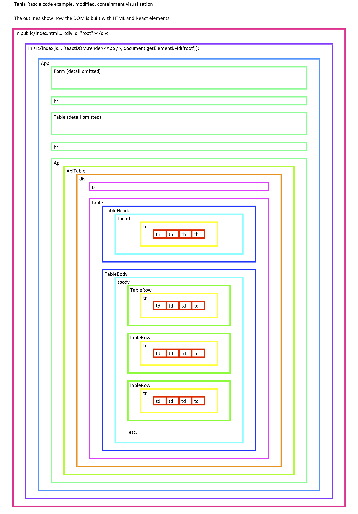

## Week 4 code examples

Remember to run this command while in the directory/folder that has the `package.json` file:

```
npm i
```

<br>

### react-tania-updated

Updated "Tania" example from last week.  
This one has a more clearly-defined and obvious component and containment structure.  

<br>

### react-tania-containment

A visualization of the containment structure of the "react-tania-updated" code example. 



<br>
