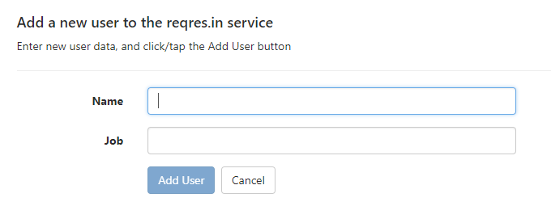
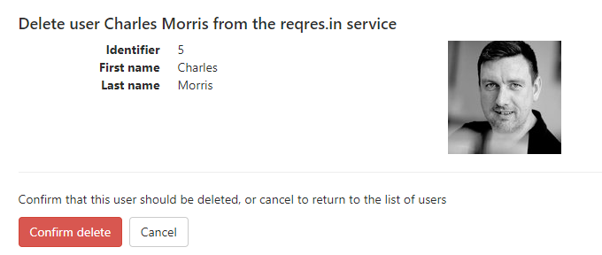

## HTML Form rendering using Bootstrap 3.x

Various code snippets. Layout is very important. Learn how to render HTML Form elements using Bootstrap classes.

<br>

### Plain HTML5

```html
<div className="form-horizontal">
    <p>Enter new user data, and click/tap the Add User button</p>
    <hr />
    <div className="form-group">
        <label htmlFor="flurb" className='control-label col-md-2'>Name</label>
        <div className="col-md-6">
            <input name="flurb" id="flurb" className="form-control" />
        </div>
    </div>
    <div className="form-group">
        <div className="col-md-offset-2 col-md-6">
            <input type="submit" value="Add User" className="btn btn-default" />
        </div>
    </div>
</div>
```

<br>

### React, add new, edit item

The rendering of these is similar. The buttons are different.

Features:
* Two text input fields, one button
* On load, the first text input field gets the keyboard input focus

```html
<div className="form-horizontal">
  <p>Enter new user data, and click/tap the Add User button</p>
  <hr />
  <div className="form-group">
    <label htmlFor="name" className='control-label col-md-2'>Name</label>
    <div className="col-md-6">
      <input name="name" className="form-control" ref={(i) => { this.input = i; }} onChange={this.handleChange} />
    </div>
  </div>
  <div className="form-group">
    <label htmlFor="job" className='control-label col-md-2'>Job</label>
    <div className="col-md-6">
      <input name="job" className="form-control" onChange={this.handleChange} />
    </div>
  </div>

  {/* Buttons go here */}  

</div>
```



*Add new* buttons:

```html
  <div className="form-group">
    <div className="col-md-offset-2 col-md-6">
      <button disabled={isDisabled} onClick={this.handleSubmit} className="btn btn-primary">Add User</button>&nbsp;&nbsp;
      <Link className='btn btn-default' to='/users'>Cancel</Link>
    </div>
  </div>
```


*Edit existing* buttons:

```html
<div className="form-group">
  <div className="col-md-offset-2 col-md-6">
    <button disabled={isDisabled} onClick={this.handleSubmit} className="btn btn-primary">Save</button>&nbsp;&nbsp;
    <Link className='btn btn-default' to='/users'>Cancel</Link>
  </div>
</div>
```

To focus the first input field:

```js
componentDidMount() {
    this.input.focus();
}
```

<br>

### React, get one, and delete item

The rendering of these is similar. The buttons are different.

Features:
* Uses a horizontal definition list

```html
<div className="row">
  <div className="col-md-6">
    <dl className="dl-horizontal">
      <dt>Identifier</dt><dd>{u.id}</dd>
      <dt>First name</dt><dd>{u.first_name}</dd>
      <dt>Last name</dt><dd>{u.last_name}</dd>
    </dl>
  </div>
  <div className="col-md-2">
    
  </div>
</div>
<hr />
```


*Get one* buttons:

```html
<p><Link className='btn btn-warning' to={`/users/edit/${u.id}`}>Edit</Link>&nbsp;&nbsp;
<Link className='btn btn-default' to='/users'>Show list of users</Link></p>
```



*Delete item* buttons:

```html
<p>Confirm that this user should be deleted, or cancel to return to the list of users</p>
<p><button onClick={this.handleSubmit} className="btn btn-danger">Confirm delete</button>&nbsp;&nbsp;
<Link className='btn btn-default' to='/users'>Cancel</Link></p>
```

<br>
