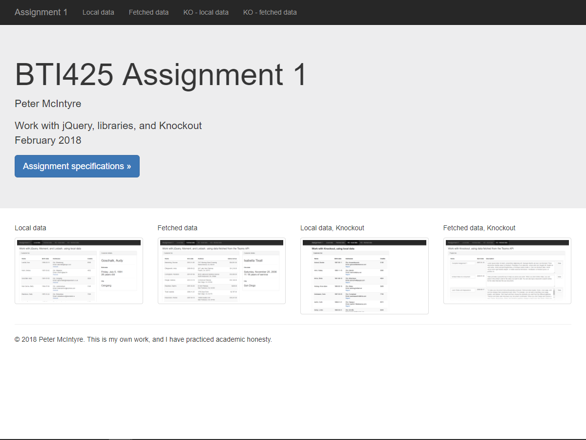
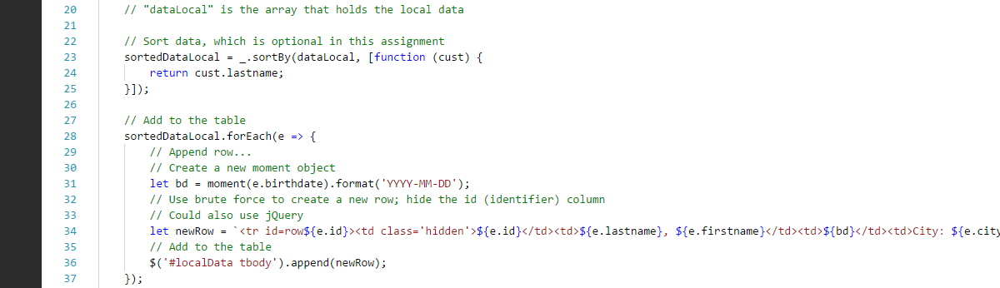
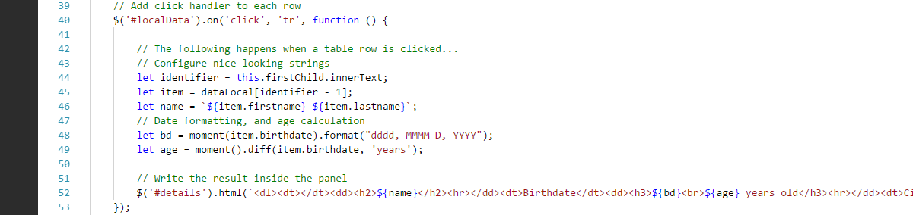
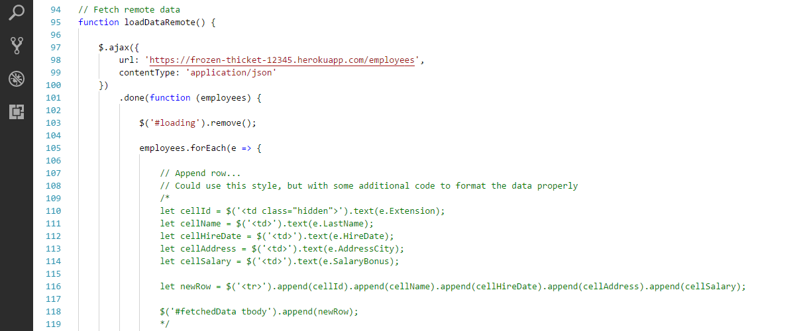
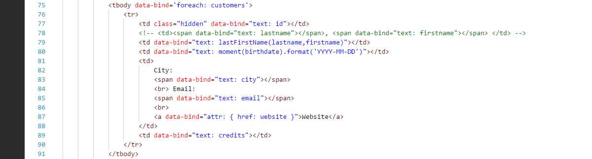
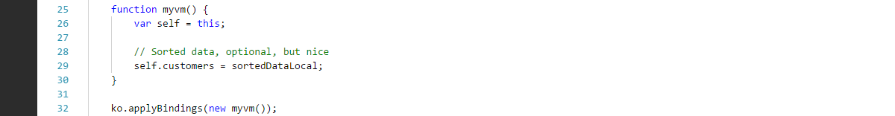
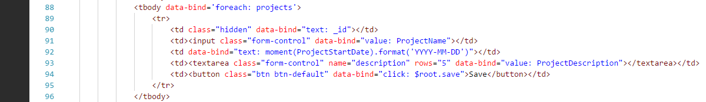
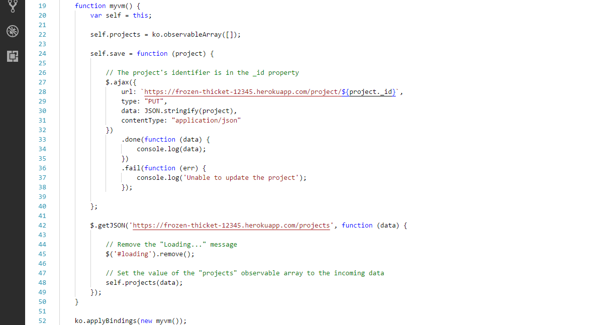

## Assignment 1 checklist

Compare your work to this sample solution. You can right-click any image and open it in its own tab/window to view it full-size.

 

### User interaction and appearance

U1. Home page looks similar to the example, with your name, and a decent-looking layout.

 

U2. Local data page looks similar to the example, and clicking a row displays some details for that customer. Dates have nice formatting.

 

U3. Fetched data page looks similar to the example, and clicking a row displays some details for that employee. Dates have nice formatting. Salary number is formatted as dollars.

 

U4. Local data page, with Knockout, looks similar to the example.

 

U5. Fetched data page, with Knockout, looks similar to the example. Description property is in a `<textarea>` element.

 

### Program design and coding

C5. Local data: Table row loading example

 

C6. Local data: Click handling code example

 

C7. Fetched data: jQuery Ajax code example, top...

...and bottom...

 

C8. Local data, with Knockout: HTML code example...

...and JavaScript code example...

 

C9. Fetched data, with Knockout: HTML code example...

...and JavaScript code example...

 
