## BTI425 Assignment 1

The purpose or objective of the assignment is to get some experience with widely-used JavaScript libraries, including jQuery, Moment, Lodash, and Knockout. In addition, we will work with the Bootstrap framework. 

Read/skim all of this document before you begin work.

<br>

### Due Date

Sunday, February 4, 2018, at 6:00pm ET

Grade value: 10% of your final course grade

*If you wish to submit the assignment before the due date and time, you can do that.*

<br>

### Introduction to the problem to be solved

We need a simple multi-page web site that will display data. Its pages will have a consistent and neat appearance, and will support a small amount of functionality. 

<br> 

### Specifications overview and work plan

Here's a brief list of specifications that you must implement:

* Follow best practices, guidance, and recommendations
* Includes an index page, and four more pages, each with some functionality

More details are provided below, in the section titled **"Doing the work"**.

During the Thursday class/session, your professor will help you *get started* and *make progress* on the assignment. 

<br>

### Getting started

Open a terminal window. In a suitable file system location, create a folder, probably named "assignment1", to hold your code. 

Create empty source code files for `index.html`, `main.js`, `main.css`. 

Prepare the rest of your dev environment:
* Code editor
* Browser for running your code
* Browser developer tools (at a minimum, you'll probably be using the element inspector, and the JavaScript console)

<br>

### Doing the work

First, you will create an HTML document that can be used as a "page template". 

After it's done, it will be your project's `index.html` entry point page. (Later, after it's done, you will copy-paste it to make other pages.)

<br>

#### Page template

For this first assignment, the instructions below may be more detailed than they need to be, or will be for future assignments. Your professor wants to help you get started with confidence and good coding habits. 

Use Emmet [abbreviations and snippets](https://docs.emmet.io/cheat-sheet/) as much as you can. 

In your code editor, open the empty `index.html` page. Create an HTML5 document with this snippet:

```
html:5
```

Remember, the snippet will include move-cursor edit points (locations). Use the `Tab` and `Shift+Tab` keys to move the cursor to the edit points. Make the initial changes that make sense, especially to the `<title>` element.

While you're there, add a few `<meta>` elements for description, and author (you!).

Later, you will add a `<footer>` element, which will hold your name, and a statement about academic honesty.

<br>

**Libraries from CDN**

Fetch the libraries we need from their [content delivery networks](https://en.wikipedia.org/wiki/Content_delivery_network) (CDN). You will need:
* jQuery
* Bootstrap, CSS and JavaScript
* Moment

The HTML for jQuery and Bootstrap are easy to find. For Moment, use the `cloudflare.com` links. Go to the bottom of the list, and you'll see a couple of links that do NOT have locale info - get one of these for now (e.g. the `.../moment.min.js` link). 

<br>

**Your own code assets**

Before continuing, add in the HTML for the `main.js` that will hold YOUR JavaScript code, and for the `main.css` that will hold your custom CSS. 

<br>

**Page structure, and Bootstrap classes**

If you are not accustomed to the task of creating a "page template", then this may be a bit tedious. Please be patient, as it will return benefits to you. (It's a good idea to start thinking systematically about the task of creating a user interfaces (UI)).

There are many different guides and opinions about the "right" way to write your page's HTML code structure. Here, we will offer our suggestions and recommendations. (Other solutions are possible.)

On the `index.html` page, there will be three "areas" of content, from top to bottom:
1. Navigation menu
2. Home page callout or "jumbotron" (but only on `index.html`)
3. Main content

<br>

The purpose of the navigation menu should be obvious. Here's a simple structure that works well for many apps:

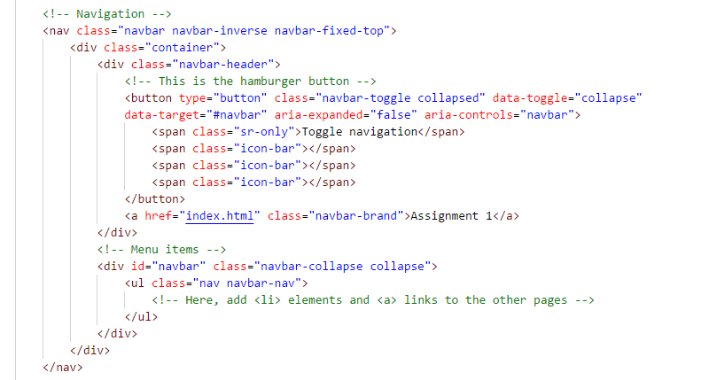

<br>

The "jumbotron" provides a large-font introduction to the web site. Remember, it usually appears only on the web site's home or entry page:

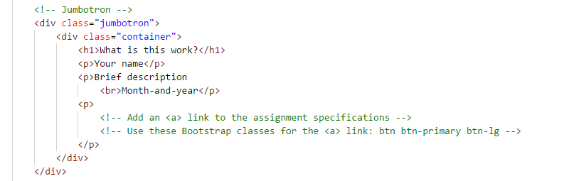

<br>

Finally, and most importantly, we have the main content of the page, and all pages. 

Notice the "row" content, which holds divs of a certain width. Different pages will have different needs. 

Notice also the `<footer>` element at the bottom. You must configure it with a statement about academic honesty.

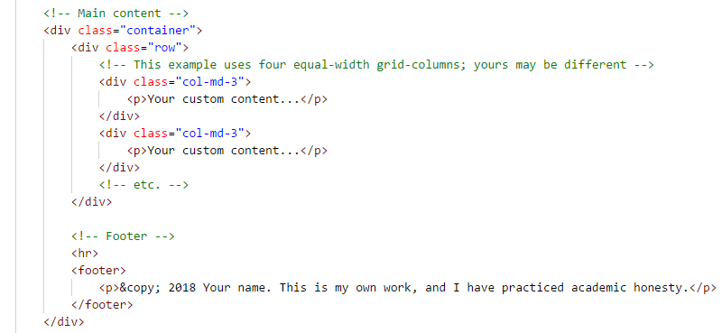

<br>

After putting it all together, you may end up with a result that looks something like this:

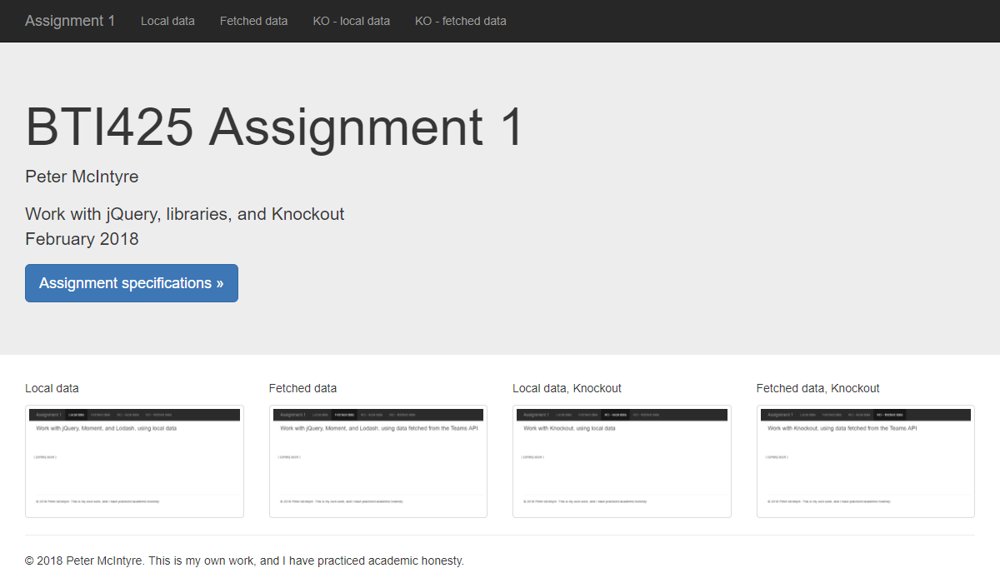

<br>

When you're happy with the appearance, you can copy-paste `index.html` to create the other four pages we need:
* Local data
* Fetched data
* Local data, with Knockout
* Fetched data, with Knockout

In the next sections, you will edit those new pages.

<br>

#### Local data

On this page, you will create data in your JavaScript code, and then display it in an HTML Table. And, when a row is clicked, its data will appear in a "details" panel on the right side. 

Here's an example of what you will create:

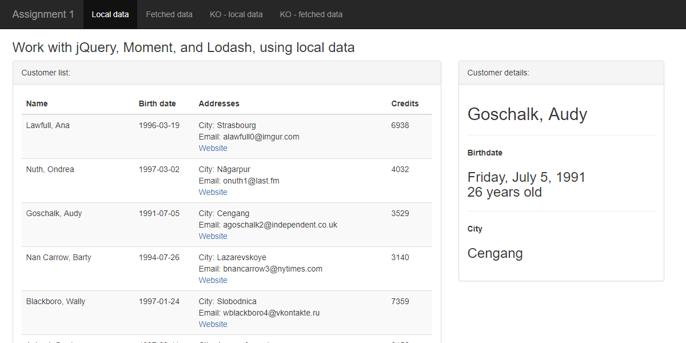

<br>

**Preparation**

In the previous section, you copied `index.html` to a new "local" page. Remove the jumbotron code from the new page. As appropriate, update `<meta>` elements, and the visible page title. 

The data will appear on the left side area, approximately 8 or 9 grid columns wide. The remaining number of grid columns can be used for the right-side details area. 

The HTML Table must have a value for the `id` attribute, so that you can get to it from your JavaScript code. Create the table structure here. For best results (and code quality), use the `thead` (with `tr` and `th` elements obviously) and `tbody` elements. 

Decide how many data columns you want in the table. The example above has four. Add one more column for the data item's identifier, but use the Bootstrap "hidden" class so that it doesn't clutter up the display. (We usually do this when the identifier doesn't really need to be in the display, yet we still need access to its value from our code.)

> If you want to surround the left and right areas as shown in the example, use the Bootstrap panel classes.

<br>

**Data**

Where do we get the data? Are you expected to hand-type dozens or hundreds of objects in your JavaScript code? No.

Let's use a service named [Mockaroo](https://mockaroo.com/). As stated on its home page:

*"Need some mock data to test your app? Mockaroo lets you generate up to 1,000 rows of realistic test data in CSV, JSON, SQL, and Excel formats."*

The home page defaults will generate 1000 rows of data. We don't need that many rows. Instead, choose 200 to 300. Most of the fields are OK for our purposes, but we must have a date (so that we can use the Moment.js library). We suggest that you replace the last two fields. Configure a date (ISO 8601 format), an integer number, a city, and a URL. The date field will hold a birthdate, so constrain its values to something reasonable for adults. Obviously, we need the data in JSON format. 

Here's what the screen could look like when you're done configuring it, just before downloading the data. Open the image in a new tab/window to view it full-size:

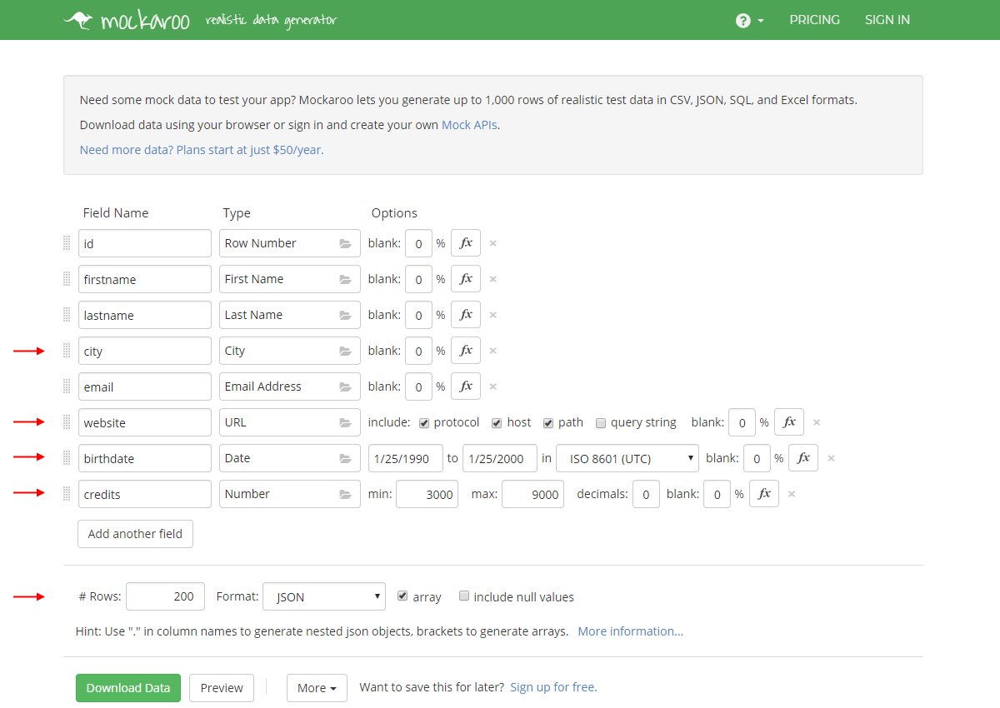

<br>

After downloading, now what?

Open the file and inspect the data. It's an array of objects. Perfect. We will just assign it to a variable.

<br>

**Coding**

Create a variable to hold the data. Its initial value will be an empty array. 

Write a function that loads the data into the array variable. 

Our `main.js` will obviously have a jQuery document-ready function. We suggest that you write its code above the data-loading function. (That simply has the effect of pushing down hundreds of lines of code to the bottom of the source code file, so that your important code is near the top.)

The document-ready function calls the data-loading function. 

Then, it goes through the array, and appends a new table row for each array item. Here:
* Make sure that you include the identifier as a hidden `<td>` element
* Format the birthdate in a nice manner (maybe like you see in the example above)
* Use some common sense when rendering some of the data, and think about its use and purpose (for example, should you display URL text, or render a hyperlink?)

Finally, add a click handler for each row. What will its callback function do? We want it to display the row's data in the right-side area. Notice that the data in the right-side area may be formatted differently than it appears in the table. Just for fun, do a date calculation task, by showing the person's age. The specific formatting doesn't matter much, but make it look nice. (The example above uses a definition list.)

<br>

#### Fetched data

On this page, you will fetch data from your Heroku-hosted Teams API, and then display it in an HTML Table. And, when a row is clicked, its data will appear in a "details" panel on the right side. (Very similar to the task above.)

Here's an example of what you will create:


<br>

**Preparation**

In the previous section, you created a page, grid, and table structure to hold the data. 

Much of that work can be copy-pasted to this "fetched" page. A few of the table columns and identifiers will be different, but it will be similar. Take advantage of that to reduce your work. 

<br>

**Data**

Where do we get the data? 

Let's use your Heroku-hosted Teams API. The "employees" collection has some nice data to display. 

<br>

**Coding**

Optionally, create a variable to hold the data. Its initial value will be an empty array. 

In the document-ready function, add a jQuery `.ajax()` function, to fetch the "employees" data. 

In its `.done()` function, append the nicely-formatted table rows. Here:
* Use the value of the `_id` property as the identifier
* Use some common sense when rendering the data, for example, the address properties
* Format the hire date data in a nice manner
* Format the salary data in a nice manner

The salary data is intended to be dollars. So, let's format it that way. Use the JavaScript `Intl.NumberFormat` object to help with this task. 

Finally, add a click handler for each row. What will its callback function do?

Similar to above, it will display the row's data in the right-side area. It gets the data from *another* Ajax request. (Yes, we know that the data could be fetched from the local array variable. But you should extract the unique identifier `_id` and use it as the parameter in the Ajax request URL. 

Again, just for fun, do a date calculation task, and show a couple of decimal digits. 

<br>

#### Local data, with Knockout

Some of the tasks on this page are similar to the "local" data page, above. 

This page will display a list of customers. (It will NOT have a click event handler for a table row. It will simply display a list of customers.) Here's an example of what you will create:

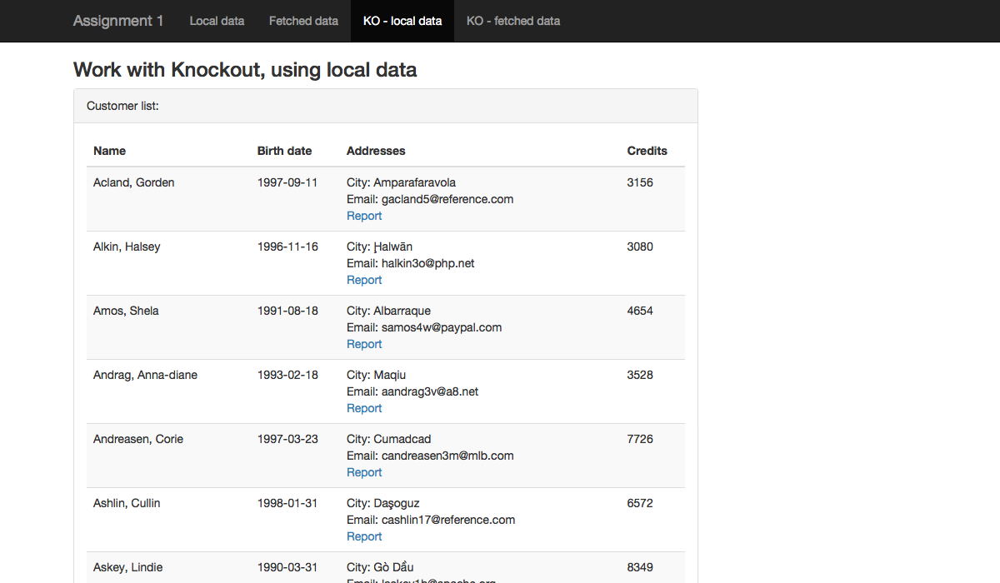

<br>

**Preparation**

Above, you copied `index.html` to a new "local, with Knockout" page. Again, remove the jumbotron code. As appropriate, update the `<meta>` elements, and the visible page title. 

Again, similar to the "local" data page, this new page will have an HTML Table on the left side of the content area. The table must have a header row, and a table body, which can be empty (until we fill it in below). 

<br>

**Data**

You can re-use the code from your "local" page, which should give you an array of objects to work with. 

<br>

**Coding**

As noted above in the "Data" section, you should have a variable which holds the data. 

The following is the minimal essentials needed to make this work with Knockout. Remember from above, on the "local" page, you used JavaScript (jQuery) in a loop to render a table row for each object in the array. 

Here, Knockout will do that.

Make sure that the Knockout library is referenced in a `<script>` element on the page. 

First, write a `data-bind` attribute for the table body. It uses [the "foreach" binding](http://knockoutjs.com/documentation/foreach-binding.html). Its value can be something like "customers". (Soon, we will create the "customers" variable in our JavaScript code). 

Next, create *one* (only) table row.

Then, create cells for the table row that you want to render. Each will have a `data-bind` attribute. Something like this:

```html
<td data-bind='text: lastname'></td>
````

Notice that `lastname` is one of the property names in the object (in the array). 

Now, let's write some JavaScript code. 

Create a view model function, located in the document-ready function. Something like this:

```js
function myvm() {
    var self = this;
    
    // Assume that 'sortedDataLocal' is our array of customer objects
    self.customers = sortedDataLocal;
}
```

Finally, apply the bindings. Notice that we use `new` in the statement:

```js
ko.applyBindings(new myvm());
```

Test your work, and the data should render in the HTML Table. 

<br>

**Refine and improve**

At this point, your table will not look like the example above. Let's refine and improve its appearance.

The **date** format should be better. Above, you formatted the date nicely, using the Moment.js library. (Make sure it's referenced on your HTML page.) We can do that here, too, but it's done a bit differently. 

The Knockout data-binding syntax in the HTML page looks something like this:

```html
<td data-bind='text: birthdate'></td>
````

We can actually call a Moment.js function in the `data-bind` attribute. Interesting. The result looks something like this:

```html
<td data-bind='text: moment(birthdate).format("YYYY-MM-DD")'></td>
````

Notice that the actual property name (birthdate) is now an argument to the `moment()` function. Then we chain the call to its `.format()` function.

This gives us a hint about how to handle the first name + last name situation. Yes, we can render a **full name** by using `span` element markup and two `data-bind` attributes. Is there a better way?

Well, we can write a *new* function to handle this, and then call it just like we call the "moment" function above. In your JavaScript, but outside of the document-ready function, create a new variable, which is a function that takes a couple of arguments. It will return the string concatenation that meets your needs. Something like this:

```js
var lastFirstName = function (ln, fn) {
    // return the string concatenation that meets your needs
}
```

Then, like the "date" situation above, call this new function in the markup:

```html
<td data-bind="text: lastFirstName(lastname, firstname)"></td>
```

Finally, the **addresses** column needs some love. In the image above, this column has three stacked lines of data, 1) the city, 2) an email address, and 3) a hyperlink to a web site. 

We already know (from your earlier work) that this area will be formatted with HTML line break elements. How do we configure the hyperlink? Can we put a `data-bind` attribute as the value of the hyperlink's `href` attribute? No. 

Knockout has a "attr" syntax for the `data-bind` attribute, [documented on this page](http://knockoutjs.com/documentation/attr-binding.html). So, when we code it, it will look something like this:

```html
<a data-bind="attr: { href: website }">Website</a>
```
Notice that "website" in `href: website` is the actual property name in the customer object. 

<br>

#### Fetched data, with Knockout

Some of the tasks on this page are similar to the "fetched" data page, above. 

This page will display a list of projects from the Teams API. It will enable the user to edit the project *name* and *description*. Here's an example of what you will create:

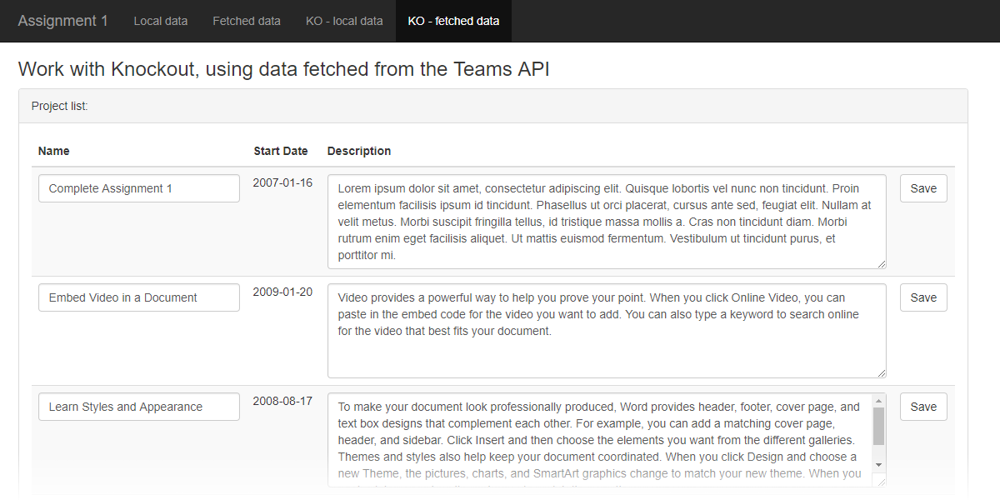

<br>

**Preparation**

As a general plan, here's what we must do in this section:
1. GET "projects" data from your Teams API
2. Render the data in an HTML Table
3. Write a function that will PUT (update) a specific project on your Teams API
4. Modify the markup and code to enable Knockout to handle a data update event (and call the update function)

Let's get started.

Above, you copied index.html to a new “fetched data, with Knockout” page. Again, remove the jumbotron code. As appropriate, update the <meta> elements, and the visible page title.

Again, similar to the “fetched” data page, this new page will have an HTML Table. This time, it can fill the width of the viewport. The table must have a header row, and a table body, which can be empty (until we fill it in below).

Be prepared to render four columns in the HTML Table. We will need the project identifier as a hidden column, and these three project columns:
1. Name
2. Start date
3. Description

Before continuing, let's adjust the column widths. As noted above, we want to enable editing of a project's *name* and *description* properties. If we don't adjust the widths now, the editing text boxes that get rendered will be unsuitable for our needs. 

It turns out that we can use the familiar "col..." classes in an HTML Table. For example:

```html
<!-- Wow - can use col-*-* classes in a table!  -->
<th class="col-md-3">Name</th>
<th class="col-md-1">Start Date</th>
<th class="col-md-8">Description</th>
```

<br>

**Data**

Use your Heroku-hosted Teams API again. The "projects" collection is what we need for this page. 

<br>

**Coding**

As noted above, our general plan is to do the following:
1. GET "projects" data from your Teams API
2. Render the data in an HTML Table
3. Write a function that will PUT (update) a specific project on your Teams API
4. Modify the markup and code to enable Knockout to handle a data update event (and call the update function)

Above (in the "local, with Knockout" section), you learned how to use Knockout to render a collection. Do the same tasks...

Make sure that the Knockout library is referenced in a `<script>` element on the page.

Write a `data-bind` attribute for the table body; its value can be something like "projects". (Soon, we will create the "projects" variable in our JavaScript code.)

Next, create *one* (only) table row. 

Then, create cells for the table row. Each will have a `data-bind` attribute. 

Now, let's write some JavaScript code. 

Create a view model function, located in the document-ready function. Initially, it will look very similar to the function you wrote above. 

```js
function myvm() {
	var self = this;

	self.projects = [];
}
```

Apply the bindings, as you have done before. 

What is missing? The "fetch data" task, to get the projects data from the Teams API. This coding task is an understandable add-on to what you already know. 

First, set the value (which is an empty array) of `self.projects` to be a [Knockout observable array](http://knockoutjs.com/documentation/observableArrays.html). 

This enables Knockout to update the UI if the value (content) of the array changes. Will it change? Yes. The array will start out empty, and then it will fill up with the fetched data. We want Knockout to detect this, and update the UI auto-magically. 

Next, add some data-fetching code. A [really convenient jQuery "shorthand" method](http://api.jquery.com/jquery.getjson/) to use is `getJSON()`. This method assumes GET, JSON data, and success. (If that doesn't meet your needs, then use the regular `ajax()` method.)

```js
$.getJSON('https://path-to-your-teams-api.herokuapp.com/projects', function (data) {

    // Set the value of the "projects" observable array to the incoming data
    self.projects(data);
})
```

At this point in time, your page should load data. 

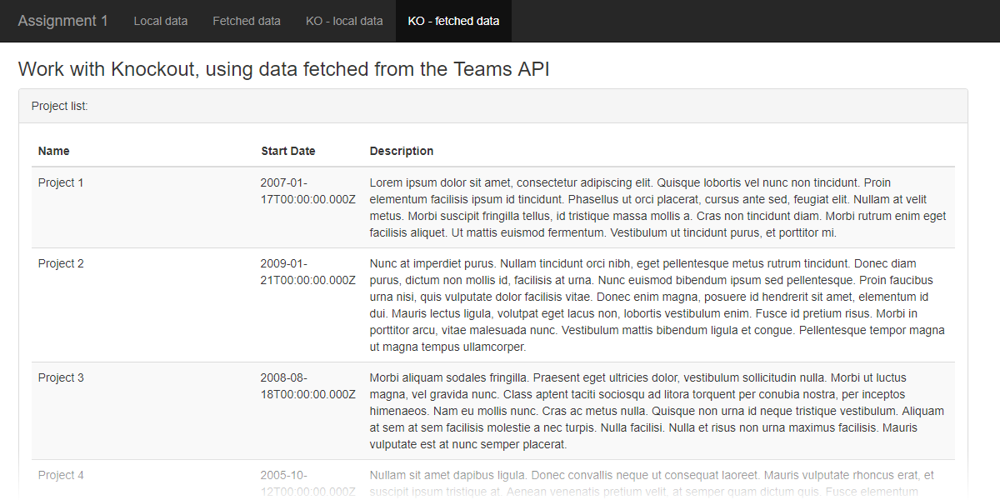

<br>

Now, we will enable project's *name* and *description* properties to be edited. Above, you created `<td>` elements with `data-bind` attributes. Replace those with plain `<td>` elements. Inside each, we will add an HTML Forms control. 

The project's *name* is usually a reasonably short value. A standard text box will work OK here. Its `data-bind` attribute will use [the "value" binding](http://knockoutjs.com/documentation/value-binding.html). 

> All HTML Forms controls *must* use the Boostrap class `form-control`.  
> When you do this, it draws nice-sized rounded-corner controls, with the correct font, etc. 

The project's *description* is usually a longer value. A text area will work here. Its `data-bind` attribute will also use the "value" binding. 

> A Bootstrap-styled `textarea` must have a `rows` attribute, but NOT a `columns` attribute. 
> Its `form-control` class will cause it to fill the width allowed by its parent container.

One more thing... We need a "save" button for each project. Add another column in both the `<thead>` and `<tbody>` elements. In the `<tbody>` element, add a `<button>` element. How is it configured?

First, Bootstrap: The [buttons documentation](https://getbootstrap.com/docs/3.3/css/#buttons) tells us to add the `btn` class. Optionally, we can add another class to set the button's background colour (for example, `btn-default`). 

Next: Knockout: On this page, we do NOT want our button and the HTML Forms fields to be enclosed by a `<form>` element. (In other words, it will NOT be a "submit" button.) Instead, we'll just write a JavaScript function to handle the button's "click" event. 

The [Knockout "click" binding](http://knockoutjs.com/documentation/click-binding.html) documentation tells us to add a `data-bind` attribute to the button:

```html
data-bind="click: save"
```

(This is also demonstrated in Step 4 of the ["Loading and saving data" tutorial](http://learn.knockoutjs.com/#/?tutorial=loadingsaving) on the Knockout learning/tutorials web site.)

Next, it tells us to edit the view model function. *Inside* the view model function, write another function named "save", which would look something like this for now:

```js
self.save = function(project) {
	console.log(project);
};
```

Show your page. Uh oh. It renders only one row. And, it throws an exception (as seen in the JavaScript console):

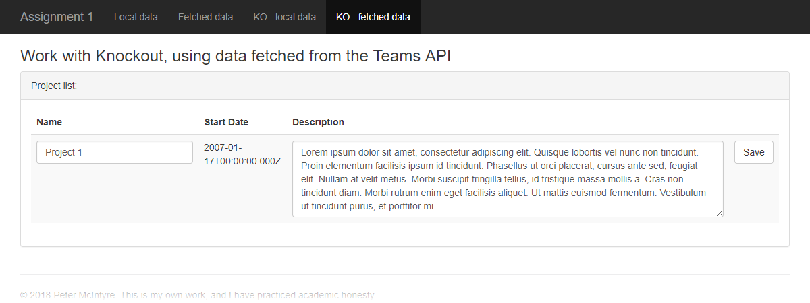

<br>

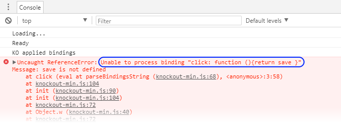

<br>

The problem is the [binding context](http://knockoutjs.com/documentation/binding-context.html). To briefly explain, the "save" button is looking for a JavaScript function named "save" in the current "location" (or context), which is the object (or row of data). The function is obviously NOT found or located in this row of data. 

Instead, the "save" function is located in the *view model* object. From the perspective of the object (or row of data), the view model is its "parent" or "root". (Think in terms of hierarchies.)

So, to fix this, we have to add the location of the "save" function to the `data-bind` attribute. Something like the following (either form will work here):

```html
<!-- Use this form... -->
data-bind="click: $parent.save"
<!-- ...or this form... -->
data-bind="click: $root.save"
```

Save your work, and run your page again. At this point in time, your page should look like the following. Clicking one of the buttons should show the data inside the clicked object in the JavaScript console. 

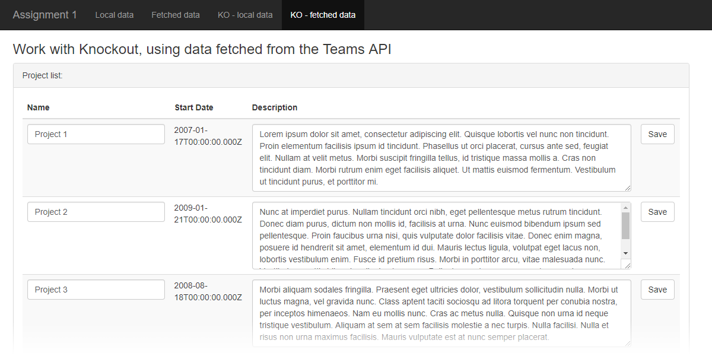

<br>

One final task... edit the "save" function to post the edited data back to the Teams API. Above, we had a simple `console.log()` statement. Replace that with a jQuery `.ajax()` statement, as discussed below.

When updating a resource, we use a [HTTP PUT](https://tools.ietf.org/html/rfc7231#section-4.3.4) request. It requires us to set the following in the request:
* Request method, PUT
* URL to the *specific* resource
* A content type
* Data, which (for our purposes, is the full/complete object that we are working with)

In the Week 3 "knockout-Ajax" code example, there's an example of an HTTP PUT request, [starting on line 87](https://github.com/sictweb/bti425/blob/master/Week_03/knockout-Ajax/js/main.js#L87). 

OK, good, that's helpful. In that code example, the "plainEmployee" object in line 90 is the data that is sent with the HTTP PUT request. In contrast, for our situation, we must send a "project" object.

Just before we write the statement, let's look at the Teams API code. In its `server.js` source code file, [starting on line 153](https://github.com/sictweb/bti425/blob/master/Templates_and_solutions/teams-api/server.js#L153), we see the code for the function that listens for HTTP PUT requests to the `/project/:projectId` segment. 

OK, now that we know where it's going, we have all we need to construct the statement, which will look similar to the following:

```js
// The project's identifier is in the _id property
$.ajax({
	url: `https://path-to-your-teams-api.herokuapp.com/project/${project._id}`,
	type: "PUT",
	data: JSON.stringify(project),
	contentType: "application/json"
})
.done(function (data) {
	console.log(data);
})
.fail(function (err) {
	console.log('Unable to update the project');
});
```

Run and test your code. Check the results in your JavaScript console. 

<br>

**Refine and improve**

The only code that needs fixing is the **date** format (as you have done before). Do that now. 

The result should be similar to the screen capture at the beginning of this section. 

<br>

### Testing your work

For this assignment, there is no external testing capability that can be used. 

Therefore, rely on your browser tools for this step. Soon, your professor will help you learn how to use the debugger.

<br>

### Reminder about academic honesty

You must comply with the College’s academic honesty policy.

Although you may interact and collaborate with others, you must submit your own work.

<br> 

### Submitting your work

Here’s how to submit your work, before the due date and time:

1. Locate the folder that holds your project files. 

2. Make a copy of the folder. (You will be uploading a zipped version of the copy.)

3. Compress/zip the copied folder. The zip file SHOULD be less than 1MB in size. If it isn’t, you haven’t followed the instructions properly.

4. Login to My.Seneca. Open the course area. Click the “Assignments” link on the left-side navigator. Follow the link for this assignment. Submit/upload your zip file. The page will accept three submissions, so if you upload, then decide to fix something and upload again, you can do so.

<br>
