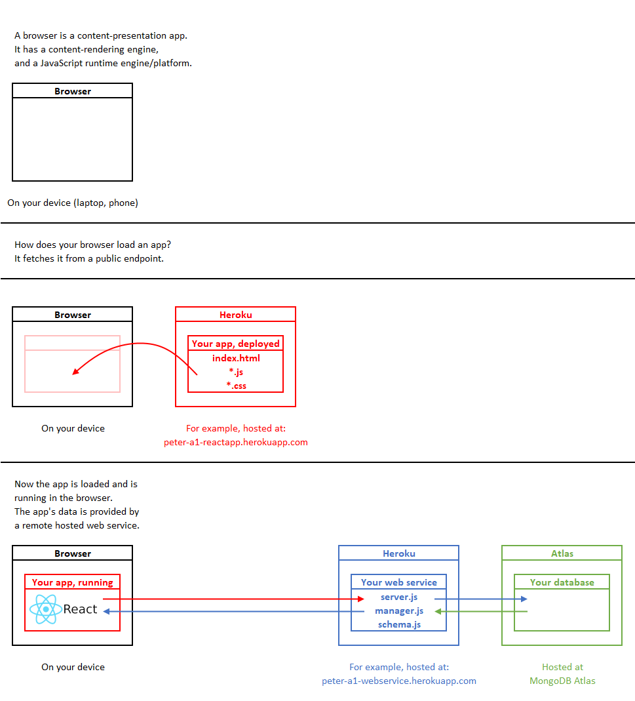
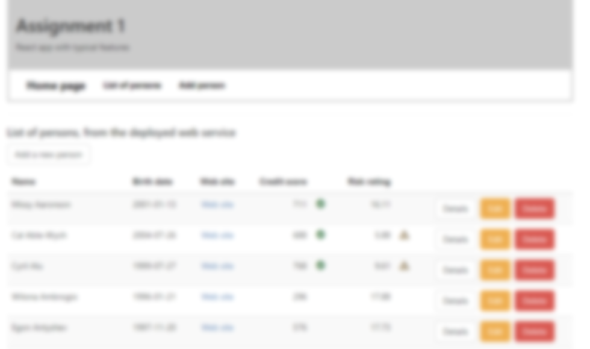
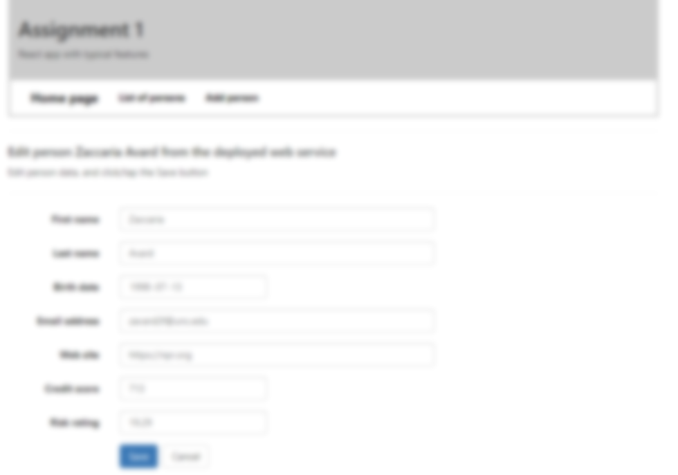
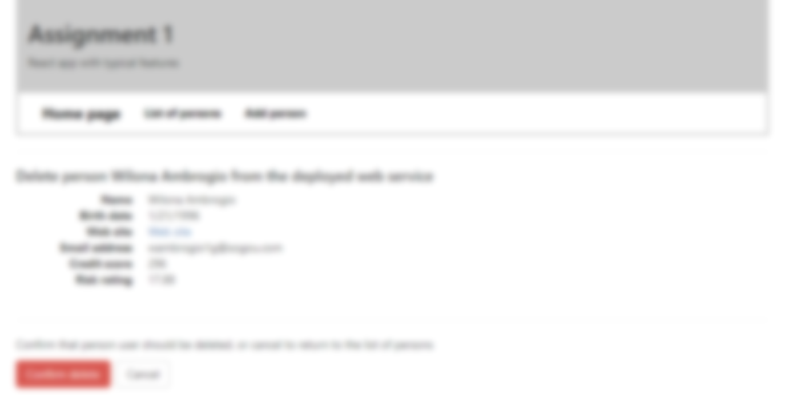

## BTI425 Assignment 1

The purpose or objective of the assignment is to create a React app.

Read/skim all of this document before you begin work.

While you are doing the work, if a *specific task* is not clear, or it seems to require an unreasonable amount of time to complete, or it seems to require knowledge way beyond the content we've covered in the course, please don't hesistate to contact your professor. 

> You should NOT have to search for or locate resources "out there" in an effort to complete this work.  
> The resources provided in this course - notes, linked content, code examples - provide sufficient coverage. Review them frequently.  
> If you think that you will find "the answer" to this assignment somewhere "out there", you're wrong. Use the course resources as your shortcut. 

 

### Due Date

Sunday, February 10, 2019, at 11:00pm ET

Grade value: 15% of your final course grade

*If you wish to submit the assignment before the due date and time, you can do that.*

 

### Overview and purpose

As noted above, the purpose of objective of the assignment is to create a React app that has good coverage of the topics in the first five weeks of the course. 

The app will use the single-entity web service that you worked on and posted to Heroku and Atlas during the first two weeks of this course. 

The app will use React components to support the typical range of data service tasks (get, add, edit, delete).  

Finally, the app will be deployed to a public host (another Heroku endpoint), so that you can deliver it to other devices (including, for example, your smartphone).  

Here's a diagram that shows the relationships among your browser, the deployed React app, and the deployed web service. Right-click and open it in a new tab/window to view it full size. 

 

### Getting started

Getting started includes generating a new project, and configuring your development environment. 

Use `create-react-app` to generate a new project, probably named `assign1`. 

Make sure that your web service has been deployed to Heroku and Atlas, and make sure that you can interact with it correctly with Postman. This is important, because you must have confidence in the hosted app to make progress on the React app. 

Set up the rest of your dev environment (terminal windows, editor, browsers and tools). 

 

### Doing the work, initial 

As noted above, the app will support the typical range of data service tasks (get, add, edit, delete). As a result, all the topics covered in weeks 3, 4, and 5 will be implemented in the app:
* Multiple components 
* Routing
* Working with a web service
* Forms 

In the following sub-sections, we suggest that you do the initial coding work that will prepare you to make progress on each of the detailed areas. 

> As suggested above, read/skim all of this document before you begin work. 

 

#### Consistent layout 

We must have a consistent and functional visual layout. Therefore, the first task is to create a layout, or a structure. You can use the guidance in the [React web services intro](https://github.com/sictweb/bti425/tree/master/Week_04) code example (in the repo). Customize the "template" so that your name appears in the header area of the viewport. Make sure that there is a navigation scheme. 

 

#### Components to support the app's purpose

As suggested by the guidance in the [HTML Form patterns](/notes/html-form-patterns) document and the [React web services intro](https://github.com/sictweb/bti425/tree/master/Week_04) code example, create source code files to hold class components for each of the five kinds of interactions. 

On each component, remember to include navigation links and/or buttons that enables the user to effectively use the app. 

 

#### Routing

As suggested by the guidance and topic coverage, configure and test the routing feature. Make sure that each of the five (interaction) components participate in routing. The app's navigation menu may have links for only the "list..." and "create..." choices, so test the routing by manually typing in the URLs. 

Remember to configure a "home" component and route, and a "not found" component and route. 

The "home page" component, as a landing page for the app, will simply state the app's purpose. *More importantly*, it will include two standard HTML hyperlinks:
1. One is the URL to your Heroku-hosted (React) app 
2. The other is the URL to your Heroku-hosted <u>M</u>ongoDB + <u>E</u>xpress.js + <u>N</u>ode.js (MEN) web service 

> Your professor needs the URL to your hosted React app so that it can be tested on a standard computer browser and on a smartphone or tablet.  
> The URL to your hosted web service is needed too, so that your professor can interact with it using Postman.

 

### Doing the work, detail

In the following sub-sections, guidance will be given to enable you to iteratively and sucessfully complete each of the five interaction components. 

The following guidance assumes that your Heroku + Atlas hosted web service works, fully and completely. 

> If you need some guidance to complete that task, review the [week 1](/notes/week01) and [week 2](/notes/week02) notes.  
> Remember the [WebAPIv2-OneEntity](https://github.com/sictweb/bti425/tree/master/Week_02) code example too.  

In your functions that make requests to the web service, make sure that you use the Fetch API. 

 

#### Get all

This component should use a repeatable content container to display all objects. An HTML table is ideal for that purpose. In each table row, render links for detail (get one), edit, and delete. It would be nice to style the links as buttons. 

Data will be fetched (from the web service) in the `componentDidMount()` function. 

> Here, make sure that you know and understand the *shape* of the data that is coming in from the call to the web service. Match it to the shape of your local storage (state) property. 

Here's what it could look like; this is from the professor's sample solution. 

 

#### Get one

This component displays the data for one specific object. Use an appropriate content container scheme to hold the property names and values. 

Data will be fetched (from the web service) in the `componentDidMount()` function. 

It would be nice to use a *conditional rendering* tactic to nicely handle both the presence and the absence of an object. 

Here's what it could look like; this is from the professor's sample solution.

 

#### Add new

This component displays an HTML Form that enables a user to enter and submit data. Use an appropriate content container scheme to implement this feature. Don't hesitate to review and use the info in the course notes about HTML Forms in React apps. 

The form `<input>` elements must use the proper HTML5 types, so that they will render correctly (and use the right keyboard on mobile devices). 

Data will be sent to the web service, in a "submit" button handler function. After a successful save, redirect to the "detail" (get one) component, so that the user sees the results of their "add new" work.

> Again, make sure that you know and understand the *shape* of the data that the web service is expecting in an "add new" request. Then, send data that matches that shape. 

Here's what it could look like; this is from the professor's sample solution.

 

#### Edit existing

You have learned that the visual part of this component will be similar to the "add new" component. The buttons are different. Also, you can decide which object properties are editable. (Do NOT allow the user to edit the MongoDB object identifier property, `_id`). 

From a behaviour point of view, data for the object-to-be-edited will be fetched (from the web service) in the `componentDidMount()` function. 

There are different strategies for showing/inserting the data-to-be-edited into the form elements. You may, or may not have to, use the `value` attribute. If you want to use that, please remember that its name in React JSX is `defaultValue`. 

Then, data will be sent to the web service, in a "submit" button handler function. After a successful save, redirect to the "detail" (get one) component, so that the user sees the results of their "edit existing" work.

> One more time... make sure that you know and understand the *shape* of the data that the web service is expecting in an "edit existing" request. Then, send data that matches that shape. 

Here's what it could look like; this is from the professor's sample solution.

 

#### Delete item

You have learned that the visual part of this component will be similar to the "get one" component. The buttons are different. 

From a behaviour point of view, data for the object-to-be-deleted will be fetched (from the web service) in the `componentDidMount()` function. 

Then, a "delete" request will be sent to the web service, in a "submit" button handler function. Then, redirect to the "list" (get all) component.

Here's what it could look like; this is from the professor's sample solution.

 

### Testing your work

For this assignment, there is no required external testing capability. Therefore, rely on your browser tools for this step. 

 

### Deploy the React app to Heroku

[Follow the guidance in the course notes](/notes/react-heroku-deploy), and deploy the React app to a new Heroku app. 

> Remember to do as noted above...  
> Update your home page component to include two standard HTML hyperlinks:  
> 1. One is the URL to your Heroku-hosted (React) app  
> 2. The other is the URL to your Heroku-hosted (MEN) web service 

 

### Grading procedure

Your professor will use a checklist during the grading process. The checklist will include items based on the assignment specifications. No, we will not distribute the checklist before the due date. 

Here's some more comments on the grading procedure:
* Part marks can be earned (it's not an all-or-nothing scheme)  
* Some marks will be earned for the presence of the web service 
* Some marks will be earned for a deployed/hosted React app
* Each of the five interaction tasks will earn marks
  * Some tasks could be "worth" more than others

Please review (again) the [information about grades](https://bti425.ca/policies#information-about-grades). To repeat one of its points, you will not earn an "A" simply for meeting a set of specifications. High grades are earned with work that is clearly better than expected (by meeting the specs). Better work includes a range of "qualitative" measures, including code quality, app and/or UI appearance, organization, content formatting, building upon foundations, and so on. 

 

### Reminder about academic honesty

You must comply with the College's academic honesty policy. Although you may interact and collaborate with others, you must submit your own work.

When you are ready to submit your work, you will copy some of the code in your project to plain text files, so that the My.Seneca/Blackboard "SafeAssign" tool can do its job. The next section will tell you which files to copy.

SafeAssign compares your work with that of other current and past students, and with existing works on the web. It uses techniques that are difficult to defeat. The overall goal is to identify copied work. 

  

### Submitting your work

We need both the Node+Express web service and the React web app.  

Here's how to submit your work, before the due date and time:

#### Node+Express web service

1. Locate the folder that holds your project files. 

2. Make a copy of the folder. (You will be uploading a zipped version of the copy.)

3. Inside that folder, remove (delete) the `node_modules` folder. Your professor does NOT need that folder. Also, if it has a `.git` folder, remove that too.

4. Still in that folder, add a new folder named "MyCode". Copy these source code files to the "MyCode" folder:  
**The JavaScript (JS) file that holds the "server" code**  
**The JS file that holds the "manager" code**  
**The JS file that holds the "schema" code**  
For each of these files in the MyCode folder, change the file name extension to "txt".

4. Compress/zip the copied folder. Maybe the name should be something like "webservice.zip". The zip file SHOULD be about 1MB in size. If it isn't, you haven't followed the instructions properly.

#### React web app 

1. Locate the folder that holds your project files. 

2. Make a copy of the folder. (You will be uploading a zipped version of the copy.)

3. Inside that folder, remove (delete) the `node_modules` folder. Your professor does NOT need that folder. Also, if it has a `.git` folder, remove that too.

4. Still in that folder, add a new folder named "MyCode". Copy these source code files to the "MyCode" folder:  
**App.js**  
**The JS file that holds the "get all" component**  
**The JS file that holds the "get one" component**  
**The JS file that holds the "add new" component**  
**The JS file that holds the "edit existing" component**  
**The JS file that holds the "delete item" component**  
For each of these files in the MyCode folder, change the file name extension to "txt".

4. Compress/zip the copied folder. Maybe the name should be something like "reactapp.zip". The zip file SHOULD be about 1MB in size. If it isn't, you haven't followed the instructions properly.

#### Bundle both of them together

Ideally, bundle both of the zip files from above into a single zip file, maybe named something like "assignment1.zip". Then...

Login to My.Seneca.  
Open the course area.  
Click the "Assignments" link on the left-side navigator.  
Follow the link for this assignment.  
Submit/upload your zip file. The page will accept three submissions, so if you upload, then decide to fix something and upload again, you can do so.

 
