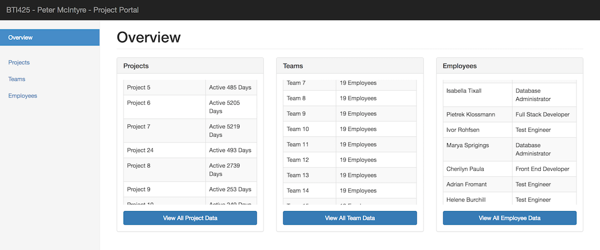
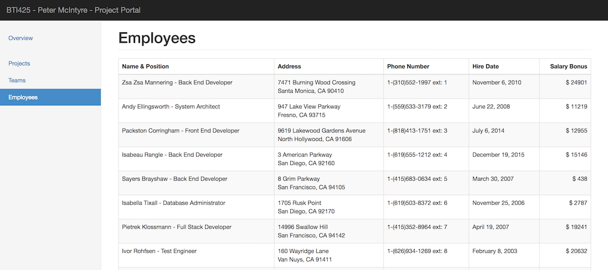
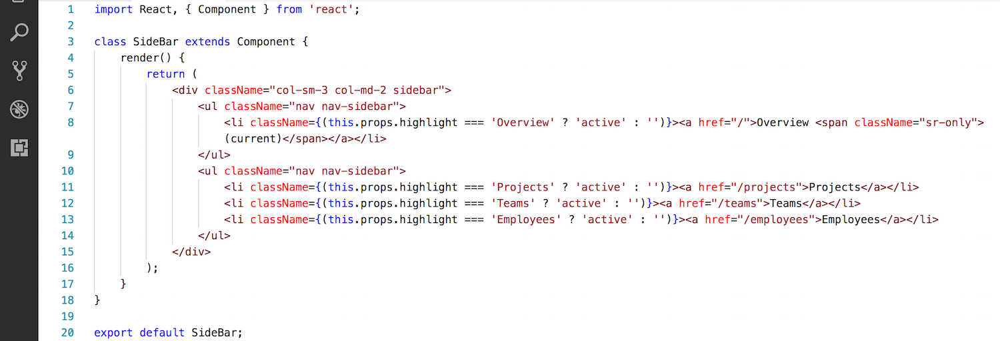
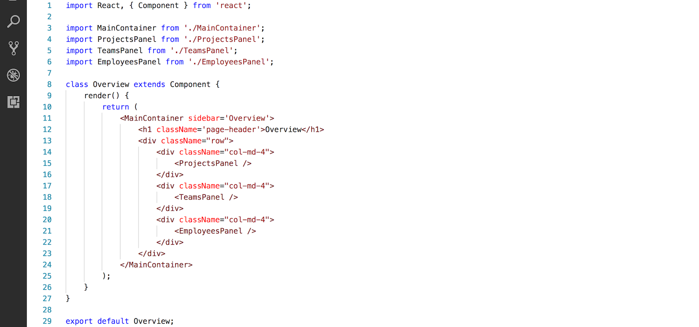
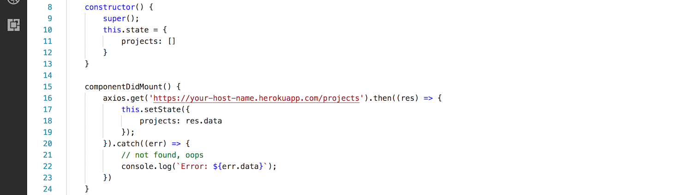
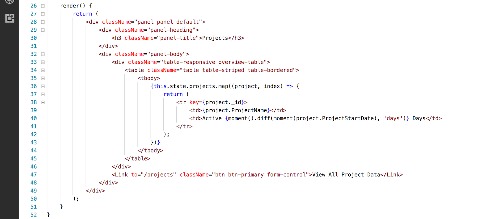
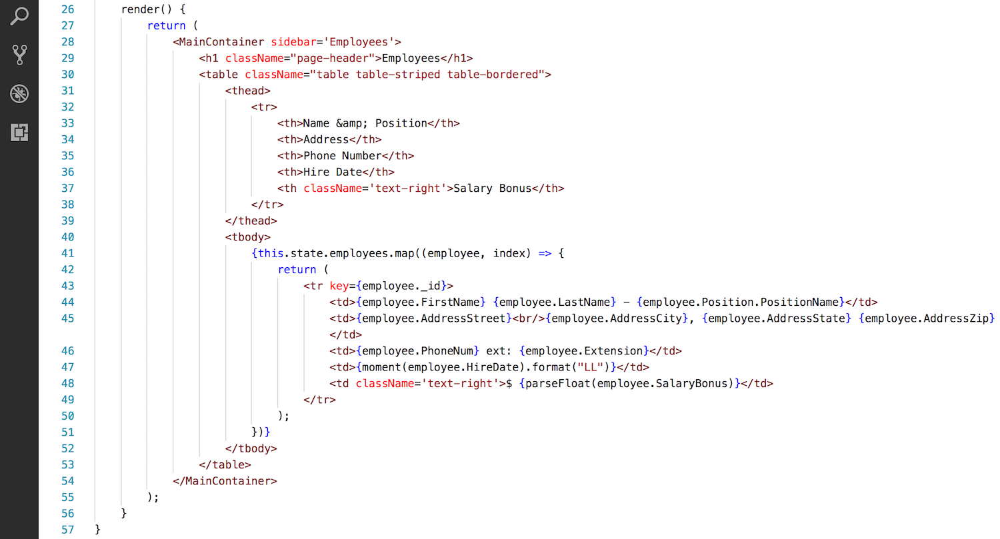
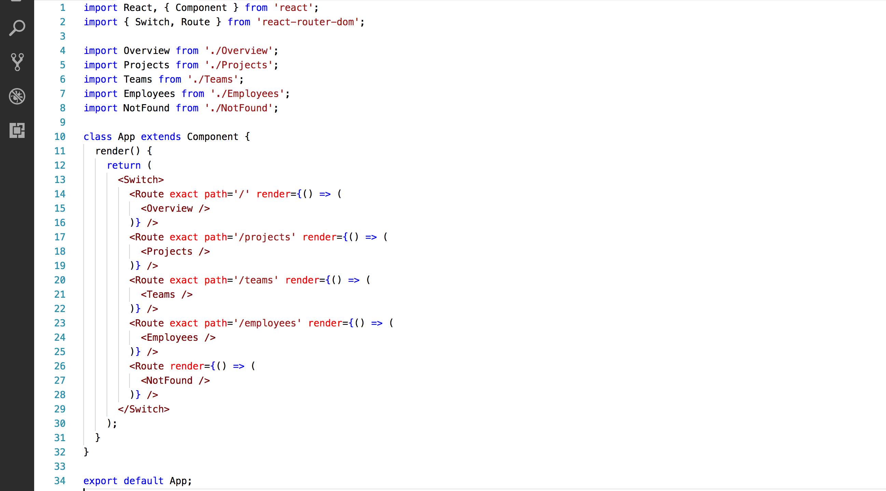

## Assignment 2 checklist

Compare your work to this sample solution. You can right-click any image and open it in its own tab/window to view it full-size.

 

### User interaction and appearance

U1. Home page looks similar to the example, with your name, and a decent-looking layout.

 

U3. Sidebar links are highlighted when the URL segment (route) changes, similar to the example.

 

### Program design and coding

C2. Sidebar code includes "active" class statement/expression. The code must be functionally the same as the code shown below.

 

C3. Overview code is organized with a header and three equal-width containers. The code must be functionally the same as the code shown below.

 

C4. "...Panel" code (in all three "panels") for the <code>constructor</code> and <code>componentDidMount</code> functions is correct. The code must be functionally the same as the code shown below.

 

C5. "...Panel" code (in all three "panels") for the <code>render</code> function is correct. The code must be functionally the same as the code shown below.

 

C6. Large-size components (Projects, Teams, Employees) <code>render</code> function is correct. Includes use of "key", and displays data (dollars, date, etc.) with nice formatting. The code must be functionally the same as the code shown below. 

 

C7. Routing code was implemented in App.js. Includes only the imports needed here, and the correct <code>Switch Route</code> structure. The code must be functionally the same as the code shown below.

 
