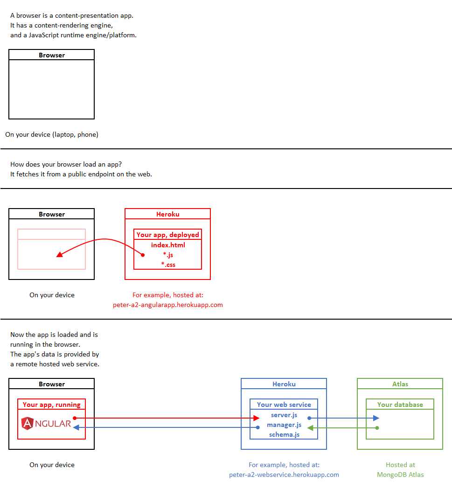
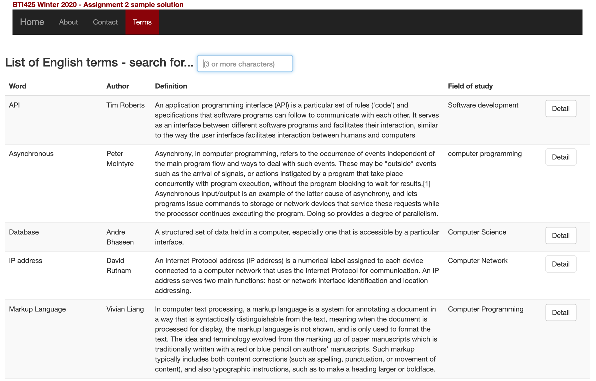
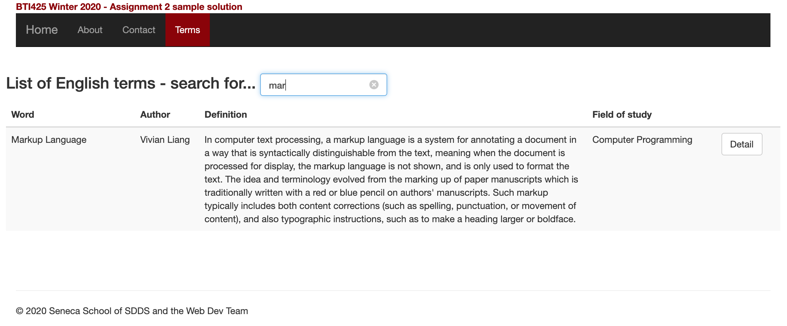
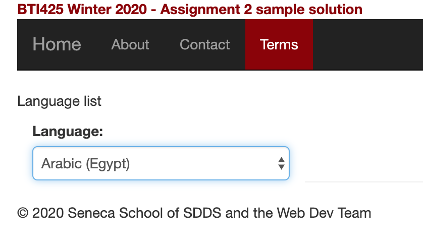

## BTI425 Assignment 2

<b>Notice</b> The course delivery and its dates and times have been affected by the worldwide novel coronavirus crisis. The content on this website may change frequently, so please refresh your viewer when consuming or reviewing content.

 

The purpose or objective of the assignment is to create a substantial Angular app that interacts with a web API.

Read/skim all of this document before you begin work.

While you are doing the work, if a *specific task* is not clear, or it seems to require an unreasonable amount of time to complete, or it seems to require knowledge way beyond the content we've covered in the course, please don't hesistate to contact your professor. 

> You should NOT have to search for or locate resources "out there" in an effort to complete this work.  
> The resources provided in this course - notes, linked content, code examples - provide sufficient coverage. Review them frequently.  
> If you think that you will find "the answer" to this assignment somewhere "out there", you're wrong. Use the course resources as your shortcut. 

 

### Due Date

Tuesday, March 31, 2020, at 11:00pm ET

Grade value: 25% of your final course grade

*If you wish to submit the assignment before the due date and time, you can do that.*

 

### Overview and purpose

As noted above, the purpose or objective of the assignment is to create a web API and an Angular app that has good coverage of the topics in the course. 

The app's purpose is to define or translate the English-language terminology we use in the computer programming courses in the School of SDDS, for use by all students, whether or not English is a student's first language. 

We have so many students who are learning English and computer programming at the same time, and that is a challenging combination. The technical terminology is often unclear, complicated, and sometimes isn't explained well. For example, when we say "asynchronous", what does it clearly mean in English, as well as in a student's first language?

The general functionality of the user app will likely include:
* View and browse a list of all terms
* Search for a term, in any language
* View details about a term, and its meaning in English and in other languages
* Add a new term, English, or in another language (including its first or initial definition)
* For an existing term (English or other), add another definition/data

In summary, the app would have some of the utility of a dictionary, Wikipedia, and other resources (including this course's notes and learning resources). 

A web API will hold the data for the app. To enable scale and crowd-sourcing of data, the professors will also publish a web API that will be designed to aggregate (with some data entry *done by you*) the terms that each student enters, for the benefit of ALL students. More info about this is below.

The web API will be posted to Heroku and Atlas, and will provide the data for the Angular app. The Angular app will also be deployed to a public host (Heroku), so that you can deliver it to other devices (including, for example, your smartphone).  

Here's a diagram that shows the relationships among your browser, the deployed Angular app, and the deployed web API. Right-click and open it in a new tab/window to view it full size. 

 

#### Where this idea came from 

Recently, in our School of SDDS, some of the web programming teachers have decided to use the course sequence (and particularly this course) as a way to create and deliver software that could be used by our School community (students and faculty) and improved over time (by students and faculty). 

A number of app ideas were developed, and this idea was selected to be worked on in the Winter 2020 academic term. 

 

### Getting started, web API

Use `npm init` to initialize a new folder, probably named `a2-web-api`. Alternatively, use a code example from the repo as a base for your project work. 

 

#### Data schemas 

As implied above, data for the app will be generated by you (the student) as you work on the app. In addition, the professors will publish a web API that will aggregate and share the data generated by all students. More info about is found below. 

For this Assignment 2, the database will include two collections:
* terms in English 
  * includes an embedded subdocument collection, definitions in English
* terms in other languages 
  * includes an embedded subdocument collection, definitions in other languages

As suggested by this list of collections, a *term* could have zero or more *definitions*. This idea supports alternative or evolving definitions over time. It is implemented as a one-to-many association or relationship that uses the MongoDB "embedded document" technique: In a English term document, it has a field that stores a collection (i.e. an array) of "definition" *subdocuments*.  

> Review the embedded subdocument coverage in the [introduction](/notes/data-assoc-intro) note and in the [how-to](/notes/data-assoc-subdocs-how-to) note. 

> The embedded subdocument must be described by a Mongoose schema.  
> Therefore, the web API will have three Mongoose schemas:  
> 1. definition 
> 2. terms in English (maybe named "termEnglish")  
> 3. terms in other languages (maybe named "termNonEnglish")  

 

Each term collection will have the same data fields:

Assignment 2 "termEnglish" schema fields:
* wordEnglish
* wordNonEnglish
* wordExpanded
* languageCode
* image
* imageType
* audio
* audioType
* linkAuthoritative
* linkWikipedia
* linkYouTube
* authorName
* dateCreated (date)
* dateRevised (date)
* fieldOfStudy
* helpYes (integer)
* helpNo (integer)
* definitions (array of "definition" objects)

The "termNonEnglish" schema will be the same, and it will *also*  have a field (probably named "termEnglishId") that will be  a document reference to the English term. 

Assignment 2 "definition" schema fields:
* authorName
* dateCreated (date)
* definition
* quality (integer)
* likes (integer)

 

In addition, an item in the English collection will be associated or related, in a one-to-many manner, with zero or more items in the non-English collection. It is implemented using the MongoDB "document reference" technique: In a *non-English term document*, it has a field (probably named "termEnglishId") that stores an object identifier "reference" to the English term document. 

> Review the document reference coverage in the [introduction](/notes/data-assoc-intro) note and in the [how-to](/notes/data-assoc-doc-ref-how-to) note. 

If you need a reminder about working with the MongoDB database engine, we suggest that you do these tasks:
* Create a database named `db-a2` (database for Assignment 2)
* In `db-a2`, create a collections likely named `TermsEnglish` and `TermsOther`

 

#### More explanations about some of the schema fields

The two "term" schemas are almost the same, by design. We wanted to make it easier to program by enabling copy-paste. Despite this, there are a few considerations which will affect your programming later on. Here's how some of the fields will be used. 

* `wordEnglish`  
Required  
The term, in English  
This will be present (non-empty) in both kinds of objects, termEnglish and termNonEnglish  
It will be unique too  

* `wordNonEnglish`  
The term, in another language  
This will be empty in termEnglish, and present in termNonEnglish  

* `wordExpanded`  
If the wordEnglish is an acronym or initialism, this will have the expansion  
For example, JSON and "JavaScript Object Notation"  
Otherwise, it will be empty  

* `languageCode`  
Required  
The ISO and *de facto* standardized codes for a language  
For example "en" for English, or "en-ca" for English (Canada)  
For termEnglish items, it will be one of the language codes that begin with "en"  
For termNonEnglish items, it will be one of the others  
Below, there is a link to a downloadable file of language codes that will be supported in the app  

* `image`, `imageType`, `audio`, and `audioType`  
We will use these in a future class/lesson  
For now, they can be empty  
They will hold file names (image and audio) for non-text media items for a term (e.g. a diagram or its pronounciation)  
(imageType and audioType are internet media type strings, e.g. "image/png")  

* `linkAuthoritative`, `linkWikipedia`, and `linkYouTube`  
URLs to web resources for the term  
Can be present or empty  
The "linkAuthoritative" is a link to the term's authoritative info source  
For example, for Node.js, it's https://nodejs.org

* `authorName`  
Required  
Your name  

* `dateCreated` and `dateRevised`  
Required  
These values are set in program code  
Do NOT get them from the app's user  

* `fieldOfStudy`  
Probably "computer programming" for our terms  
The course professors foresee that this app can be used by learners in any field of study, and not just ours, so that's its purpose - to identify the term's field of study

* `helpYes` and `helpNo`  
There will be a user interface (UI) item that will enable these values to be incremented  
Obviously, with enablement by the web API  
The idea is that we could ask the user whether the term they were looking at was hepful or not (to their learning)

* `definitions`  
A collection of one or more "definition" documents  
It is always possible for someone to have an alternate or better definition than an existing one  
It's also possible that a term (e.g. "server") could have multiple and somewhat different definitions    

* For a termNonEnglish document... `termEnglishId`  
Required (for a termNonEnglish document  
It is the object identifier of the termEnglish it's related to 

In the "definition" schema...

* `authorName`  
Required  
Your name  

* `dateCreated`  
Required  
This value is set in program code  
Do NOT get it from the app's user  

* `definition`  
Required  
The actual possibly-lengthy *definition* or explanation of the term  
The text format will be HTML  
And, the plan is that the content will use the language's character set  

* `quality`  
Ignore this for now; for future use  
(A human and/or AI-ML curator could assign a quality rating value to the definition)  

* `likes`  
There will be a user interface (UI) item that will enable this value to be incremented  
Obviously, with enablement by the web API  
The idea is that the user could quickly and easily indicate whether they "like" the specific definition

 

#### Data service tasks 

The data service tasks are similar for each entity (termEnglish and termNonEnglish). As you would predict, 

We suggest that you write the method pairs (in `server.js` and `manager.js`) for the termEnglish entity first, and thoroughly test them. Then, you will be able to essentially copy-paste-and-edit them for use for the termNonEnglish entity. The "add new" task will be slightly different in the termNonEnglish method pair, because we must use the object identifier for the related termEnglish document. 

During the code-writing process, test frequently with Postman. 

It is expected that the following, at a minimum, will be needed for the **termEnglish** entity:
1. get all (sorted) 
1. get one, by object identifier 
1. get one (or some), by "wordEnglish" 
1. add new (termEnglish document, including one definition embedded subdocument) 
1. edit existing (termEnglish document), to add a *new* definition 
1. edit existing (termEnglish document), to increment the "helpYes" value
1. edit existing (termEnglish document), to increment the "helpNo" value
1. edit existing (definition document), to increment the "likes" value

> For guidance about how to handle "get some" for number 3, read this:  
> [Web API CRUD - "get some" technique](/notes/web-api-crud-get-some)

> Reminder about the associated/related data coverage and how-to notes.  
> The `webapi-data-assoc-embed-doc` code example shows how to approach the coding task for numbers 4 and 5.

> For guidance about how to handle the "increment" tasks for numbers 6, 7, and 8, read this:  
> [Web API - "command" technique](/notes/web-api-commands)

Time permitting, it may require another method pair to support the text editing of the definition's text. 

It is expected that the following, at a minimum, will be needed for the **termNonEnglish** entity:
1. get all (sorted) (it's possible that the app won't need to use this)
1. get one, by object identifier 
1. get one (or some), by "wordNonEnglish" 
1. add new (termNonEnglish document, including one definition embedded subdocument) 
1. edit existing (termNonEnglish document), to add a *new* definition 
1. edit existing (termNonEnglish document), to increment the "helpYes" value
1. edit existing (termNonEnglish document), to increment the "helpNo" value
1. edit existing (definition document), to increment the "likes" value

> Reminder about the associated/related data coverage and how-to notes.  
> The `webapi-data-assoc-doc-ref` code example shows how to approach the *document reference* coding task for number 4.

> FYI, that code example also shows how to approach the coding task to fetch a termEnglish document which includes its associated/related termNonEnglish documents.

> For guidance about how to handle the "increment" tasks for numbers 6, 7, and 8, read this:  
> [Web API - "command" technique](/notes/web-api-commands)

 

#### Get large amounts of data (eventually!)

As noted above, the professor version of the web API has been published here:

[Professor Assignment 2 web API](https://pam-2020-a2and3webapi.herokuapp.com/api)

Here's the plain text URL:  
`https://pam-2020-a2and3webapi.herokuapp.com/api`

Using Postman, you can add these segments to the URL, and interact with the web API. Replace "XXXXXX..." with a MongoDB object identifier:

* `/terms/english`  
All terms in English 

* `/terms/english/XXXXXX...`  
One term, in English, for a specific identifier 

* `/terms/other`  
All terms in other languages

* `/terms/other/XXXXXX...`  
One non-English term, for a specific identifier 

In addition, you can add a new English term (with its initial definition), using this URL:
* `/terms/english`  
Obviously POST, application/json, and a JSON entity body  

And, for an *existing* English term, you can add another definition, using this URL:
* `/terms/english/XXXXXX.../add-definition`  
PUT, application/json, and a JSON entity body  

As you would expect, you can add a new non-English term (with its initial definition), using this URL:
* `/terms/other`  
POST, application/json, and a JSON entity body  

For an *existing* non-English term, you can add another definition, using this URL:
* `/terms/other/XXXXXX.../add-definition`  
PUT, application/json, and a JSON entity body  

To increment a term's "helpYes" counter:
* `/terms/english/helpyes/XXXXXX...`  
PUT, application/json, and a JSON entity body that looks like...  
`{ "_id": "XXXXXX..." }`  
* Or, begin the URL with `/terms/other...` for non-English

To increment a term's "helpNo" counter:
* `/terms/english/helpno/XXXXXX...`  
PUT, application/json, and a JSON entity body that looks like...  
`{ "_id": "XXXXXX..." }`
* Or, begin the URL with `/terms/other...` for non-English

Finally, to increment a definition's "likes" counter: 
* `/terms/english/definition-like/XXXXXX...`  
PUT, application/json, and a JSON entity body that looks like...  
`{ "_id": "XXXXXX..." }`  
(this is the object identifier for the *definition*, not the *term*)
* Or, begin the URL with `/terms/other...` for non-English

 

<mark>To help yourself, and your fellow students,</mark> plan on using Postman and adding at least one English term and one non-English term to the professor web API. We also suggest that you add another definition to a term (one English and one non-English). 

> Data entry tips:
> * Send a "get one" request to get the JSON for one term  
> * That will give you a model that you can use to copy, paste, then edit  
> * As an example, [here is the JSON](media/a2-post-english.json) that the professor used to add the "asynchronous" English term - notice how the definition is packaged  
> 
> * When you are entering a non-English term, use one of the official [language codes](https://pam-2020-a2and3webapi.herokuapp.com/api/languages) (e.g. "fr-ca" or "ru" etc.)  
> * As an example, [here is the JSON](media/a2-post-other.json) that the professor used to add the "asynchronisme" French term - notice how the definition is packaged

 

The intention is that each student will be able to get access to a substantial collection of data, because the efforts of all 100 students in the course, each creating at least two terms, should result in about 200 sharable terms. How?

The best feature of the professor web API is the ability for YOU to DOWNLOAD the data as import-ready JSON, and then use MongoDB Compass to "import" the data into YOUR database. Open a browser, and use these URLs to download each collection:

* `/terms/english/download`  
All English terms, downloaded to your computer 

* `/terms/other/download`  
All non-English terms, downloaded to your computer 

After you have these downloaded files, you can easily import them into your own database collections. 

> What if the import tasks does not work?  
> Please CONTACT YOUR PROFESSOR, because it should work.  
>   
> What if some fields are missing when you query the data with YOUR web API code?  
> It's likely a property name or type mismatch - carefully compare your Mongoose schema with the published data. 

 

### Getting started, Angular app

Getting started includes generating a new project, and configuring your development environment. 

> You can create a new project with `ng new...`  
> Or, you can use a template from the code example repo folder "Templates and solutions"

Make sure that your web API has been completed, and deployed to Heroku and MongoDB Atlas. Make sure that you can interact with it correctly with Postman. This is important, because you must have confidence in the hosted app to make progress on the Angular app. 

Set up the rest of your dev environment (terminal windows, editor, browsers and tools). 

 

#### Suggestion - deploy to Heroku often

We have a suggestion: As you make progress on the Angular app, feature by feature, deploy it to Heroku, and maybe use another device (your smartphone?) to connect to it and interact with it. 

How-to instructions for Angular app to Heroku are here:  
[Deploy Angular app to Heroku](/notes/angular-heroku-deploy)

 

### Doing the work, initial 

The first big task is to design and plan the components needed and how the user will interact with the app. Here's an overview of how your professors thought about when making a sample solution: 
* We'll need a "home" component
* It should either show a list of English terms, or include a link to a dedicated component 
* Maybe it's a good idea to use the "home" component to hold the "search" functionality 
* From the list of English terms, include an "add new" link, and for each item on the list, include a link to a detail component
* The detail component will show all of the term's data
  * And it will include its definitions 
  * And translations (full text or link - to be decided)
* From there, it should be possible to "add" a new definition for the displayed term 
* And it should be possible to "add" a new non-English translation for the displayed term 
* When displaying a term, the UI should have a control that would enable the viewer/user to easily tap "yes this helped me" or "no this didn't help me" 
* When displaying a definition for a term, the UI should have a control that would enable the viewer/user to easily indicate that they "like" the definition 

So, overall, maybe about six - plus or minus - components. Here is some commentary.

 

### List of English terms

As noted above, the list of English terms can be on the home or landing component, or in a dedicated component. 

Decide which fields you want to display in the list. 

In the data manager service, write a method that will send a request to the web API resource. Obviously, you must write classes (in the data classes source code file) that match the shape of the web API results (definition, English term, and non-English term). 

 

#### Search for an English term

Somewhere in the user interface (in an existing component or in a dedicated component), search (for an English term) should be supported. To learn one approach, read the [Angular app "search" UI and UX](/notes/angular-search-ui) document.

In the professor's sample solution, it was implemented as part of the list of English terms. 

 

### Add new English term

This is a classic implementation of an "add new" use case. As you have learned, it needs:
* A component 
* In the component template, controls are needed to gather data from the user
* In the component code, properties for the form data and other needs, and a method to handle form submission
* Also in the component code, a data class that matches the shape of the form data 
* A data manager service method that sends the data to the web API

Some of the data items can be set or calculated in code. In other words, it is obviously *not necessary* to gather the "create date and time" from the user. Do that programmatically. For new English terms, we also will just set its value because we know the language code.

Remember that you MUST gather a definition when you are creating a new English term. (As you know, additional definitions can be added later.)

> Note: Screen capture sample is coming soon.

 

### English term detail

This is a classic implementation of a "get one" use case.

Its visual UI design is somewhat important. For example, an English term could have one - or more - definitions. It would be nice to conveniently display, or have access to, the multiple definitions. Also, an English term could have zero - or more - translations. As above, it would be nice to display or link to them (if present). 

This means that we can tolerate different visual UI designs. One choice is to render everything in one component. Another choice is to render each translation separately in its own component. 

Whatever is done, one of the tasks a user may want to do after viewing an English term and its definition(s) is to *add another definition*. Enable that capability in the UI. 

Another task a user may want to do after viewing an English term and its definition(s) is to *add a translation* in another language. Enable that capability in the UI. 

Another task a user may want to do is to "vote" on whether the term and its definitions were helpful. (That's what the "help yes" and "help no" fields are for in the web API and database schema.) Gathering that info from the user can be done in many ways, but they all require an element that causes a method (in the component code) to run, which in turn calls a data manager service method, which sends a request to the appropriate web API resource. 

Similarly, each definition should offer the ability to "like" it, again via an element > method > data manager service > web API request process. 

> Note: Screen capture sample is coming soon.

 

### Add a new definition to an English term

Above, we identified a possible user task is to add another definition to an English term. That will be a classic "add new" use case, which will end up sending a request to the web API method that you wrote for that purpose. 

When you are composing the form, remember that the web API request will need the English term identifier, so make sure that you pass that along from the term detail component to the "add new" definition component. 

> Note: Screen capture sample is coming soon.

 

### Add a new translation for an English term

Like the "add new" English term above, we must enable the ability to add a *new translation* for an existing English term. 

This is a classic implementation of an "add new" use case. Very similar to the one above (for an English term), but different because it targets a different web API resource, and it must include the term identifier (so make sure to pass that along).

> Note: Screen capture sample is coming soon.

The language code must be from the professor's sample solution for the web API. The URL is:  
`http://pam-2020-a2and3webapi.herokuapp.com/api/languages`  
It is OK to use that resource directly from your data manager service. You must write a data class that matches the shape of the collection's items. It is not necessary to add this to your own web API and database (but if you do want to, go ahead).

Obviously, when the component loads, the code must fetch the languages collection so that they can be rendered in an item-selection control (e.g. a drop-down list or whatever). 

In the `select option` element group, the visible text on the item-selection control must be the language name. The non-displayed value attribute must be the language code (that ends up getting stored in the database). 

 

### Add a new definition to a translation

This will be almost the same as the one described above, in the "Add a new definition to an English term" section. 

> Note: Screen capture sample is coming soon.

 

### Testing your work

For this assignment, there is no required external testing capability. Therefore, rely on your browser tools for this step. 

 

### Deploy the Angular app to Heroku

Follow the guidance in the course notes, and deploy the Angular app to a new Heroku app. 

> Remember to do as noted above...  
> Update your home page component to include two standard HTML hyperlinks:  
> 1. One is the URL to your Heroku-hosted (Angular) app  
> 2. The other is the URL to your Heroku-hosted (DEN) web API 

 

### Grading procedure

Your professor will use a checklist during the grading process. The checklist will include items based on the assignment specifications. No, we will not distribute the checklist before the due date. 

Here's some more comments on the grading procedure:
* Part marks can be earned (it's not an all-or-nothing scheme)  
* Some marks will be earned for the deployed/hosted web API 
* Some marks will be earned for a deployed/hosted Angular app
* Each of the interaction tasks will earn marks
  * Some tasks could be "worth" more than others

Please review (again) the [information about grades](https://bti425.ca/policies#information-about-grades). To repeat one of its points, you will not earn an "A" simply for meeting a set of specifications. High grades are earned with work that is clearly better than expected (by meeting the specs). Better work includes a range of "qualitative" measures, including code quality, app and/or UI appearance, organization, content formatting, building upon foundations, and so on. 

 

### Reminder about academic honesty

You must comply with the College's academic honesty policy. Although you may interact and collaborate with others, you must submit your own work.

When you are ready to submit your work, you will copy some of the code in your project to plain text files, so that the My.Seneca/Blackboard "SafeAssign" tool can do its job. The next section will tell you which files to copy.

SafeAssign compares your work with that of other current and past students, and with existing works on the web. It uses techniques that are difficult to defeat. The overall goal is to identify copied work. 

  

### Submitting your work

We need both the Node+Express web API and the Angular web app.  

Here's how to submit your work, before the due date and time:

#### Node+Express web API

1. Locate the folder that holds your project files. 

2. Make a copy of the folder. (You will be uploading a zipped version of the copy.)

3. Inside that folder, remove (delete) the `node_modules` folder. Your professor does NOT need that folder. Also, if it has a `.git` folder, remove that too.

4. Still in that folder, add a new folder named "MyCode". Copy these source code files to the "MyCode" folder:  
**The JavaScript (JS) file that holds the "server" code**  
**The JS file that holds the "manager" code**  
**The JS file(s) that holds the "schema" code**  
For each of these files in the MyCode folder, change the file name extension to "txt".

4. Compress/zip the copied folder. Maybe the name should be something like "webapi.zip". The zip file SHOULD be about 1MB in size. If it isn't, you haven't followed the instructions properly.

#### Angular web app 

1. Locate the folder that holds your project files. 

2. Make a copy of the folder. (You will be uploading a zipped version of the copy.)

3. Inside that folder, remove (delete) the `node_modules` folder. Your professor does NOT need that folder. Also, if it has a `.git` folder, remove that too.

4. Still in that folder, add a new folder named "MyCode". Copy these source code files to the "MyCode" folder:  
**to be determined**  
For each of these files in the MyCode folder, change the file name extension to "txt".

4. Compress/zip the copied folder. Maybe the name should be something like "angularapp.zip". The zip file SHOULD be about 1MB in size. If it isn't, you haven't followed the instructions properly.

#### Bundle both of them together

Ideally, bundle both of the zip files from above into a single zip file, maybe named something like "assignment2.zip". Then...

Login to My.Seneca.  
Open the course area.  
Click the "Assignments" link on the left-side navigator.  
Follow the link for this assignment.  
Submit/upload your zip file. The page will accept three submissions, so if you upload, then decide to fix something and upload again, you can do so.

 
