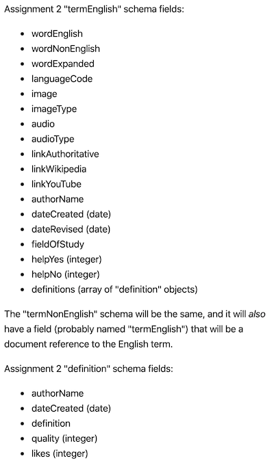

## BTI425 Assignment 2

The purpose or objective of the assignment is to create a substantial Angular app that interacts with a web API.

Read/skim all of this document before you begin work.

Notice:  
This document will be updated over time. This programming assignment is new and has not been done in the past. As a result, we do not yet have complete specifications or an example solution, but we generally know what needs to be done. However, there's enough below for you to begin work. Remember the general advice from the professors at the beginning of the course - work on the assignment regularly over time, and don't leave it to the deadline. 

While you are doing the work, if a *specific task* is not clear, or it seems to require an unreasonable amount of time to complete, or it seems to require knowledge way beyond the content we've covered in the course, please don't hesistate to contact your professor. 

> You should NOT have to search for or locate resources "out there" in an effort to complete this work.  
> The resources provided in this course - notes, linked content, code examples - provide sufficient coverage. Review them frequently.  
> If you think that you will find "the answer" to this assignment somewhere "out there", you're wrong. Use the course resources as your shortcut. 

 

### Due Date

Tuesday, March 24, 2020, at 11:00pm ET

Grade value: 25% of your final course grade

*If you wish to submit the assignment before the due date and time, you can do that.*

 

### Overview and purpose

As noted above, the purpose or objective of the assignment is to create a web API and an Angular app that has good coverage of the topics in the course. 

The app's purpose is to define or translate the English-language terminology we use in the computer programming courses in the School of SDDS, for use by all students, whether or not English is a student's first language. 

We have so many students who are learning English and computer programming at the same time, and that is a challenging combination. The technical terminology is often unclear, complicated, and sometimes isn't explained well. For example, when we say "asynchronous", what does it clearly mean in English, as well as in a student's first language?

The general functionality of the user app will likely include:
* View and browse a list of all terms
* Search for a term 
* View details about a term, and its meaning in English and in a student's preferred or first language 
* Add a new term, including the English definition/data, and a definition/data in another language
* For an existing English term, add a definition/data in another language 
* For an existing term (English or other), add another definition/data

In summary, the app would have some of the utility of a dictionary, Wikipedia, and other resources (including this course's notes and learning resources). 

A web API will hold the data for the app. To enable scale and crowd-sourcing of data, the professors will also publish a web API that will be designed to aggregate (with some programming work done by you) the terms that each student creates in their own app, for the benefit of ALL students.

The web API will be posted to Heroku and Atlas, and will provide the data for the Angular app. The Angular app will also be deployed to a public host (Heroku), so that you can deliver it to other devices (including, for example, your smartphone).  

Here's a diagram that shows the relationships among your browser, the deployed Angular app, and the deployed web API. Right-click and open it in a new tab/window to view it full size. 

 

#### Where this idea came from 

Recently, in our School of SDDS, some of the web programming teachers have decided to use the course sequence (and particularly this course) as a way to create and deliver software that could be used by our School community (students and faculty) and improved over time (by students and faculty). 

A number of app ideas were developed, and this idea was selected to be worked on in the Winter 2020 academic term. 

 

### Getting started, web API

Use `npm init` to initialize a new folder, probably named `a2-web-api`. Alternatively, use a code example from the repo as a base for your project work. 

 

#### Data and schema 

As implied above, data for the app will be generated by you (the student) as you work on the app. 

In addition, the professors will publish a web API that will aggregate and share the data generated by all students. More info about that will be published soon. 

> For testing purposes, plan on adding at least one English term and one non-English term to your own local database.  
> Soon, there will be a way to share your work.  
> The intention is that each student will be able to get access to a substantial collection of data, because the efforts of all 100 students in the course, each creating at least two terms, should result in about 200 sharable terms. 

The database will include at least two collections:
* terms in English 
  * includes an embedded subdocument collection, definitions in English
* terms in other languages 
  * includes an embedded subdocument collection, definitions in other languages

As suggested by this list of collections, a *term* could have zero or more *definitions*. This idea supports alternative or evolving definitions over time. It is implemented as a one-to-many association or relationship that uses the MongoDB "embedded document" technique: In a English term document, it has a field that stores a collection (i.e. an array) of "definition" *subdocuments*.  

> The embedded subdocument must be described by a Mongoose schema.  
> Therefore, the web API will have three Mongoose schemas:  
> 1. definition 
> 2. terms in English (maybe named "termEnglish")  
> 3. terms in other languages (maybe named termNonEnglish")  

Each term collection will have the same data fields:

In addition, an item in the English collection will be associated or related, in a one-to-many manner, with zero or more items in the non-English collection. It is implemented using the MongoDB "document reference" technique: In a non-English term document, it has a field (probably named "termEnglish") that stores an object identifier "reference" to the English term document. 

If you need a reminder about working with the MongoDB database engine, we suggest that you do these tasks:
* Create a database named `db-a2` (database for Assignment 2)
* In `db-a2`, create a collections likely named `TermsEnglish` and `TermsOther`

 

#### Data service tasks 

For each collection, the web API will support all five familiar tasks:
* get all 
* get one (by identifier, and also by other fields)
* add new
* edit existing
* delete item

Write the code to make this happen. Test frequently with Postman. 

When complete, deploy to MongoDB Atlas. 

 

### Getting started, Angular app

Getting started includes generating a new project, and configuring your development environment. 

Make sure that your web API has been deployed to Heroku and Atlas, and make sure that you can interact with it correctly with Postman. This is important, because you must have confidence in the hosted app to make progress on the Angular app. 

Set up the rest of your dev environment (terminal windows, editor, browsers and tools). 

 

### Doing the work, initial 

(more to come)

 
 
 
 
 
 
 
 
 

### Testing your work

For this assignment, there is no required external testing capability. Therefore, rely on your browser tools for this step. 

 

### Deploy the Angular app to Heroku

Follow the guidance in the course notes, and deploy the Angular app to a new Heroku app. 

> Remember to do as noted above...  
> Update your home page component to include two standard HTML hyperlinks:  
> 1. One is the URL to your Heroku-hosted (Angular) app  
> 2. The other is the URL to your Heroku-hosted (DEN) web API 

 

### Grading procedure

Your professor will use a checklist during the grading process. The checklist will include items based on the assignment specifications. No, we will not distribute the checklist before the due date. 

Here's some more comments on the grading procedure:
* Part marks can be earned (it's not an all-or-nothing scheme)  
* Some marks will be earned for the presence of the web API 
* Some marks will be earned for a deployed/hosted Angular app
* Each of the five interaction tasks will earn marks
  * Some tasks could be "worth" more than others

Please review (again) the [information about grades](https://bti425.ca/policies#information-about-grades). To repeat one of its points, you will not earn an "A" simply for meeting a set of specifications. High grades are earned with work that is clearly better than expected (by meeting the specs). Better work includes a range of "qualitative" measures, including code quality, app and/or UI appearance, organization, content formatting, building upon foundations, and so on. 

 

### Reminder about academic honesty

You must comply with the College's academic honesty policy. Although you may interact and collaborate with others, you must submit your own work.

When you are ready to submit your work, you will copy some of the code in your project to plain text files, so that the My.Seneca/Blackboard "SafeAssign" tool can do its job. The next section will tell you which files to copy.

SafeAssign compares your work with that of other current and past students, and with existing works on the web. It uses techniques that are difficult to defeat. The overall goal is to identify copied work. 

  

### Submitting your work

We need both the Node+Express web API and the Angular web app.  

Here's how to submit your work, before the due date and time:

#### Node+Express web API

1. Locate the folder that holds your project files. 

2. Make a copy of the folder. (You will be uploading a zipped version of the copy.)

3. Inside that folder, remove (delete) the `node_modules` folder. Your professor does NOT need that folder. Also, if it has a `.git` folder, remove that too.

4. Still in that folder, add a new folder named "MyCode". Copy these source code files to the "MyCode" folder:  
**The JavaScript (JS) file that holds the "server" code**  
**The JS file that holds the "manager" code**  
**The JS file(s) that holds the "schema" code**  
For each of these files in the MyCode folder, change the file name extension to "txt".

4. Compress/zip the copied folder. Maybe the name should be something like "webapi.zip". The zip file SHOULD be about 1MB in size. If it isn't, you haven't followed the instructions properly.

#### Angular web app 

1. Locate the folder that holds your project files. 

2. Make a copy of the folder. (You will be uploading a zipped version of the copy.)

3. Inside that folder, remove (delete) the `node_modules` folder. Your professor does NOT need that folder. Also, if it has a `.git` folder, remove that too.

4. Still in that folder, add a new folder named "MyCode". Copy these source code files to the "MyCode" folder:  
**to be determined**  
For each of these files in the MyCode folder, change the file name extension to "txt".

4. Compress/zip the copied folder. Maybe the name should be something like "angularapp.zip". The zip file SHOULD be about 1MB in size. If it isn't, you haven't followed the instructions properly.

#### Bundle both of them together

Ideally, bundle both of the zip files from above into a single zip file, maybe named something like "assignment2.zip". Then...

Login to My.Seneca.  
Open the course area.  
Click the "Assignments" link on the left-side navigator.  
Follow the link for this assignment.  
Submit/upload your zip file. The page will accept three submissions, so if you upload, then decide to fix something and upload again, you can do so.

 
