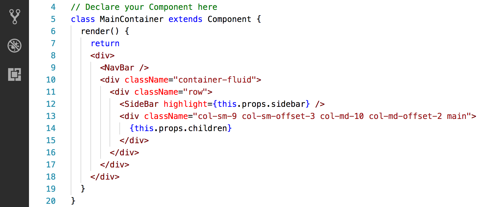
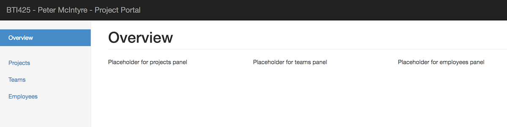
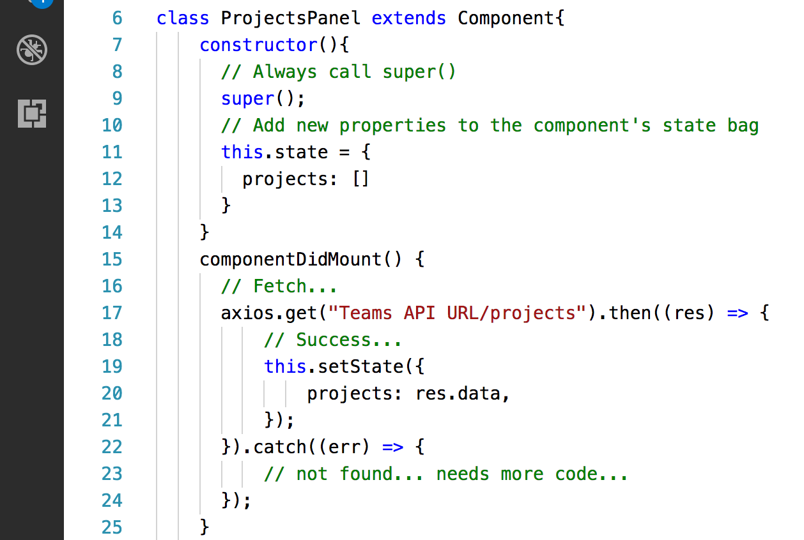
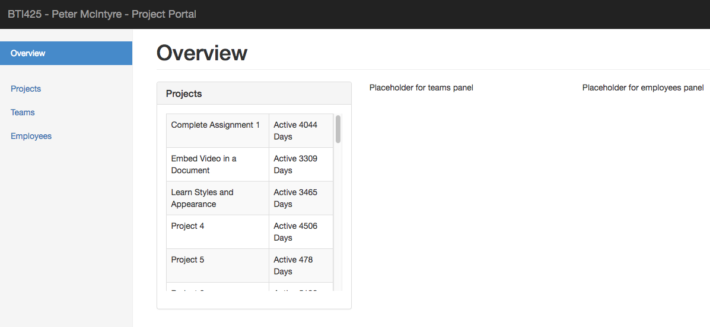
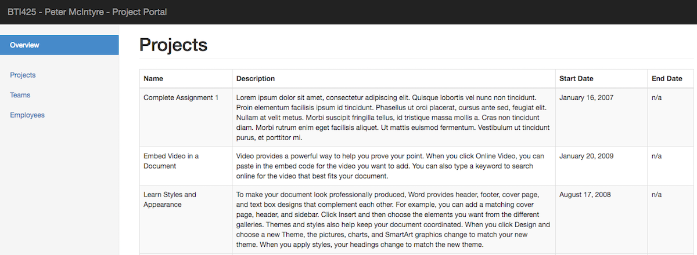

## BTI425 Assignment 2

> This document is substantially complete, and ready to use.  
> A few more images (screen capture samples etc.) will be added, and a few clean-up edits may happen.  
> This notice will be removed when the edits are complete.

The purpose or objective of the assignment is to get some experience with React. 

Read/skim all of this document before you begin work.

<br>

### Due Date

Sunday, February 18, 2018, at 6:00pm ET

Grade value: 10% of your final course grade

*If you wish to submit the assignment before the due date and time, you can do that.*

<br>

### Introduction to the problem to be solved

We need a React app that will display data from the Teams API. The app will have multiple components, and support routing. When finished, the initial or landing-page view of the app will look similar to the following:


<br> 

### Specifications overview and work plan

Here's a brief list of specifications that you must implement:

* Follow best practices, guidance, and recommendations
* Has four data-oriented component views, Overview, Projects, Teams, and Employees 
* Continues to work with your Teams API, using an HTTP request add-in named "axios" 
* Has other structural views (nav header, sidebar, main container, not found)
* Viewing a data-oriented component is implemented by routing
* Display-only, we will not be updating or modifying the data

More details are provided below, in the section titled **"Doing the work"**.

During the Thursday classes/sessions, your professor will help you *get started* and *make progress* on the assignment. 

<br>

### Getting started

Open a terminal window, and navigate to a suitable file system location. We will use the `create-react-app` program to create the folder and its generated code:

```
create-react-app assignment2
```

After it completes, verify that it runs, by using the `npm start` command; it should show the "Welcome to React" view. You can close it, and shut down (Control+C) the process in your terminal window. 

Prepare the rest of your dev environment:
* Code editor
* Browser developer tools (at a minimum, you'll probably be using the element inspector, and the JavaScript console)

<br>

#### Add links to Bootstrap CSS and plugins

Edit `public/index.html`:
1. Add the Bootstrap CSS library link element (CDN version) to the `<head>` element
2. Add the jQuery and Bootstrap JavaScript script elements to the end of the `<body>` element

<br>

#### Add new packages

This app will send requests to your Teams API. React has no built-in way to compose HTTP requests. The React designers leave that to us as programmers. We could use the native `XmlHttpRequest` object, the newer `fetch` API, or any of several libraries. For this assignment, let's use a well-known library named [axios](https://github.com/axios/axios). Using a terminal window (and located in the `assignment2` folder), add axios:

```
npm install --save axios
```

Some of the data in the Teams API is date-and-time oriented. Let's continue to use the [Moment.js](https://momentjs.com) library. In Assignment 1, we referred to it using a content delivery network (CDN). In this assignment, let's add the code:

```
npm install --save moment
```

Finally, we will be creating multiple components, and replacing a large area/rectangle on the view with content from the different components. This will be done with resource URLs, and a feature called routing. The base React library does not include routing; the React designers leave that to us as programmers. We will use the well-known [React Router](https://reacttraining.com/react-router/) library. Add the code:

```
npm install --save react-router-dom
```

<br>

#### Get some "starter" source code files

To help you get started with the appearance of the "Overview" view, we have created some "starter" source code files. On the GitHub code repository, in the `Templates_and_solutions` folder, locate the `a2-source` folder. Inside, there are two source code files. 

The contents of `App.js` from the repo will *replace* the generated code in `App.js` in the new app. 

Similarly, the contents of `index.css` from the repo will *replace* the generated code in `index.css` in the new app. 

After you save your work and restart the app (in your terminal window), the initial view will look similar to the following:


<br>

### Doing the work

This is a three-part procedure:
1. Create simple *component* versions for each view 
2. Update each component to fetch data from the Teams API
3. Implement routing 

We will do this work in three distinct parts, to ensure that you can make progress all during the lifetime of the assignment. It will enable you to build and test/run, and then continue to build on the results. 

<br>

#### Create simple components

Above, you learned that the app needs four data-oriented views (for Overview, Projects, Teams, Employees). 

[In the notes](https://sictweb.github.io/bti425/notes/react-app-design-basics), you learned that a component has a consistent and predictable code structure, as shown here:

```jsx
import React, { Component } from 'react';
// import whatever else you like here

// Declare your Component here
class SomeComponent extends Component{
  render(){
    return (
      <div>Hello World</div>
    );
  }
}

// export the component by name
export default SomeComponent; 
```

Create the "Overview" component first:
* The first source code file will be named `Overview.js`
* Copy the code above, and paste it into the source code file
* Replace the "SomeComponent" name/symbol with `Overview`

Look again at the image example above. You can see that the "overview" view is a container for three other views (projects, teams, employees). Each of these views will display a small amount of data. In our app, we want to use [Bootstrap panels](https://getbootstrap.com/docs/3.3/components/#panels) because they look nice. So, let's assume that each of those is a "panel". 

Therefore, for *each* of the other three views named above, create a new source code file for the component, using the naming format ProjectsPanel, TeamsPanel, and EmployeesPanel. 

Finally, we need some "structural" views, as learned above. Using the technique above, create components with these names:
* NavBar (the top black-background strip)
* SideBar (for left-side links)
* MainContainer (the all-enclosing container for all visible views)
* NotFound (which will be a special version of MainContainer to hold content for a route that does not actually exist)

Before continuing, run (i.e. `npm start`) the app, to ensure that your work is correct. Look at the JavaScript console to ensure that there are no errors. When that happens, shut down the process, so we can continue.

<br>

**General strategy**

For the next while, we'll cut (take) code from `App.js` and paste it into the appropriate component. Before moving on to data-fetching, we'll ensure that your app can render multiple components. 

<br>

**NavBar component**

Take the `<nav>` element code from `App.js`, and paste it in the render function in the NavBar component, replacing the existing "hello world" `<div>` element. 

Modify the navbar brand element by adding YOUR name (so that it's clearly visible when we use the app). 

<br>

**SideBar component**

Take the sidebar `<div>` element code from `App.js`, and paste it in the render function in the SideBar component (replacing, as above...). 

Next, we're going to add some code that will highlight the "active" view. (We are preparing for a future task.) First, the Bootstrap `active` class is used to highlight (or change the appearance) of a currently-active or selected item. For example, here is the first `<li>` element from the sidebar, before and after the `active` class is added:

```html
<!-- Before adding the 'active' class... -->
<li><a href="/projects">Projects</a></li>
<!-- After adding... -->
<li class="active"><a href="/projects">Projects</a></li>
```

We are not yet done, because we do not actually want to hard-code these `<li>` items with the class. Instead, we want to programmatically determine which is active. How? By passing some data to the sidebar component, something that will indicate whether it should be active. (Again, we are preparing for a future task.) 

Therefore, change the hard-coded class with a React expression. For example, here is the first `<li>` element from the sidebar, coded as an expression:

```jsx
// As a conditional expression...
// The value of the 'highlight' property will be passed in...
<li className={(this.props.highlight === 'Projects' ? 'active' : '')}><a href="/projects">Projects</a></li>
```

<br>

**MainContainer component**

As noted above, this component is the all-enclosing container for all visible views. It has the navbar and sidebar components. In the remaining rectangle, it will render - depending on user interaction - one of the other views (overview, projects panel, teams panel, or employees panel). 

Top-to-bottom, the markup will be organized like this:
* `<NavBar>` element (which will resolve to the NavBar component)
* `<div>` "container" element 

Inside the "container" element, we will have the sidebar component, and then the component for the user-selected view. 

Now that you know its organization, do some coding. Using the code in `App.js` to give you hints, write the code. Here's an example of what it may look like:



<br>

Recall from [the notes](https://sictweb.github.io/bti425/notes/react-app-design-basics#the-panels) and the [React documentation](https://reactjs.org/docs/jsx-in-depth.html#jsx-children) that `this.props.children` is a special property. It represents the content (elements and/or text) that are inside the tags. 

To explain, this MainContainer component has content that is known now (the structural/layout divs, and the NavBar and SideBar components). However, it will have more content added in the future, dynamically. That's what `this.props.children` represents. 

At this point in time, we can modify `App.js` again. 

> Suggestion/tip: Before you do the next task, save (or comment out) the current markup in the render method. As you write the panel components below, copying the existing content will save you a bit of time when creating the panel markup structures.

Now that we have the main container component partially done, replace the big block of code with a simpler return value. Something like this:

```jsx
  return (
      <MainContainer>
      </MainContainer>
  );
```

Later, we will modify this again, but this will work for now. At this point in time, here's what the app looks like. Notice that all the panel details (i.e. info about projects, teams, and employees) has disappeared:


<br>

Returning to the discussion about `this.props.children`, this makes sense. There is no content (elements and/or text) inside the MainContainer tags. In the near future, there will be, when we add (for example) the custom `<Overview />` element. At that point in time, the Overview component will be in the `this.props.children` collection, and will render. Interesting, yes?

<br>

**Overview component, again**

Let's return to the coding for the overview component again. When we last worked with it, its render method returned a hello world div. Let's change that, so that it will return placeholders for the panels. 

First, replace the existing div with an empty div, which will be a container. 

Next, add an `<h1>` element to hold the view's title, "Overview". The value of its class attribute will be "page-header". Remember that in JSX, the name of the HTML class attribute is transformed into "className". 

Next, we need another div, and the value of its class attribute will be "row". Again, remember in JSX, "class" becomes "className". 

Inside that div, we can add three more divs. Each will be one-third the width of the viewport (i.e. col-md-4). Inside each, add some placeholder text for each panel. 

Back in `App.js`, import the overview component, and inside the MainContainer element, add the `<Overview />` element. Run the app, and the result may look something like this:



<br>

**ProjectsPanel component**

Your tasks get more interesting and challenging now, and for the remainder of the assignment. Remember to refer to the notes and documentation (for React, add-in libraries, MDN for HTML, CSS, JavaScript, etc.). Don't use Stack Overflow. 

This ProjectsPanel component will be the first one to include code for these three methods:
* constructor()
* componentDidMount()
* render()

It is also probably the first one to need more libraries. Near the top of the source code, right after the first "import React..." statement, add statements to import axios and moment.

The `constructor()` method will define the component's local state/storage properties. We need one property, an empty array for the projects. 

The `componentDidMount()` method will load the data into the projects array. How? It will fetch from your Teams API. This is where you will use the axios library. 

Here's a typical pattern that will get you started:



<br>

Now, we can work on the `render()` method. The content will be rendered in a panel (use some of the code that was cut from `App.js`), and it will be about one-third of the available width. Therefore, let's render only a couple of project properties. One will be the project name, and the other will be the number of days since the project was created. 

The number of days is a calculated value. Use the Moment.js library to generate an integer value. 

In [the notes](https://sictweb.github.io/bti425/notes/react-app-design-basics#rendering-data-in-a-collection), you learned how to render data in a collection. That's what we will do here. Follow the guidance in the notes, and in the documentation. 

Edit the overview component again. Import this projects panel component. Then, replace the placeholder text with the custom element `<ProjectsPanel />`. 

Run the app, and the result may look something like this:



<br>

**TeamsPanel component**

The guidance here will be similar to the ProjectsPanel above. Follow it, and make changes (logic, symbol names, elements, etc.) where necessary and appropriate. 

In the table, render the team name, and the number of employees on the team. 

Run the app, and the result may look something like this:


<br>

**EmployeesPanel component**

The guidance here will be similar to the two panels above. Follow it, and make changes (logic, symbol names, elements, etc.) where necessary and appropriate. 

In the table, render the employee name (nicely, in first name plus last name format, and the employee's job/position/title. 

Run the app, and the result may look something like this:


<br>

#### Add data-fetching to each component

Above, you should have added data-fetching capability to each panel in the overview component. If this was not done, then circle back and add that capability now. 

Above, you created and configured a sidebar component. In our app, we want the bottom-right area of the view (below the navbar and to the right of the sidebar) to be replaced by a new view whenever a user clicks on one of the sidebar items. 

Let's prepare for that now. Above, you created small-area components (ProjectsPanel, TeamsPanel, and EmployeesPanel), so that they could be placed inside the view that's managed by the overview component. Although we could use those here, we instead want larger and more detailed components. 

Before continuing, use the technique you learned above to create and initially configure getting-started versions of three new components:
* Projects
* Teams
* Employees

<br>

**Configuring the new Projects component**

This task will be similar to what you did above in the ProjectsPanel section. In other words, a constructor method and a componentDidMount method will be added, and configured to fetch data from the Teams API. Much of that code can be reused as-is. 

The difference happens when rendering the table. You want to display more columns (and maybe size the columns nicely). 

How can you see the result? We need to configure routing, but that will happen in the next major section. Until then, is there a quick way to view this component? 

Yes. Edit `App.js`. Comment out the custom overview element, and add in this new `<Projects />` element. (Remember to import this new projects component too.)

Run the app, and the result may look something like this:



<br>

**Configuring the new Teams and Employees components**

As you would expect, this task will be similar to the task above (Projects). The only real differences are the fetched data and the rendered table columns. 

<br>

**Configuring the NotFound component**

We will use this view if or when a route is not handled. (Obviously, more about routing is in the following major section.)

Its render method will return a `<MainContainer>` element. Inside that, a suitable header (e.g. h2 maybe) and a bit of text to tell the user that the requested view was not found.

<br>

#### Implement routing

Up until now, we were able to see the results of our work by manually editing `App.js`, and adding custom elements to show each view (overview, projects, teams, and employees). 

In this section, we will add and configure the *routing* feature. The initial work is done in `index.js` - import the router module.

```jsx
import { BrowserRouter } from 'react-router-dom'
```

Then, in the render method, wrap the existing `<App />` element with a new `<BrowserRouter>` element. 

<br>

**Changes in `App.js` and other components**

Until now, the `App.js` render method looked something like this as you wrote code and tested the results:

```jsx
    return (
      <MainContainer>
          {/* <Overview /> */}
          {/* <Projects /> */}
          {/* <Teams /> */}
          {/* <Employees /> */}
          <NotFound />
      </MainContainer>
    );
```

This was OK, as it helped you learn, and helped you make progress in an incremental way. Now, we must **move** the wrapper component "MainContainer" to **each** of the other components (overview, projects, teams, employees, and not found). Do that now before continuing. (It is likely that you can just replace the top-level div element with the MainContainer custom element. Remember to import that component too.) 

Return to editing `App.js`. The next task is similar to what you learned in the [React routing notes](https://sictweb.github.io/bti425/notes/react-routing#appjs):

First, import some classes from the React Router package.

```jsx
import { Switch, Route } from 'react-router-dom';
```

Then, in the render method, create a switch-route hierarchy to implement the routing. Follow the guidance in the notes. 

<br>

**Updating all `<a>` links to use routing instead**

Now, go back to every new (added) component, and look for `<a>` elements that are related to routing. The sidebar will need some work, but there may be others. 

Next, in each component that needs attention, import the "link" class from React Router.

```jsx
import {Link} from 'react-router-dom';
```

Then, replace the link code:

```html
<!-- Old 'a' element... -->
<a href='fooPath'>Foo</a>
<!-- New 'Link' element... -->
<Link to='fooPath'>Foo<Link>
```

<br>

### Testing your work

For this assignment, there is no external testing capability that can be used. 

Therefore, rely on your browser tools for this step. Soon, your professor will help you learn how to use the debugger.

<br>

### Reminder about academic honesty

You must comply with the College’s academic honesty policy.

Although you may interact and collaborate with others, you must submit your own work.

<br> 

### Submitting your work

Here’s how to submit your work, before the due date and time:

1. Locate the folder that holds your project files. 

2. Make a copy of the folder. (You will be uploading a zipped version of the copy.)

3. Inside that folder, remove (delete) the `node_modules` folder. Your professor does NOT need that folder. 

4. Compress/zip the copied folder. The zip file SHOULD be less than 1MB in size. If it isn’t, you haven’t followed the instructions properly.

5. Login to My.Seneca. Open the course area. Click the “Assignments” link on the left-side navigator. Follow the link for this assignment. Submit/upload your zip file. The page will accept three submissions, so if you upload, then decide to fix something and upload again, you can do so.

<br>
