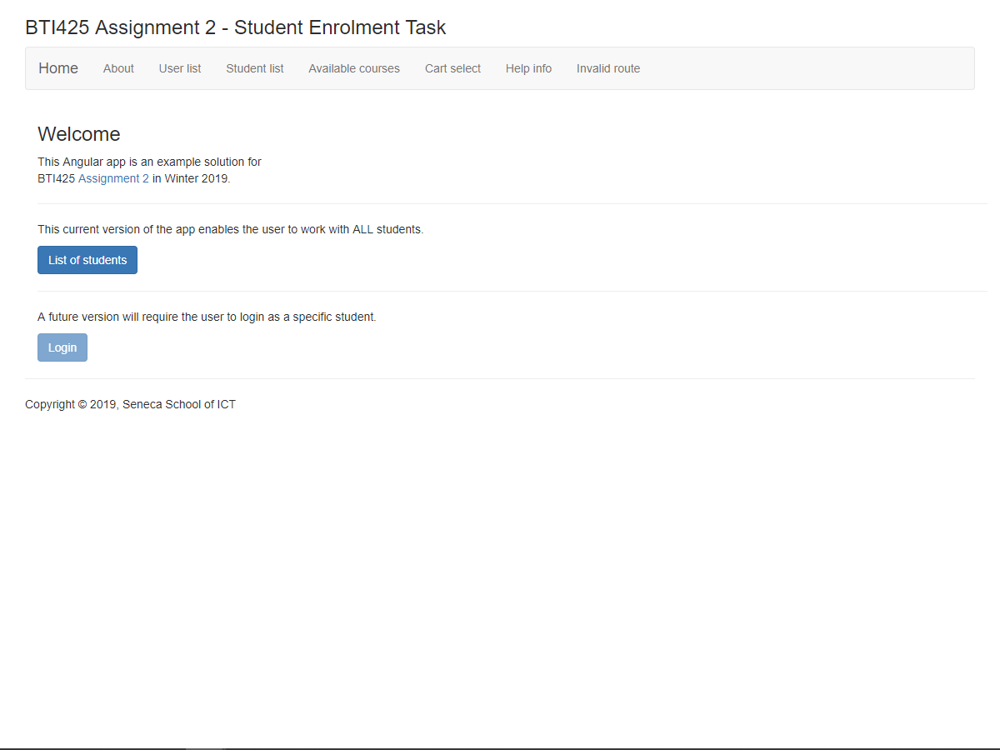
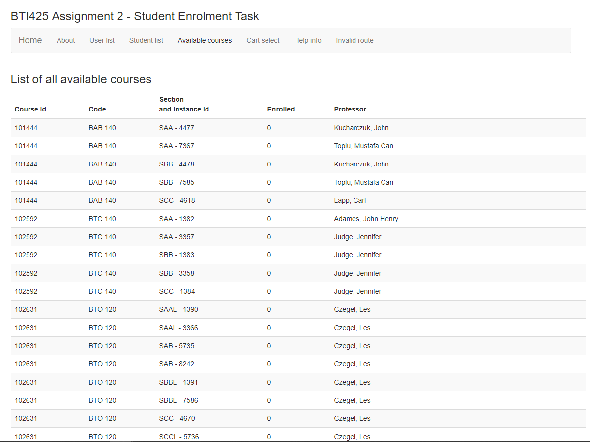
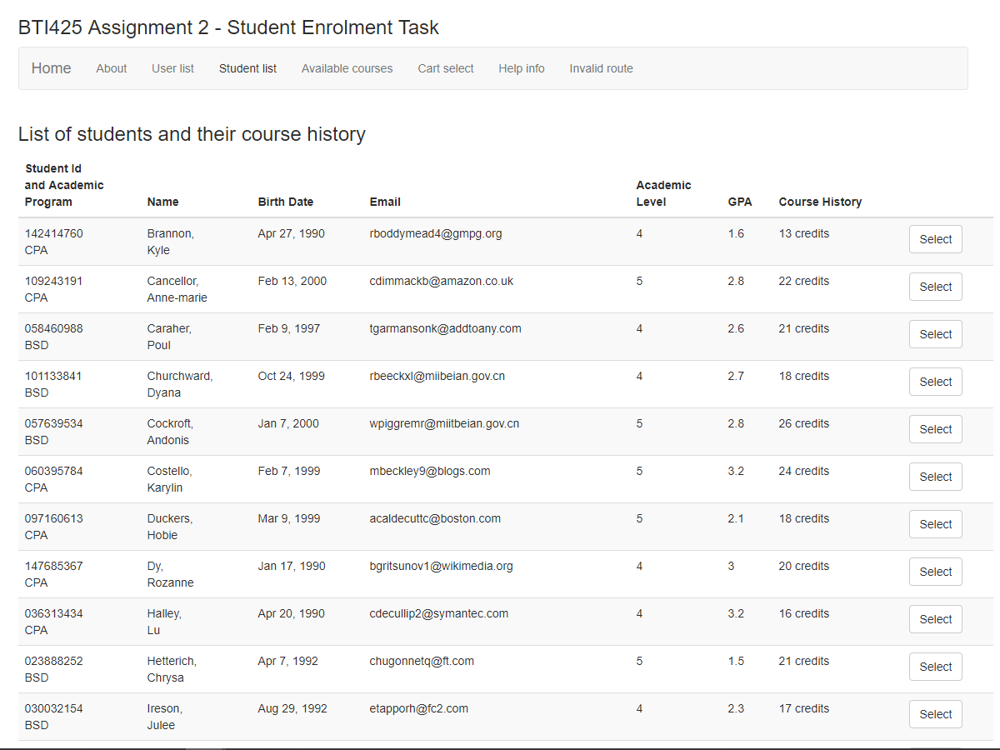
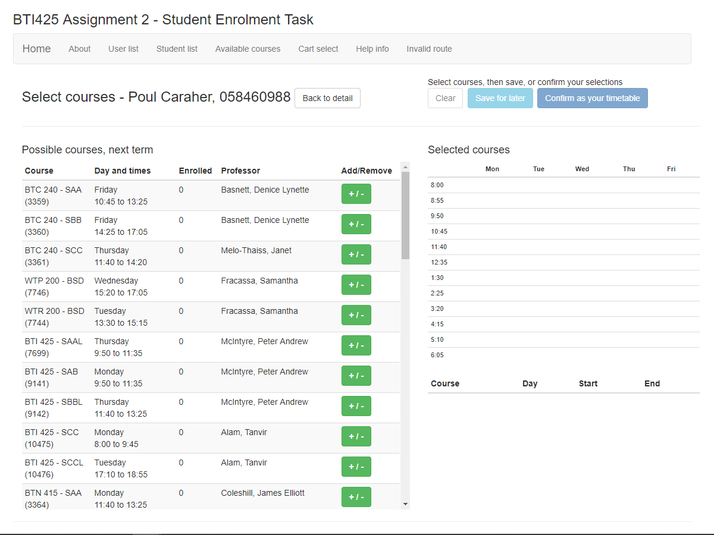
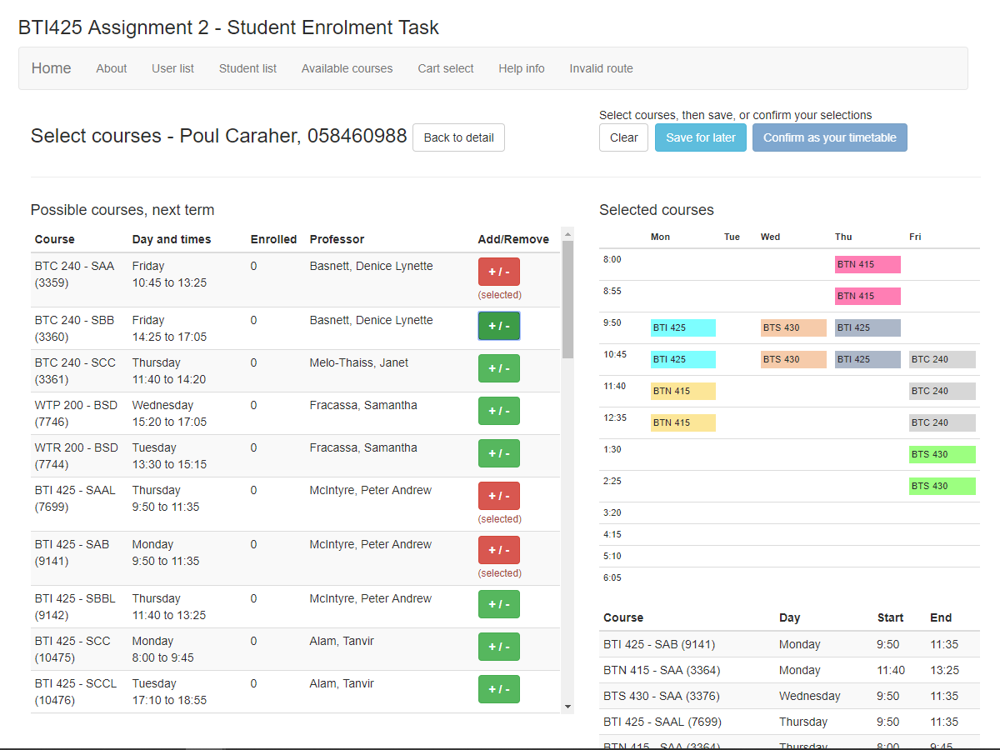
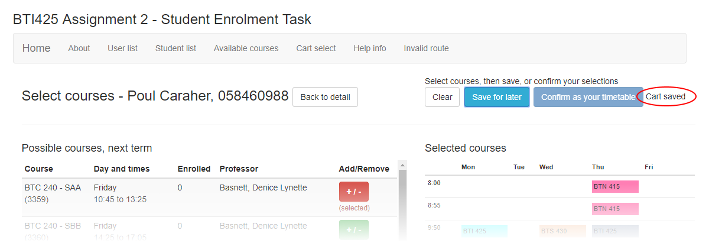
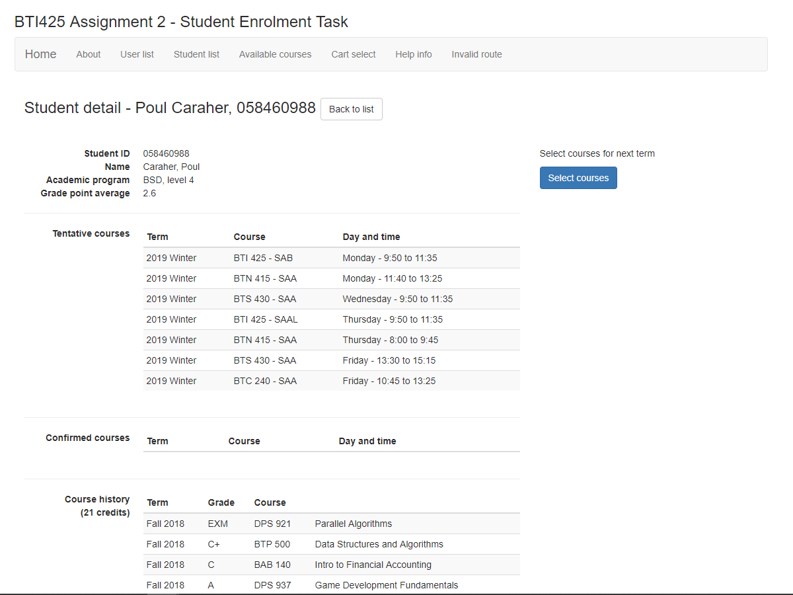
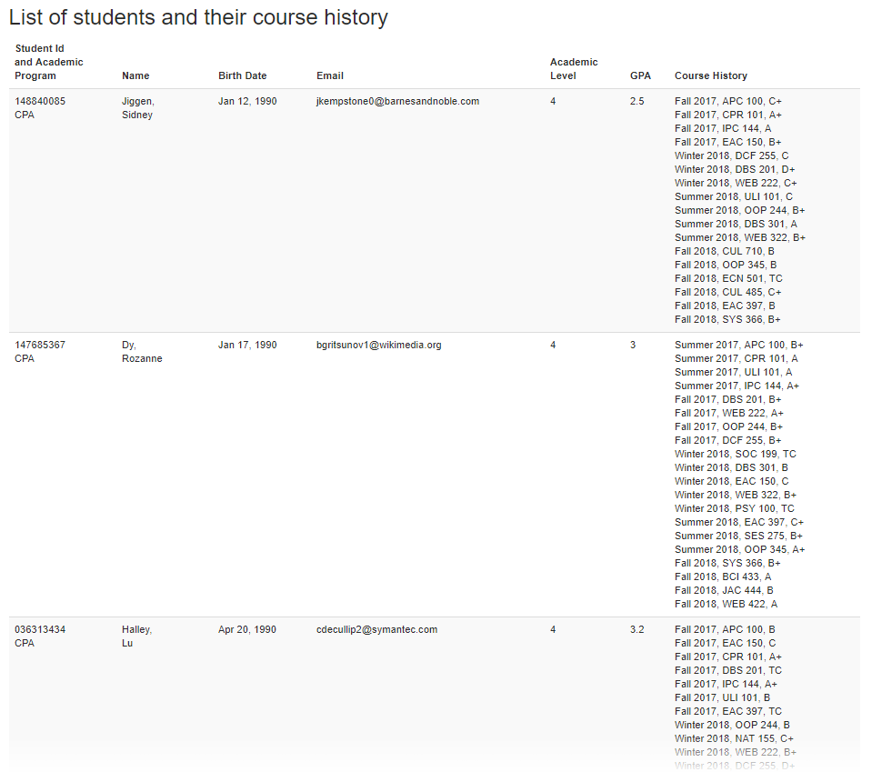

## BTI425 Assignment 2

The purpose or objective of the assignment is to create a substantial Angular app.

Read/skim all of this document before you begin work.

While you are doing the work, if a *specific task* is not clear, or it seems to require an unreasonable amount of time to complete, or it seems to require knowledge way beyond the content we've covered in the course, please don't hesistate to contact your professor. 

> You should NOT have to search for or locate resources "out there" in an effort to complete this work.  
> The resources provided in this course - notes, linked content, code examples - provide sufficient coverage. Review them frequently.  
> If you think that you will find "the answer" to this assignment somewhere "out there", you're wrong. Use the course resources as your shortcut. 

<br>

### Due Date

Sunday, March 31, 2019, at 11:00pm ET

Grade value: 25% of your final course grade

*If you wish to submit the assignment before the due date and time, you can do that.*

<br>

### Overview and purpose

As noted above, the purpose of objective of the assignment is to create a substantial Angular app that has good coverage of the topics since we started working with this app dev platform. 

The theme of the app is to perform a task that's similar to the *new academic term course enrolment* process. Current students use the student center app to do this task. The professor team thought it would be interesting to implement some of this here. 

The app will be deployed to a public host (a Heroku endpoint), so that you can deliver it to other devices (including, for example, your smartphone).  

Notably, the app will use a *new* web service, also posted to Heroku and Atlas. The web service should be your first work task and completion goal. 

Looking to the future, it is possible that the final Assignment 3 will build upon the work done in this Assignment 2, by adding security-aware capabilities and safe-coding techniques. 

<br>

#### A guided tour of the app

If you wish to interact with the app, the professor-created example solution is publicly available:

[https://pam-2019-a2app.herokuapp.com](https://pam-2019-a2app.herokuapp.com)

Right-click any image below to open it full-size in a new tab or window. 

The landing page of the app enables the user to view a menu of tasks. 



<br>

A list of all possible courses (for all academic programs) can be viewed. 



<br>

A list of students can be viewed.



<br>

Select any student to view details and begin working with the enrolment task. Notice the "Tentative courses" list is empty. It is intended to show a list of selected courses that have not yet been added to the timetable. Also notice the empty "Confirmed courses" list. After viewing, click/tap the "Select courses" button. 


<br>

The "shopping cart" appears. 

On the top, some task buttons are available. 

On the left, a *customized* list of possible courses for that student is shown. It is built based on the student's prerequisites (from the course history). The add/remove button will add (or remove) a course to/from a "selected courses" list. 

On the right, the selected courses appear in a timetable grid, and in a standard list format. 

> Your professor will provide you with a ready-to-use component for the grid and the list. 



<br>

Interact with the list, and add/remove some courses. Notice that the selections appear on the right. 



<br>

After you're happy with the result, click/tap the "Save for later" button. It will do that, and show you a message. 



<br>

When you're happy with the result, return to the student detail page, and the selected courses will appear. 



<br>

> The "confirm" task will be posted soon.

<br>

### Getting started

Getting started includes generating a new project, and configuring your development environment. 

Use `ng new...` to generate a new project, probably named `assign2`. 

> Alternatively, make a copy of the repo's Week 10 `forms-validation-intro` code example, and modify that.

Set up the rest of your dev environment (terminal windows, editor, browsers and tools). 

<br>

### Doing the work, initial 

We work on two code bases:
1. The web service/API 
2. The Angular web app 

Before we do the web service/API work, get familiar with the data. 

During Week 8, your goal should be to start getting comfortable with the assignment's data model. We will have multiple entity collections, with some related data. As a result, it will be more substantial than the single-entity web service that you built in Assignment 1. 

To support this learning, get the `assign-2-data-student-v1.json` data file from the Week 8 folder of the code repository. Study its structure. Notice the following:
* It is a collection of "student" objects 
* Each "student" object has a number of data properties 
* One of its properties is "credits", which is a collection of courses a student has passed (this is a "course history")

Then, edit a component (new or existing) your Angular app to display the data in a simple table, as shown below. The contents of the JSON data file can be the value of a new class-level property - that's the easiest way to materialize the data without yet having to create a database or a web service. 



After it shows the results you want, you can throw away this "testing" code.

The Week 8 folder also includes courses-related data file, `assign-2-data-courses-available-v2.json`. Study its structure. Notice the following: 
* It is a collection of "available course" objects 
* Each "course" object has a number of data properties 
* Data for both the "2018 Fall" and "2019 Winter" terms are included (although we will use only the "2019 Winter" items)
* One of the properties is "prerequisite", which is a collection of strings that are course codes 

Similar to above, it would be a good idea to work with the courses data. You could either show/display the data in an Angular component, or you could use Node.js. The code repo has a `a2dataquerytests.js` source code file that you can edit and execute at the command line. It will enable you to become familiar with the course data. 

<br>

### Web service/API starter tasks

In this section, the web service/API starter tasks are discussed. 

<br>

#### Import each JSON data file into a MongoDB Atlas collection

As noted above, there are data files for "students" and "available courses". 

Import each JSON data file into a MongoDB Atlas collection. Use the command-line `mongoimport` program to do this task. Get the command text from the MongoDB Atlas console. We suggest that you paste the text into a text editor, so that you can edit and prepare the command before you attempt to execute it. 

> Remember to add the `--jsonArray` option to the command

<br>

#### Write a schema class for each collection

The guidance now is to create a separate source code file for each Mongoose schema class. We suggest a naming convention for the source code files, by using a prefix "msc-" (the initials for Mongoose schema class). That way, you can tell at a glance the purpose of the source code file. For example:
```
msc-student.js
msc-course.js
```

The data members of both schema classes will be strings or numbers mostly. Make sure the properties that have date and time info are stored as strings. 

Notice that the student data has an embedded collection of course history credits. Therefore, create another source code file to define a "credit" class:
```
msc-credit.js
```

In the student schema class, near the top, "require" the credit schema class like this:
```js
// Get the schema for the embedded/referenced document
var Credit = require('./msc-credit');
```

Then, in the student schema class, the property can be defined like this:
```js
credits: [Credit]
```

In the `manager.js` code, when you define a constant for each schema class, you can "require" the student schema class, but you don't need to "require" the credit schema class, because it will be inherited by the above action.

Notice that the course data has an embedded collection of prerequisite (course codes). The property can be defined as an array of type String.

<br>

#### Add functions/methods to `server.js` and `manager.js` 

We suggest that you create functions/methods that will deliver:
* all students
* one specific student, fetched by its unique MongoDB identifier
* all courses
* one specific course, as above 

We also suggest that you create two additional functions/methods:
* all courses in the BSD program in the Winter 2019 term 
* all courses in the CPA program in the Winter 2019 term

Doing this will enable a smaller result set to be delivered to the requestor. How should this be coded?

Recently, you were introduced to the "get some, filtered" Mongoose query. You learned that you can pass a JavaScript object to the `find()` method; the object has name-value pairs that represent the filter criteria. For example, your code will end up looking something like this:
```js
Courses.find({ academicProgram: 'some-string', term: 'some-string' })
  // This will find all that match BOTH criteria
```

Test your work using Postman, before moving on to the Angular app coding. 

Then deploy the web service/API to Heroku. 

<br>

### Angular web app starter tasks

In this section, the Angular web app starter tasks are discussed. 

<br>

#### Consistent layout 

We must have a consistent and functional visual layout. Therefore, the first task is to create a layout, or a structure. You can use the guidance in the [Angular component interaction](https://github.com/sictweb/bti425/tree/master/Week_07) code example (in the repo). Customize the "template" so that your name appears in the header area of the viewport. Make sure that there is a navigation scheme. 

Also, make sure there is a "home" component, and a "not found" component. 

<br>

#### Components to support the app's purpose

As suggested by the guided tour above, a number of components are needed. Create them now. Here's what we suggest:

* Course list - shows all available courses in a table/list 
* Course detail - for one specific course 
* Student list - shows all available students 
* Student detail - for one specific student
* Shopping cart - to enable selection of courses for a student

> Your professors will provide three additional cart-related components.  
> They will enhance the shopping cart experience.  
> More information is provided below. 

<br>

#### Routing

As suggested by the guidance and topic coverage, configure and test the routing feature. 

Remember to configure a "home" component and route, and a "not found" component and route. 

Make sure you think about then implement some appropriate navigation elements in your app. For example, a "list" view will probably include link elements to "details". And, a "details" view will probably include a link element to "go back" to the "list". This is a general statement, and your app needs may vary. 

The "home page" component, as a landing page for the app, will state the app's purpose. *More importantly*, it will include two standard HTML hyperlinks:
1. One is the URL to your Heroku-hosted (Angular) app 
2. The other is the URL to your Heroku-hosted <u>M</u>ongoDB + <u>E</u>xpress.js + <u>N</u>ode.js (MEN) web service 

Like the professor's publicly-posted example solution, we also suggest that you add two links to the home page. One link points to the student list. The other will be used for a future "login" task (and it can be rendered as a disabled button for now).

> Your professor needs the URL to your hosted Angular app so that it can be tested on a standard computer browser and on a smartphone or tablet.  
> The URL to your hosted web service is needed too, so that your professor can interact with it using Postman.

<br>

### Doing the work, detail

As a follow-up to your recent work (above) with the web service/API, edit the components that will display students and courses, all (in a list) and one (as detail). 

The student detail component should probably show/list the course history credits. It should also have a navigation element that will display the (shopping) "cart". (We'll discuss the "cart" component soon.)

<br>

#### Cart component

This is the most interesting component, with new features. 

Think of it as a kind of "student detail" page, but with special functionality. 

As you can see in the example solution, it displays data for a specific student, and a list of courses that a student can select. It also offers tasks (save selections, confirm as timetable). 

On the right side of the example solution, a timetable "grid" shows the day-and-time of the selected courses. Below that, a list of selected courses appears. *Both these areas are components, and will be provided by your professors.* 

Here is some guidance that will help you build this component. 

##### Routing and the component

One decision we must make concerns routing. Assuming that the "student detail" component is located here:
```
/student/detail/:id
```

How should we get to the cart? Should we do the following? We know that it would work (if we did the usual coding tasks):
```
/student/cart/:id
```

As an alternative, we are suggesting that we store the student object in the service, and use it to maintain "interaction state". This was discussed [early in the course](https://bti425.ca/notes/intro-web-services). The benefit is that we would have a simple URL like the following that does not expose any student-specific identifier/data:
```
/cart
```

How does this all work? Well, in point form, this is how we can do it:
* Define a property in the service, to hold a student object 
* When the student detail component loads (`ngOnInit`), it also saves/stores the student object to the property in the service 
* When the cart component loads (`constructor`), it attempts to get the student object from the property in the service 
* If successful, it copies it to a local "student" property 
* Otherwise, it does a programmatic navigation to the student list

> We could do the same task in the "student detail" component too.  
> It's not required for the assignment, but it's something to think about.

##### Properties in the component 

We suggest creating three array properties. Each will hold a collection of course objects. 

A "courses possible" array is intended to hold the results of a query to the service (and then on to the web API) for all Winter 2019 courses in an academic program. The contents of this array will NOT be displayed/rendered - it is used as in-memory data. 

> This collection starts out empty, and is filled in as a result of a call (to the web API) made in the `ngOnInit` method. 

A "courses matched" array is intended to hold the results of a matching task. Each item in the "courses possible" array will be inspected, and if it is determined that the student will be able to select the course, it is copied (i.e. push) to this "courses matched" array. The contents of this array WILL be rendered in the user interface. 

> This collection starts out empty, and is filled in as a result of a call to a matching function, which we must write. 

A "courses selected" array is intended to hold the results of a user interaction task. In the user interface, a user will select one of the displayed courses (from the "courses matched" collection above), and it will be copied to this "courses selected" array. 

> This collection starts out empty, and is filled in as a result of user interaction. 

A property to hold the current student object is also needed, as described in the previous section. 

##### Initialization 

As described earlier, we need the student object:
* When the cart component loads (`constructor`), it attempts to get the student object from the property in the service 
* If successful, it copies it to a local "student" property 
* Otherwise, it does a programmatic navigation to the student list

We also need the "courses possible" data, so we get this in `ngOnInit`. When the data comes in, we save it in the property. Then, we call a new function (that we must write) to filter the "courses possible" collection into a smaller "courses matched" collection that is customized for the specific student. 

Do you think you need an algorithm to build the "courses matched" collection? If yes, try this:

```js
courseMatch(): void {

  // For each possible course...
    // Continue only if the enrol total is less than 4
      // Do we have a course history credit for this course?
      // If yes, continue
        // Look for a match of ALL prereqs...
        // If we have ALL prereqs in the course history...
          // Add course to the "courses matched" collection

  // Optional - clean up the time string by removing 
  // the seconds data (e.g. 13:30:00 becomes 13:30)
}
```

A comment about the "Look for match of ALL prereqs": The logic is a bit easier if we set a boolean "flag" (to "true") before we look at each prerequsite. Then, as we inspect each prerequisite, and we find one that's missing, we can change the "flag" to false. After finishing looking at all the prerequisites, the "flag" is used to determine whether we add the course to the "courses matched" collection.


<br>  
<br>  
<br>  
<br>  
<br>  
<br>  


### Testing your work

For this assignment, there is no required external testing capability. Therefore, rely on your browser tools for this step. 

<br>

### Deploy the Angular app to Heroku

> Note - Above, you will deploy the web service to Heroku and Atlas.

[Follow the guidance in the course notes](/notes/react-heroku-deploy), and deploy the Angular app to a new Heroku app. 

> Remember to do as noted above...  
> Update your home page component to include two standard HTML hyperlinks:  
> 1. One is the URL to your Heroku-hosted (Angular) app  
> 2. The other is the URL to your Heroku-hosted (MEN) web service 

<br>

### Grading procedure

Your professor will use a checklist during the grading process. The checklist will include items based on the assignment specifications. No, we will not distribute the checklist before the due date. 

Here's some more comments on the grading procedure:
* Part marks can be earned (it's not an all-or-nothing scheme)  
* Some marks will be earned for the presence of the web service 
* Some marks will be earned for a deployed/hosted Angular app
* Each of the five interaction tasks will earn marks
  * Some tasks could be "worth" more than others

Please review (again) the [information about grades](https://bti425.ca/policies#information-about-grades). To repeat one of its points, you will not earn an "A" simply for meeting a set of specifications. High grades are earned with work that is clearly better than expected (by meeting the specs). Better work includes a range of "qualitative" measures, including code quality, app and/or UI appearance, organization, content formatting, building upon foundations, and so on. 

<br>

### Reminder about academic honesty

You must comply with the College's academic honesty policy. Although you may interact and collaborate with others, you must submit your own work.

When you are ready to submit your work, you will copy some of the code in your project to plain text files, so that the My.Seneca/Blackboard "SafeAssign" tool can do its job. The next section will tell you which files to copy.

SafeAssign compares your work with that of other current and past students, and with existing works on the web. It uses techniques that are difficult to defeat. The overall goal is to identify copied work. 

<br> 

### Submitting your work

We need both the Node+Express web service and the Angular web app.  

Here's how to submit your work, before the due date and time:

#### Node+Express web service

1. Locate the folder that holds your project files. 

2. Make a copy of the folder. (You will be uploading a zipped version of the copy.)

3. Inside that folder, remove (delete) the `node_modules` folder. Your professor does NOT need that folder. Also, if it has a `.git` folder, remove that too.

4. Still in that folder, add a new folder named "MyCode". Copy these source code files to the "MyCode" folder:  
**The JavaScript (JS) file that holds the "server" code**  
**The JS file that holds the "manager" code**  
**The JS files (multiple) that hold the "schema" code**  
For each of these files in the MyCode folder, change the file name extension to "txt".

4. Compress/zip the copied folder. Maybe the name should be something like "assign2webservice.zip". The zip file SHOULD be about 1MB in size. If it isn't, you haven't followed the instructions properly.

#### Angular web app 

1. Locate the folder that holds your project files. 

2. Make a copy of the folder. (You will be uploading a zipped version of the copy.)

3. Inside that folder, remove (delete) the `node_modules` folder. Your professor does NOT need that folder. Also, if it has a `.git` folder, remove that too.

4. Still in that folder, add a new folder named "MyCode". Copy these source code files to the "MyCode" folder:  
**App.js**  
**The JS file that holds the (to be determined) component**  
**( more to come )**  
For each of these files in the MyCode folder, change the file name extension to "txt".

4. Compress/zip the copied folder. Maybe the name should be something like "assign2app.zip". The zip file SHOULD be about 1MB in size. If it isn't, you haven't followed the instructions properly.

#### Bundle both of them together

Ideally, bundle both of the zip files from above into a single zip file, maybe named something like "assignment2.zip". Then...

Login to My.Seneca.  
Open the course area.  
Click the "Assignments" link on the left-side navigator.  
Follow the link for this assignment.  
Submit/upload your zip file. The page will accept three submissions, so if you upload, then decide to fix something and upload again, you can do so.

<br>
