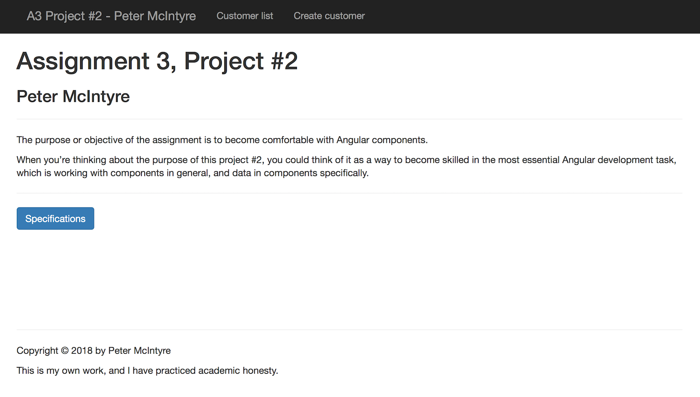
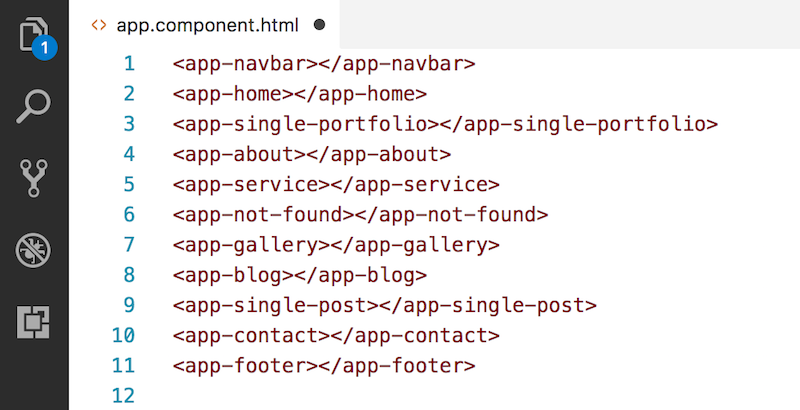
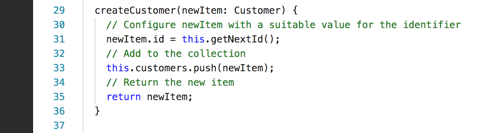
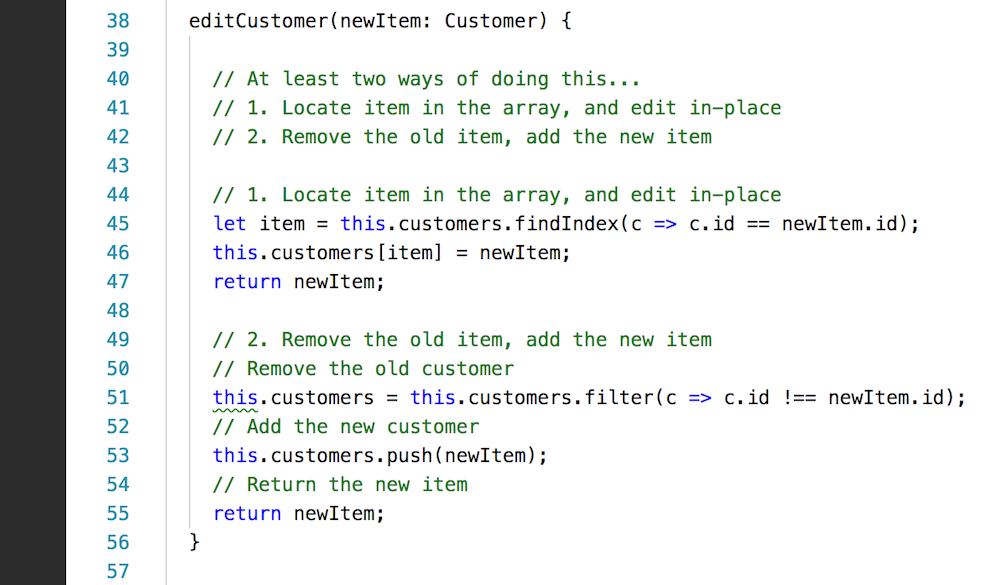
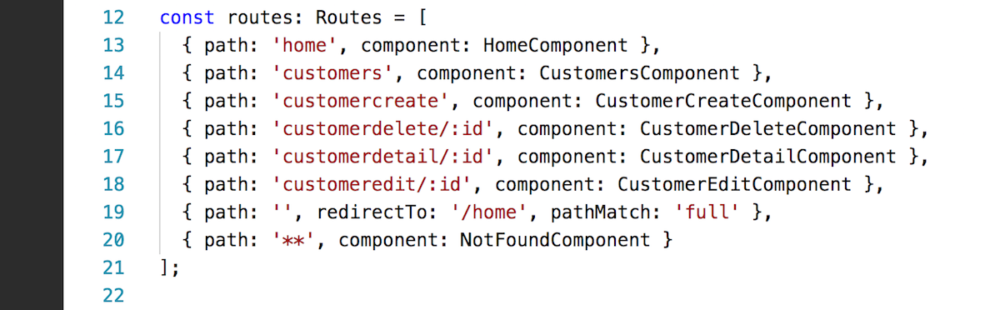

## Assignment 3 checklist

Compare your work to this sample solution. You can right-click any image and open it in its own tab/window to view it full-size.

<br>

### User interaction and appearance

U1, both projects. Title/landing page looks OK, and has nav menu.<br>Customized content includes student's name.


<br>



<br>

U5, project 2. Create, edit, and delete tasks work and have nice appearance (UI is clear and understandable).

In other words, users know what choices are available to them, because they are shown as text, links, buttons, etc. 

<br>

### Program design and coding

C1, project 1. App component template includes elements for all components.



<br>

C2, project 1. On-page hyperlinks (# and id), no hyperlinks to ".html" pages.

For example, nav component template would have this hyperlink:

```html
<a href="#service">Service</a>
```

And, the target in the service component template would have this identifier:

```html
<p id="service"></p>
<!-- ...or... -->
<div id="service"></div>
```

C4, project 2. Data manager "delete" method uses array <code>filter()</code> method.


<br>

C5, project 2. Data manager "create" method is logically correct (similar to the example).



<br>

C6, project 2. Data manager "edit" method is logically correct (similar to the example).

(Comment out one of the code blocks before you attempt to compile.)



<br>

C7, project 2. In the app routing module, all route objects are defined, in the right sequence.



<br>
