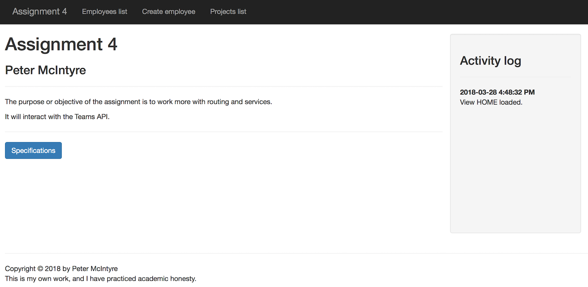
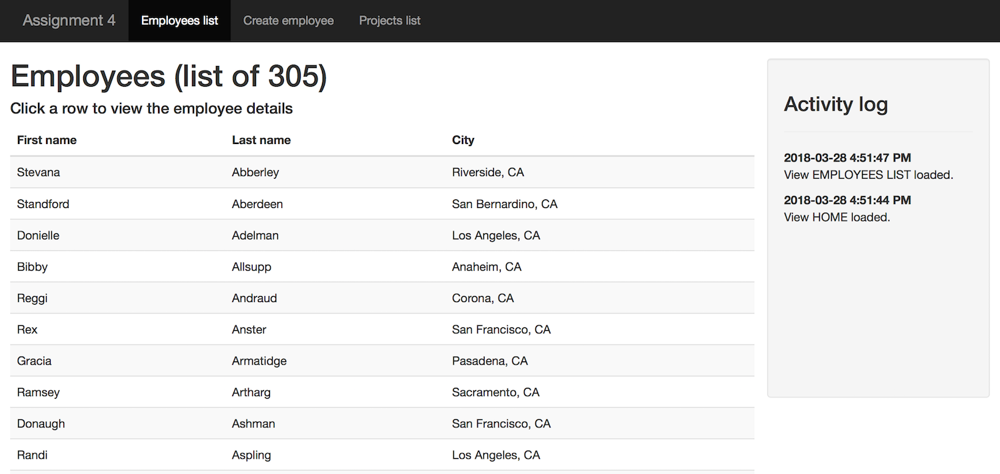
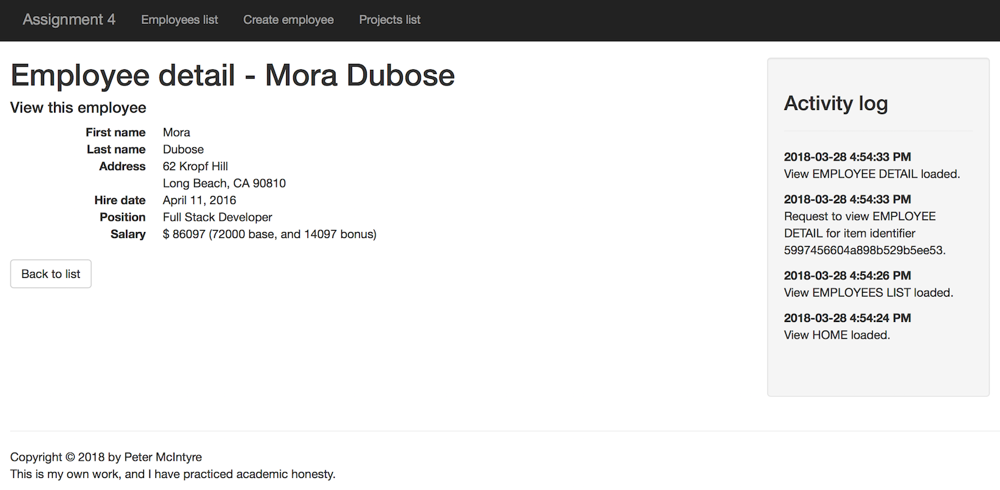
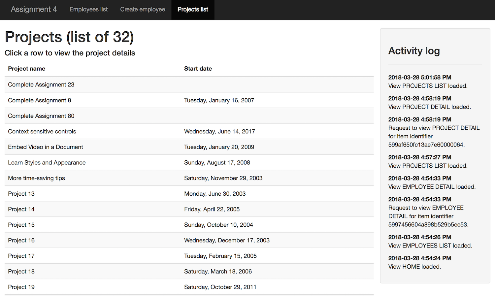
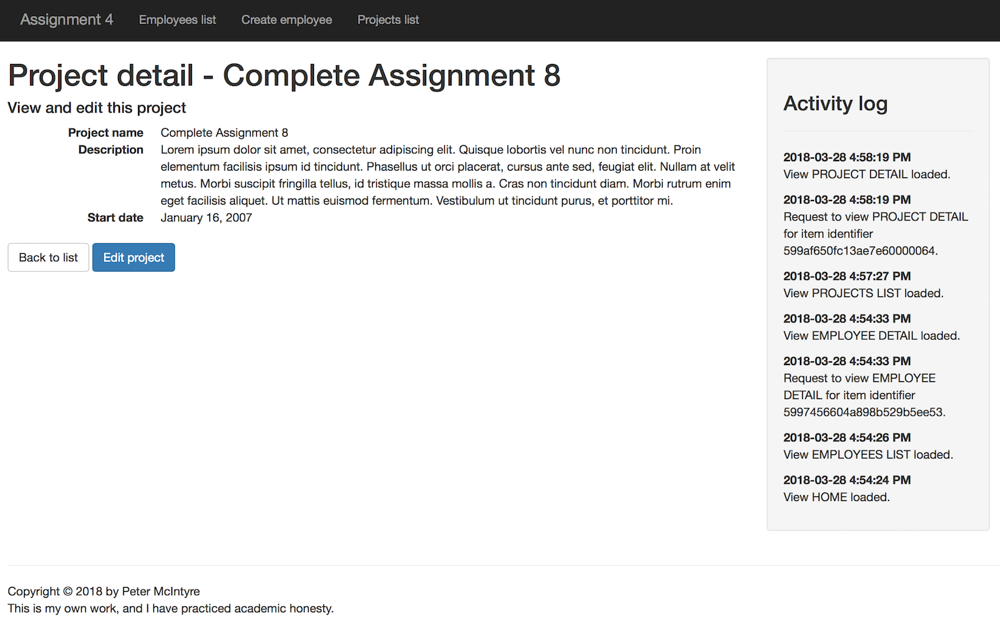
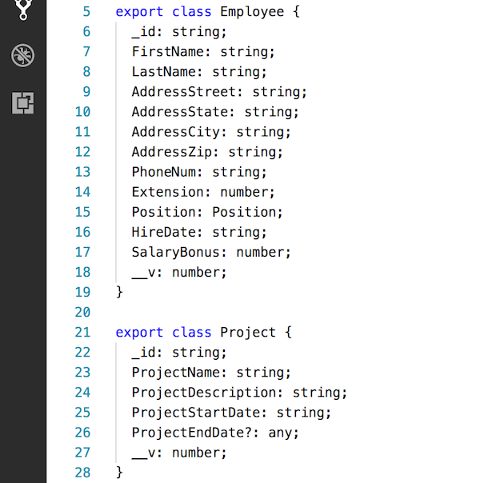
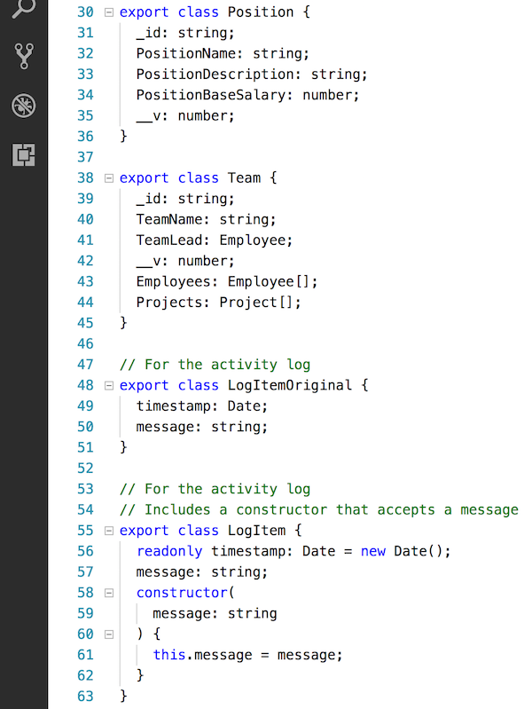
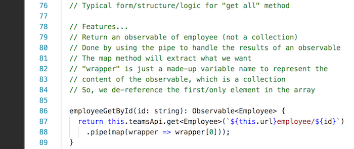
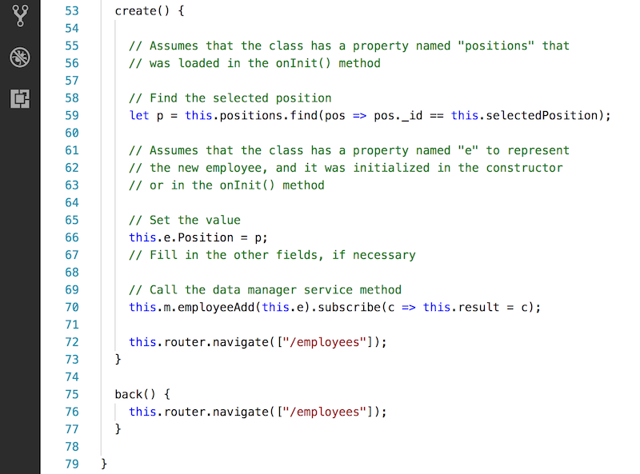

## Assignment 4 checklist

Compare your work to this sample solution. You can right-click any image and open it in its own tab/window to view it full-size.

<br>

### User interaction and appearance

**U1.** Title/landing page looks OK. Includes student name. Appearance shows thought and care.



<br>

**U2.** Employee <i>get-all</i> and <i>get-one</i> views work and look OK. Data sorted or nicely-formatted.



<br>



<br>

**U4.** Project <i>get-all</i> and <i>get-one</i> views work and look OK. Data sorted or nicely-formatted.



<br>



<br>

### Program design and coding

**C1.** Route objects correctly declared, in the right sequence.

Empty and not found routes are at the end of the array.

<br>

**C2.** Data/schema classes are declared correctly, with the right types.



<br>



<br>

**C3.** Clearly and appropriately-named HttpClient ojbect. Private string field to hold the URL to the Teams API.

For example:
```ts
// Example constructor parameter
private teamsApi: HttpClient
// ...or...
private http: HttpClient

// Example url string
private url: string = 'https://my-teams-api.herokuapp.com/';
```

<br>

**C4.** Data manager service <i>get-all</i> methods have the appropriate general form/structure/logic.

```ts
// Typical form/structure/logic for "get all" method

employeeGetAll(): Observable<Employee[]> {
  return this.teamsApi.get<Employee[]>(`${this.url}employees`);
}
```

<br>

**C5.** Data manager service <i>get-one</i> methods have the appropriate general form/structure/logic.



<br>

**C7.** In the "create employee" component, the <i>create</i> method code has the appropriate general form/structure/logic.



<br>
