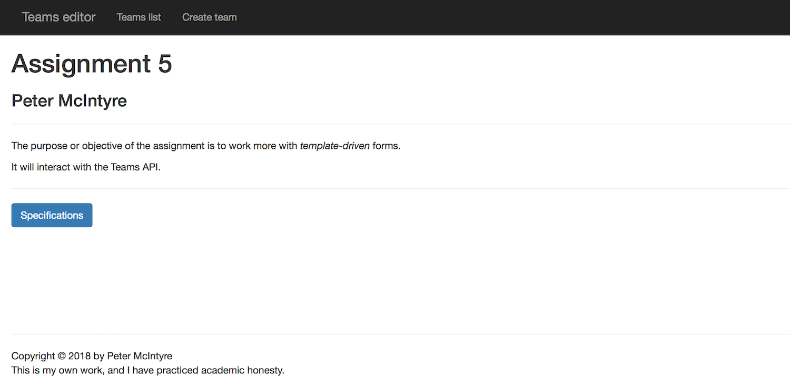
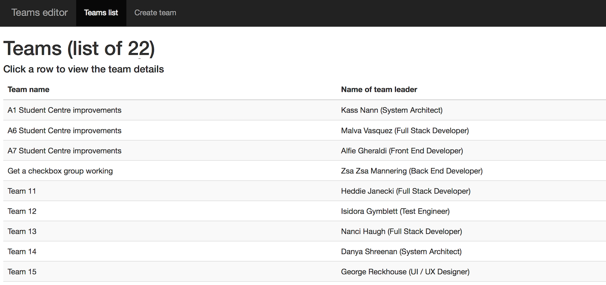
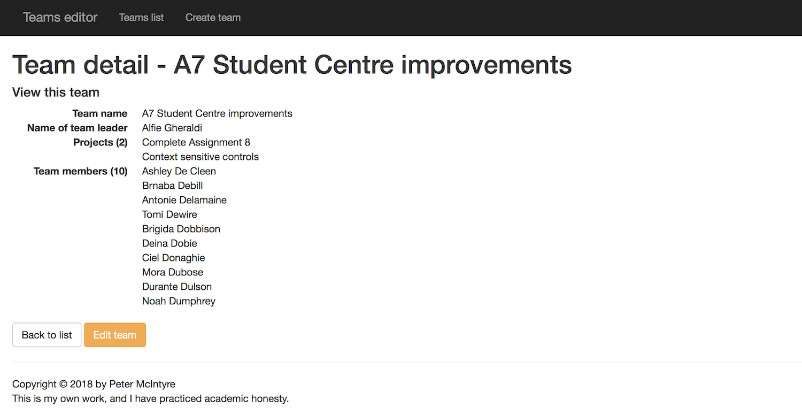
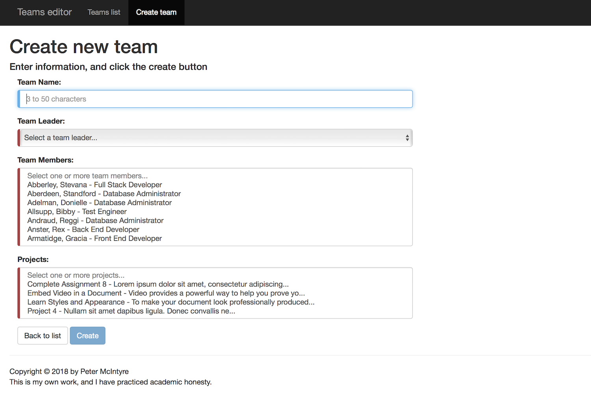
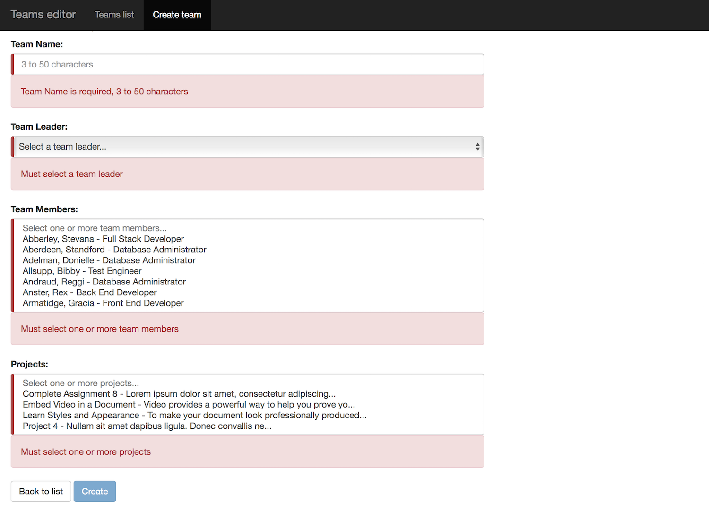
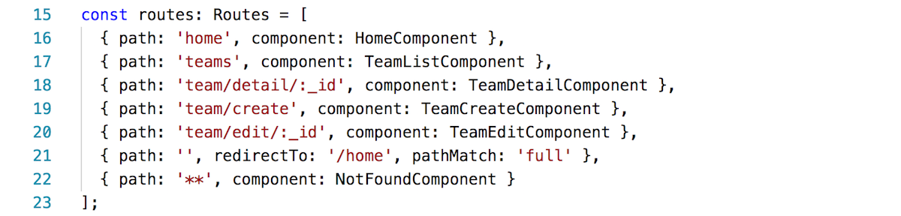

## Assignment 5 checklist

Compare your work to this sample solution. You can right-click any image and open it in its own tab/window to view it full-size.

<br>

### User interaction and appearance

**U1.** Title/landing page looks OK. Includes student name. Appearance shows thought and care.



<br>

**U2.** Team <i>get-all</i> view works and looks OK. Data sorted or nicely-formatted.



<br>

**U3.** Team <i>get-one</i> view works and looks OK. Data includes <i>Projects</i> and <i>Team members</i>, and is nicely-formatted.



<br>

**U4.** Team <i>add-new</i> view works and looks OK:
* View loads with autofocus cursor in the team name field
* Team leader drop-down has "select..." prompt
* Data is loaded in ALL item-selection elements
* Submit button is disabled when the form loads



<br>

**U5.** Validators work correctly, and look nice/appropriate: 
* Team name - required, field length limits 
* Team leader - required 
* Team members - at least one required
* Projects - at least one required



<br>

### Program design and coding

**C1.** Route objects correctly declared, in the right sequence.

Empty and not found routes are at the end of the array.



<br>

**C2.** The data manager service has a clearly and appropriately-named HttpClient ojbect. Private string field to hold the URL to the Teams API.

For example:
```ts
// Example constructor parameter
private teamsApi: HttpClient
// ...or...
private http: HttpClient

// Example url string
private url: string = 'https://my-teams-api.herokuapp.com/';
```

<br>

**C3.** Data manager service <i>add-new</i> method has the appropriate general form/structure/logic.

```ts
// Post, then...
// extract the value of the 'message' key-value pair,
// and return that as the response
teamAdd(newItem: Team): Observable<any> {
  return this.teamsApi.post<any>(`${this.url}teams`, newItem)
    .pipe(map(wrapper => wrapper.message));
}
```

<br>

**C4.** Angular template-driven forms are declared correctly in the app module.

```ts
// In app.module.ts, near the top
import { FormsModule } from "@angular/forms";

// Then, in the NgModule decorator's "imports" array
@NgModule({
  declarations: [
    // etc.
  ],
  imports: [
    FormsModule,
    // etc. 
  ],
  // etc.
})
export class AppModule { }
```

<br>

**C5.** In the "create team" component class, these properties (or very similar) were declared.

```ts
// Properties

team: Team;
employees: Employee[];
projects: Project[];

selectedTeamLead: string;
selectedEmployees: string[];
selectedProjects: string[];
```
<br>

**C6.** The 'employees' and 'projects' collections were initialized in the <code>ngOnInit</code> method.

```ts
// Get employees
this.m.employeeGetAll().subscribe(c => this.employees = c.sort(function (a, b) { return cmp(a.LastName, b.LastName) || cmp(a.FirstName, b.FirstName) }));

// Get projects
this.m.projectGetAll().subscribe(c => this.projects = c.sort(function (a, b) { return cmp(a.ProjectName, b.ProjectName) }));
```

<br>

**C7.** Other properties were initialized in the <code>constructor</code> or <code>ngOnInit</code> method.

```ts
this.team = new Team();

// To prevent console errors during rendering...
this.team.TeamName = '';
this.team.TeamLead = new Employee();
this.team.Projects = [];
this.team.Employees = [];

this.employees = [];
this.projects = [];

this.selectedTeamLead = '';
this.selectedEmployees = [];
this.selectedProjects = [];
```

<br>

**C8.** The <code>onSubmit</code> has the following general sequence of tasks.

```ts
onSubmit(): void {

  // Assemble the team object

  this.team.TeamLead = this.employees.find(e => e._id == this.selectedTeamLead);

  this.selectedEmployees.forEach(se => {
    let teamMember = this.employees.find(e => e._id == se);
    this.team.Employees.push(teamMember);
  });

  this.selectedProjects.forEach(sp => {
    let teamProject = this.projects.find(p => p._id == sp);
    this.team.Projects.push(teamProject);
  });

  // Attempt to add the team

  this.m.teamAdd(this.team).subscribe(res => {

    // Extract the team identifier
    let teamId = res as string;
    teamId = teamId.replace('Team ', '');
    teamId = teamId.replace(' added successfully', '');

    // Navigate to the team detail
    this.router.navigate(['/team/detail', teamId]);
  });
}
```

<br>

**C9.** In the "create team" template, the team name field is configured as follows.

```html
<div class="form-group">
  <label class="control-label" for="name">Team Name:</label>
  <input class="form-control" [(ngModel)]='team.TeamName' id="name" name="name" #name='ngModel' required pattern='.{3,}' maxlength="50"
    autofocus placeholder="3 to 50 characters">
  <div *ngIf='name.invalid && (name.dirty || name.touched)' class='alert alert-danger'>
    <div *ngIf='name.errors.required'>Team Name is required, 3 to 50 characters</div>
    <div *ngIf='name.errors.pattern'>Team Name must be at least 3 characters</div>
  </div>
</div>
```

<br>

**C10.** In the "create team" template, the team lead field is configured as follows.

```html
<div class="form-group">
  <label class="control-label" for="teamLead">Team Leader:</label>
  <select name="teamLead" id="teamLead" #teamLead='ngModel' class="form-control" [(ngModel)]='selectedTeamLead' required>
    <option *ngIf='teamLead.invalid && teamLead.pristine' value='' disabled>Select a team leader...</option>
    <option *ngFor='let e of employees' [value]="e._id">{{ e.LastName }}, {{ e.FirstName }}</option>
  </select>
  <div *ngIf='teamLead.invalid && teamLead.touched' class='alert alert-danger'>
    <div *ngIf='teamLead.errors.required'>Must select a team leader</div>
  </div>
</div>
```

<br>

**C11.** In the "create team" template, the team members field is configured as follows.

```html
<div class="form-group">
  <label class="control-label" for="teamMembers">Team Members:</label>
  <select name="teamMembers" id="teamMembers" #teamMembers='ngModel' class="form-control" [(ngModel)]='selectedEmployees' multiple
    size="8" required>
    <option *ngIf='teamMembers.invalid && teamMembers.pristine' value='' disabled>Select one or more team members...</option>
    <!-- The ? suppresses error messages -->
    <option *ngFor='let e of employees' [value]="e._id">{{ e.LastName }}, {{ e.FirstName }} - {{ e.Position?.PositionName }}</option>
  </select>
  <div *ngIf='teamMembers.invalid && teamMembers.touched' class='alert alert-danger'>
    <div *ngIf='teamMembers.errors.required'>Must select one or more team members</div>
  </div>
</div>
```

<br>
