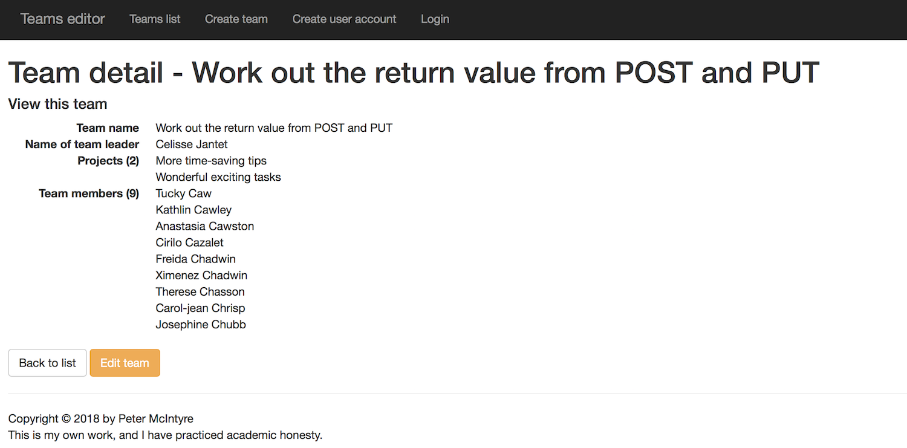
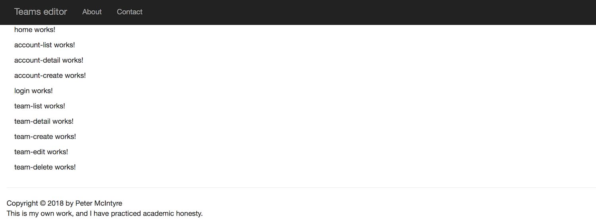
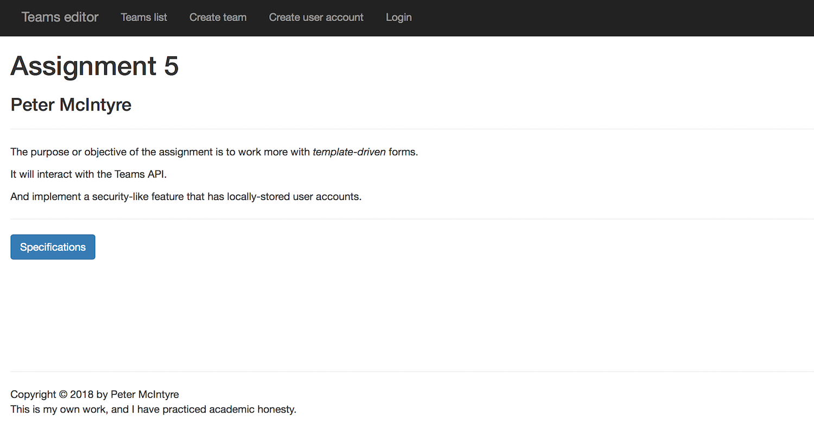
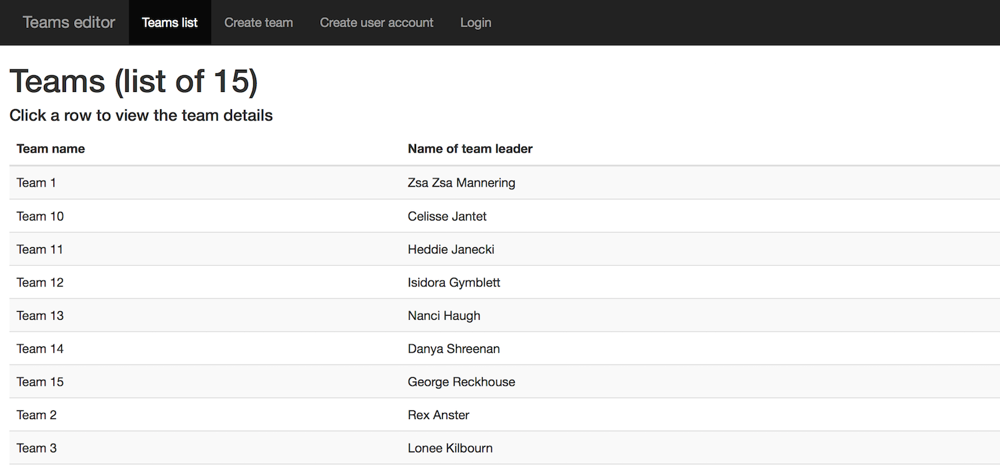
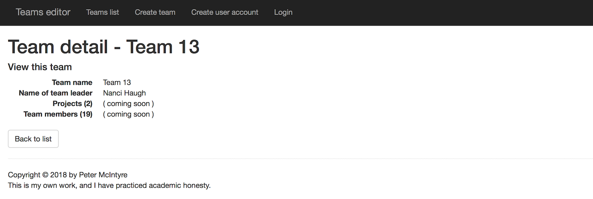
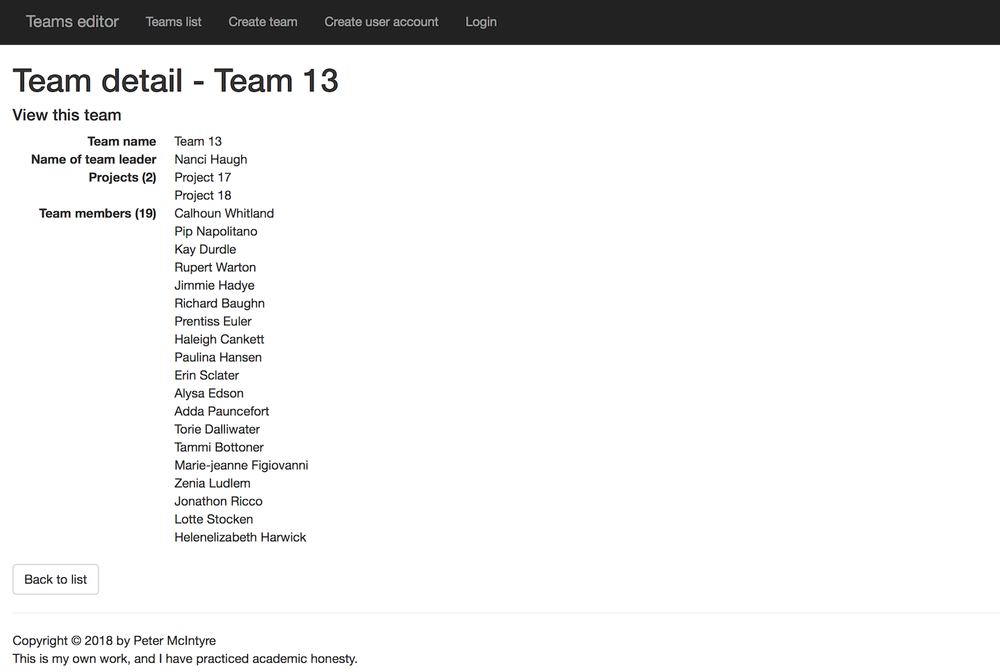

## BTI425 Assignment 5

The purpose or objective of the assignment is to implement interactive forms for an app, and then deploy it to a hosting service.

> This document is being edited.  
> This notice will be removed when the edits are complete.  

<br>

Read/skim all of this document before you begin work.

While you are doing the work, if a *specific task* is not clear, or it seems to require an unreasonable amount of time to complete, or it seems to require knowledge way beyond the content we've covered in the course, please don't hesistate to contact your professor. 

<br>

### Due Date

Sunday, April 8, 2018, at 6:00pm ET

Grade value: 10% of your final course grade

*If you wish to submit the assignment before the due date and time, you can do that.*

<br>

### Introduction to the problem to be solved

In the previous two assignments, you learned just enough about forms to implement a few use cases. In this assignment, you'll go further, by correctly implementing some Angular *template-driven forms* techniques. We plan to cover a few scenarios (add new, and edit existing), while working with your Teams API. 

In addition, you will add a security-like feature to the app, by implementing locally-stored user accounts, and then coding an authentication view. This feature enables you to go back and protect the *add new* and *edit existing* use cases. 

> Please note that this app's security-like feature is **NOT suitable for production use**.  
>  
> We are doing it simply as an illustration of what the feature could look like.  
> Implementing the feature actually enables you to get a bit of experience with two technologies, 1) local storage in the browser, and 2) Angular route guards.  
>  
> In the near future, but outside the scope and delivery of this course, we hope to publish some guidance about implementing security in an Angular app.  

<br>

Finally, you will deploy the app to a public host, so that you can deliver it to other devices (including, for example, your smartphone).  

In summary:
* Use locally-stored data, specifically user accounts
* Interact with Teams API, specifically the Team entity, to do create, read, and update tasks with that entity
* Deploy to Heroku

Here is an example of a typical view from the app, showing the "team detail" view:



<br>

**Reminder about how-to instructions and guidance**

As first described in the previous assignment specifications, the how-to instructions in this assignment, and in future assignments, will probably be less detailed, with less guidance.  

<br> 

### Specifications overview and work plan

Here's a brief list of specifications that you must implement:

* Design and use a class that describes a "user account"
* Maintain, in the browser's local storage, a collection of user accounts
* Code a component that enables authentication
* For the Team entity (in your Teams API), support create, read, and update tasks, by more correctly using *template-driven forms* 
* Deploy to a public host, and show that it can run correctly on devices (including your smartphone)

More details are provided below, in the section titled **"Doing the work"**.

During the Thursday classes/sessions, your professor will help you *get started* and *make progress* on the assignment. 

<br>

### Getting started

Getting started includes generating a new project, and configuring your development environment. 

<br>

#### Starting work on the assignment

Open a terminal window, and navigate to a suitable file system location. We will use the Angular CLI program to create the folder and its generated code for the project:

```
ng new assignment5 --routing -st -sg
```

After the app generation task completes, verify that the app runs. Then prepare the rest of your dev environment:
* Probably use another terminal window (so you can run code-generation commands)
* Probably use one or two Finder windows/tabs (for graphical navigation and Quick Look viewing)
* Code editor 
* Browser, and browser developer tools (at a minimum, you'll probably be using the element inspector, and the JavaScript console)
* Reference notes, including the relevant course notes (current and past), and authoritative resources (e.g. MDN, Angular documentation, etc.)

Include the Bootstrap CSS library in your app. 

Add `<meta>` tags for author and description, similar to what you've done in previous assignments. 

> We have created a document that suggests [how to create the containment structure](https://github.com/sictweb/bti425/blob/master/Templates_and_solutions/containment-nav-content-footer.md) for an app that has nav, content, and footer areas. Just like this app.  
> You may find it useful for this assignment, and for future work (as is or adapted).  

<br>

### Doing the work

As you have read, there are two design-and-coding efforts, 1) create and update with forms, and 2) the security-like feature. It does not matter which is done first. 

<br>

#### Plan your components

As always, we will need some kind of a heading and/or navigation menu. For this app, it's OK to use only a nav menu. We will need a footer for your academic honesty statement (although you can just place that in the app component template if you wish). And a "not found" component.  

For content areas, we will need the following:
* home (landing page)
* user account create
* user account view details
* user accounts list
* user login
* teams list
* team view details
* team create
* team edit

Use the Angular CLI to generate components for each of them now. Remember, use Pascal case names if you are using multi-word names for components. 

> Note:  
> Recently, we noticed that the computers in DB3078 may return the following error message when the Angular CLI "generate" program is used:  
> `Cannot read property 'NullLogger' of undefined`  
> If you get that error message, then there may be a work-around. Use the following command to update the Angular CLI version:  
> `npm install --save @angular/cli@latest`  

<br>

Then, as a brief and quick test, add their selectors to the app component's HTML template so that they appear when the app loads. (Obviously, they won't stay there after the test. We just do it now to prove that the components work and they show up in the view.)

At this point in time, it is possible that your work may look like the following. As always, right-click any image and open it in its own tab/window to view it full-size.



<br>

##### Refine the structure and appearance

Before continuing, you should spend a few minutes and ensure that the viewport code is structured correctly. And, ensure that the appearance takes advantage of the standard Bootstrap classes (container, row, and so on). 

The "home" component can display a bit of information about you, and a bit about the app. 

If you have started to create a personal-use library of standard code snippets, you can use that code here (where appropriate). The code in your personal-use library can come from many sources, including your own work, course code examples, and other trustworthy sources. Be careful about attribution and academic honesty.  

<br>

#### Configure routing for the app

The app is ready for routing to be configured, because it was generated with the `--routing` flag. 

In the class session on Tuesday, March 13, we completed an exercise to identify the design, planning, and coding tasks that implement routing in an app. Here's the result:
1. Decide which components will participate in routing
2. Design and code your routes
3. Decide which component(s) will hold the `<router-outlet>` element, and edit your code
4. If it makes sense for your app, decide which component will hold the hyperlink elements, and edit your code 
5. In each routed component class, edit the code to enable accessto the routing state
6. Where appropriate, implement imperative (programmatic) navigation

Here's some additional discussion on each of these. 

##### 1. Decide which components will participate in routing

In this app, it's likely that all components (listed above) will participate in routing. 

##### 2. Design and code your routes

Do that now. Ensure that the sequence is correct. And, ensure that you have routes to handle empty and not-found situations. 

##### 3. Decide which component(s) will hold the `<router-outlet>` element, and edit your code

In the [Refine the structure and appearance](#refine-the-structure-and-appearance) section above, you should have already completed that task. (If you did it correctly, it's in the app component template.)

##### 4. If it makes sense for your app, decide which component will hold the hyperlink elements, and edit your code 

Yes, in this app, we have a nav component, so edit that now. 

##### 5. In each routed component class, edit the code to enable access to the routing state

You can do that now, if you wish, by editing each of the routed components (their constructor method). Or, you can do that later. 

##### 6. Where appropriate, implement imperative (programmatic) navigation

You can do that on demand later on (below), as you code the component. 

At this point in time, it is possible that your work may look like the following. 



<br>

#### Let's prepare to get data involved

In the previous assignments, we worked with in-memory data, and with data from your Teams API.

Here, we will work with both. In addition, the in-memory data will be backed with *local storage*. There are many kinds of local storage available, but we are going to use the [localStorage](https://developer.mozilla.org/en-US/docs/Web/API/Window/localStorage) object that's in every browser, and is a property of the browser's `Window` object. 

We can store key-value pairs in local storage. Let's assume that both will be string type. Can we store objects (e.g. JavaScript objects and arrays)? Yes. We transform the object into JSON when saving/storing. When reading, we transform the string into JSON, which can then become the value of a variable or property. 

While the official documentation ([linked above](https://developer.mozilla.org/en-US/docs/Web/API/Window/localStorage)) is OK, [this article by Craig Buckler](https://www.safaribooksonline.com/blog/2013/10/10/how-to-use-html5-local-storage/) covers all of the functionality we need. Read it, practice (before you need to use it), and then use it.

<br>

##### Data / schema classes

At this point in modern life, every student has created many user accounts on various online properties. Think of that scenario for a moment.

Generate then write a class that has all the necessary data properties for a user account. We want good coverage of many HTML Form elements, and therefore HTML5 and Angular form features. At a minimum, the class' properties should include the following:

Purpose | Suggested<br>type | More info | Likely<br>form element | Constraints
--- | --- | --- | ---  | --- 
User name | string | Email address | Text box | Must be an email address; length limits; required
Full name | string | Can be one property or two (i.e. family name and given name(s)) | Text box | Length limits; required
User birth date | string (ISO 8601 date) | | Text box (for a date) | Must be a date; required
Date created | string (ISO 8601 date) | Date the account was created | Probably none; assigned in code | Must be a date; required (assigned in code)
User kind/role | string | We will use only two constant strings, "standard" and "accountmanager" | Radio button group | Required
PIN | number | [Personal identification number](https://en.wikipedia.org/wiki/Personal_identification_number), about 4 digits | Text box (for a number) | Required, range (min, max)
Active | boolean | Is the user "active", or not? | Single check box | 

<br>

Generate then write a class that has all the necessary data properties for a team. 

> If you were happy with the data/schema classes that you wrote for the previous assignment, then you can use there here too.

Incidentally, as you will learn, you must also write classes for project, employee, and position. Why? A team object has a collection of projects, an employee object, and a collection of employees. An employee object includes a position. 

> A note about writing data / schema classes: Obviously, it is possible to create a separate source code file to hold each class.  
> Alternatively, it is also possible to create a single source code file to hold the code for *all* classes.  
> The alternative may make it a bit easier, because only one "import" statement would be needed in any component or service class.  
> Is one way better than the other? No, they're just different. 

> Also, remember that for now, the data type of "date" fields is "string".

<br>

##### Data manager service

Generate a service. 

The sequence of design, planning, and coding tasks are suggested by the work you did with previous assignment. Here's the list, with a few new tasks to be done when we're working with a web service:
1. Import the data / schema classes 
2. Optionally, for each entity collection, create a private field to hold the collection locally in memory
3. Optionally, code the method that will load each collection
4. Write methods that implement the app's use cases

Please note the following about the result of task #2 above (create a private field): Sometimes (but not all times), it is convenient to locally hold (in memory) all or part of a collection that is delivered by a web service. We have to be careful about this. Most often, the authoritative version of the data is maintained by the web service. So, we don't want to mutate the local version and somehow mistakenly consider it to be authoritative. In general, any data mutation must be done by sending a request to the web service. In other words, don't change the in-memory data, and think that somehow magically it will get updated at the web service - it won't (unless you imperatively make that happen).

Before continuing, you can do tasks #1 and #2 above. 

The coding for tasks #3 and #4 can be done now (if you clearly know what to do), or you can do them incrementally, as part of the component-related tasks described below. 

We will code the activity logging feature later, after we have completed the other components. 

<br>

#### Prepare to use the Teams API

In the [course notes](https://sictweb.github.io/bti425/notes/week09), the recipe for working with a web service was discussed and demonstrated. In summary, here are the key tasks in the recipe:

1. Open the app module for editing. Import the `HttpClientModule` symbol into the app module, and add it to its `@NgModule.imports` array.

2. Open the data manager service for editing. Import the `HttpClient` symbol into the data manager service, and add it to the constructor.

3. Create a private field that holds the URL string to your Teams API web service.

4. For each use case, write a method that calls an HttpClient method on the web service. Almost always, the method will have a return value, an `Observable<T>` (where `T` is a class name; an object or an array). 

5. In each component class, import the data manager service, and inject it (and any other services and features you need, e.g. route status) into the constructor. (Similar to what you did in Assignment 3 project #2.)

> Study the "get one" responses from the Teams API.  
> All successful responses appear to return a collection, with exactly ONE item in the collection.  
> Therefore, a "get one employee" return value will be `Observable<Employee[]>`, same as "get all".  
> An unsuccessful response returns HTTP 500, so we'll have to test for that. Maybe its result will be to force a navigation to the "not found" component. (Why? Think about it...)   

<br>

#### Prepare to use Angular template-driven forms

This info is in the weekly class notes, and in the [Angular documentation](https://angular.io/guide/forms#revise-appmodulets). 

Open the app module (`app.module.ts`) for editing. 

Add the forms module to the import statements near the top:

```ts
import { FormsModule } from "@angular/forms";
```

Then, in the `@NgModule` decorator object, in the `imports` array, add the `FormsModule` module. 

Finally, we suggest adding a few style rules to visually indicate form elements that are valid and invalid. In the `styles.css` file (in the project root), add these rules:

```css
/* Forms classes */

.ng-valid[required], .ng-valid.required  {
  border-left: 5px solid #42A948; /* green */
}

.ng-invalid:not(form)  {
  border-left: 5px solid #a94442; /* red */
}
```

<br>

#### Team list component

In this section, and in the other component-related sections that follow, we will perform the coding tasks in both the component (class and template) and the data manager service that will fulfill the use case. Sometimes there's no "straight line" approach, and it's necessary to go back-and-forth. 

The "display all teams" task should be well-understood by now, as you have done it at least a few times now. In summary:

In the data manager service, write a method (maybe named teamGetAll) that will fetch ALL teams from the Teams API.

In the teams component class, create a property to hold the data we want.

Call the data manager service method. The call must be in the ngOnInit method block, because we're ultimately working with a web service.

In the teams template, create the markup you want (e.g. an HTML Table) that will render the data.

Most "display all" views will allow the user to select an item on the list, and display its details. Therefore, as you have done before...

Still in the teams template, add an event handler for the "select an item" idea.

Back in the teams class, create a private field to hold a selected team.

Write a method that handles the "select an item" event. Its code will likely just navigate to the "team detail" component.

After completing this section, your "display all teams" view may look similar to the following:



<br>

#### Team detail component

The "display item detail" task should be well-understood by now, as you have done it at least a few times now. In summary:

In the data manager service, write a method (maybe named teamGetAll) that will fetch a specific team from the Teams API.

In the "team detail" component class, create a property to hold the data we want.

Call the data manager service method. The call must be in the ngOnInit method block, because we're ultimately working with a web service.

In the "team detail" template, create the markup you want that will render the data (likely a definition list).

After completing this section, your "display item detail" view may look similar to the following:



<br>

##### Preventing console errors during rending

Assuming that you have followed the guidance above, specifically to create a property to hold the team data that comes back from the seb service, you may notice console errors that indicate undefined data, although the data does appear in the user interface. 

The reason for this is the delay in getting the data. When the view is first rendered, the data is not available. However, it comes within a few seconds or sooner. 

If this bothers you (and it probably should), one way to suppress the error messages is to initialize the property in the constructor. In other words, initialize the team property to a new instance of team. Then, for the reference properties (TeamLead, Employees, Projects), initialize them too. For example:

```ts
// This prevents a data binding error
// Assume that "team" is a property that will hold the data
// that comes back from the call to the web service
this.team = new Team();
this.team.TeamLead = new Employee();
this.team.Projects = [];
this.team.Employees = [];
```

<br>

##### Rendering project and team member names

Notice the "( coming soon )" placeholders for the projects and team members collections. We can fill those out now. 

In the "team detail" template, add an `*ngFor` repeater to render the name of each project. In your professor's sample solution, a `<span>` element was used to repeatedly render the project name, followed by a `<br>`. 

Do the same to render the team member (employee) names. 

After completing this section, your "display item detail" view may look similar to the following:



<br>

### Team create component

This will be a challenge. We suggest that you design, code, and test repeatedly. Make small-sized progressions.

dd


Team create, multi-step approach
team-create-step1 - team name
team-create-step2 - with validation
step3 - validation for select-one


<br>
<br>
<br>
<br>
<br>

# The area below is still being edited.

<br>
<br>
<br>
<br>
<br>


<br>

### Testing your work

For this assignment, there is no external testing capability that can be used. 

Therefore, rely on your browser tools for this step. Soon, your professor will help you learn how to use the debugger.

<br>

### Reminder about academic honesty

You must comply with the College’s academic honesty policy.

Although you may interact and collaborate with others, you must submit your own work.

<br> 

### Submitting your work

Here’s how to submit your work, before the due date and time:

1. Locate the folder that holds your project files. 

2. Make a copy of the folder. (You will be uploading a zipped version of the copy.)

3. Inside that folder, remove (delete) the `node_modules` folder. Your professor does NOT need that folder. 

4. Compress/zip the copied folder. The zip file SHOULD be less than 1MB in size. If it isn’t, you haven’t followed the instructions properly.

5. Login to My.Seneca. Open the course area. Click the “Assignments” link on the left-side navigator. Follow the link for this assignment. Submit/upload your zip file. The page will accept three submissions, so if you upload, then decide to fix something and upload again, you can do so.

<br>
