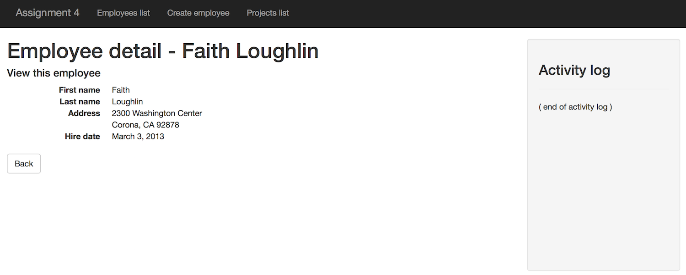
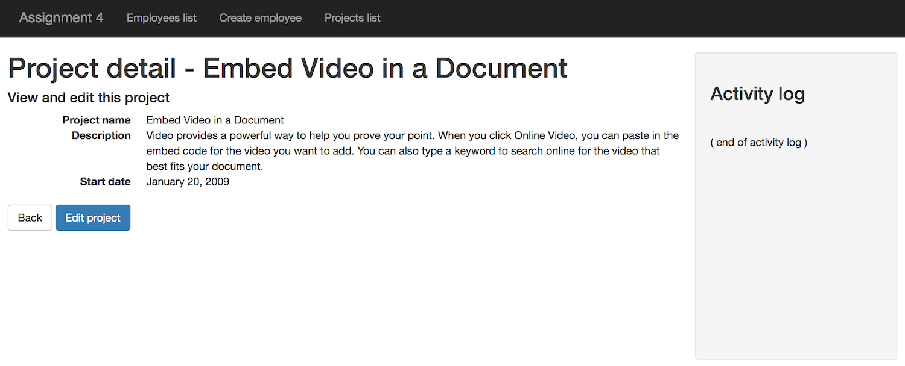
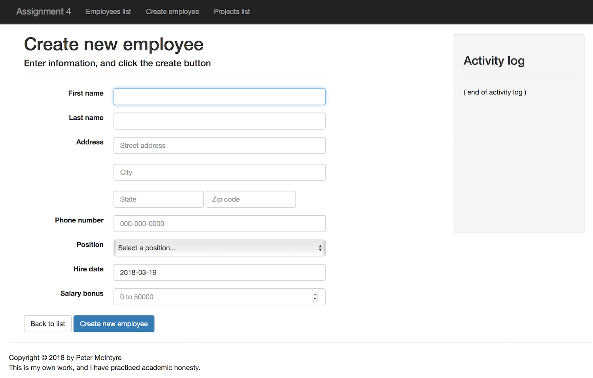
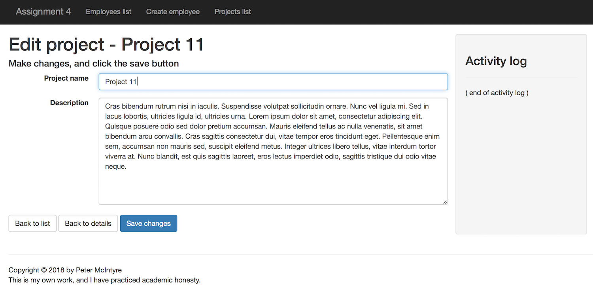
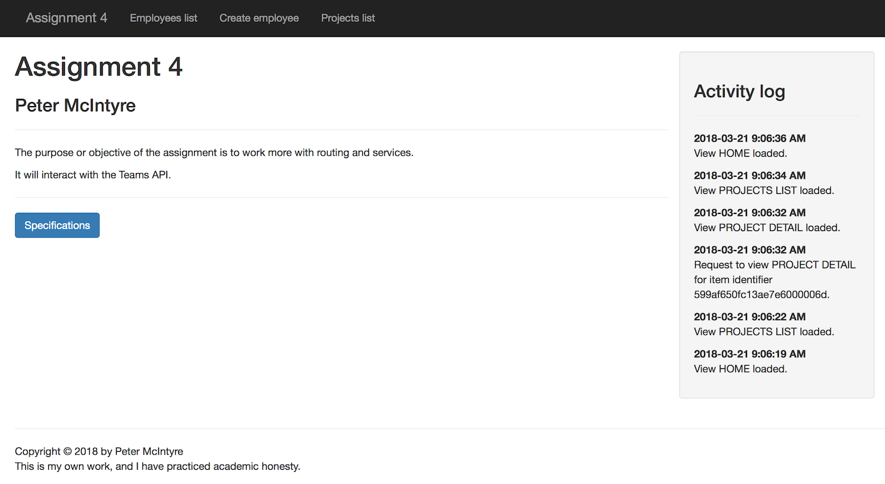

## BTI425 Assignment 5

The purpose or objective of the assignment is to implement interactive forms for an app, and then deploy it to a hosting service.

> This document is being edited.  
> This notice will be removed when the edits are complete.  
> We expect to complete the edits by mid-day on Friday, March 30.  

<br>

Read/skim all of this document before you begin work.

While you are doing the work, if a *specific task* is not clear, or it seems to require an unreasonable amount of time to complete, or it seems to require knowledge way beyond the content we've covered in the course, please don't hesistate to contact your professor. 

<br>

### Due Date

Sunday, April 8, 2018, at 6:00pm ET

Grade value: 10% of your final course grade

*If you wish to submit the assignment before the due date and time, you can do that.*

<br>

### Introduction to the problem to be solved

In the previous two assignments, you learned just enough about forms to implement a few use cases. In this assignment, you'll go further, by correctly implementing some Angular *template-driven forms* techniques. We plan to cover a few scenarios (add new, and edit existing), while working with your Teams API. 

In addition, you will add a security-like feature to the app, by implementing locally-stored user accounts, and then coding an authentication view. This feature enables you to go back and protect the *add new* and *edit existing* use cases. 

> Please note that this security-like feature is NOT suitable for production use.  
> We are doing it simply as an illustration of what the feature could look like.  
> Implementing the feature actually enables you to get a bit of experience with two technologies, 1) local storage in the browser, and 2) Angular route guards.  
> In the near future, but outside the scope and delivery of this course, we hope to publish some guidance about implementing security in an Angular app.  

Finally, you will deploy the app to a public host, so that you can deliver it to other devices (including, for example, your smartphone).  

In summary:
* Use locally-stored data, specifically user accounts
* Interact with Teams API, specifically the Team entity, to do CRUD with that entity
* Deploy to Heroku

Here is an example of a typical view from the app, showing the "project detail" view:


<br>

**Reminder about how-to instructions and guidance**

As first described in the previous assignment specifications, the how-to instructions in this assignment, and in future assignments, will probably be less detailed, with less guidance.  

<br> 

### Specifications overview and work plan

Here's a brief list of specifications that you must implement:

* Design and use a class to hold a "user account"
* Maintain, in local storage, a collection of user accounts
* Code a component that enables authentication
* For the Team entity (in your Teams API), support the full range of CRUD tasks, by more correctly using *template-driven forms* 
* Deploy to a public host, and show that it can run correctly on devices (including your smartphone)

More details are provided below, in the section titled **"Doing the work"**.

During the Thursday classes/sessions, your professor will help you *get started* and *make progress* on the assignment. 

<br>

### Getting started

Getting started includes generating a new project, and configuring your development environment. 

<br>

#### Starting work on the assignment

Open a terminal window, and navigate to a suitable file system location. We will use the Angular CLI program to create the folder and its generated code for the project:

```
ng new assignment5 --routing -st -sg
```

After the app generation task completes, verify that the app runs. Then prepare the rest of your dev environment:
* Probably use another terminal window (so you can run code-generation commands)
* Probably use one or two Finder windows/tabs (for graphical navigation and Quick Look viewing)
* Code editor 
* Browser, and browser developer tools (at a minimum, you'll probably be using the element inspector, and the JavaScript console)
* Reference notes, including the relevant course notes (current and past), and authoritative resources (e.g. MDN, Angular documentation, etc.)

Include the Bootstrap CSS library in your app. 

Add `<meta>` tags for author and description, similar to what you've done in previous assignments. 

> We have created a document that suggests [how to create the containment structure](https://github.com/sictweb/bti425/blob/master/Templates_and_solutions/containment-nav-content-footer.md) for an app that has nav, content, and footer areas. Just like this app.  
> You may find it useful for this assignment, and for future work (as is or adapted).  

<br>

### Doing the work

( more to come )

<br>

#### Plan your components

As always, we will need some kind of a heading and/or navigation menu. For this app, it's OK to use only a nav menu. We will need a footer for your academic honesty statement (although you can just place that in the app component template if you wish). And a "not found" component.  

For content areas, we will need the following:
* home (landing page)
* account create
* account view details
* accounts list
* login
* teams list
* team view details
* team create
* maybe... team edit
* maybe... team delete

Use the Angular CLI to generate components for each of them now. Remember, use Pascal case names if you are using multi-word names for components. 

> Note:  
> Recently, we noticed that the computers in DB3078 may return the following error message when the Angular CLI "generate" program is used:  
> `Cannot read property 'NullLogger' of undefined`  
> If you get that error message, then there may be a work-around. Use the following command to update the Angular CLI version:  
> `npm install --save @angular/cli@latest`  

<br>

Then, as a brief and quick test, add their selectors to the app component's HTML template so that they appear when the app loads. (Obviously, they won't stay there after the test. We just do it now to prove that the components work and they show up in the view.)

<br>

##### Refine the structure and appearance

Before continuing, you should spend a few minutes and ensure that the viewport code is structured correctly. And, ensure that the appearance takes advantage of the standard Bootstrap classes (container, row, and so on). 

The "home" component can display a bit of information about you, and a bit about the app. 

If you have started to create a personal-use library of standard code snippets, you can use that code here (where appropriate). The code in your personal-use library can come from many sources, including your own work, course code examples, and other trustworthy sources. Be careful about attribution and academic honesty.  

At this point in time, it is possible that your work may look like the following. As always, right-click any image and open it in its own tab/window to view it full-size.


<br>

#### Configure routing for the app

The app is ready for routing to be configured, because it was generated with the `--routing` flag. 

In the class session on Tuesday, March 13, we completed an exercise to identify the design, planning, and coding tasks that implement routing in an app. Here's the result:
1. Decide which components will participate in routing
2. Design and code your routes
3. Decide which component(s) will hold the `<router-outlet>` element, and edit your code
4. If it makes sense for your app, decide which component will hold the hyperlink elements, and edit your code 
5. In each routed component class, edit the code to enable accessto the routing state
6. Where appropriate, implement imperative (programmatic) navigation

Here's some additional discussion on each of these. 

##### 1. Decide which components will participate in routing

In this app, it's likely that all components (listed above) will participate in routing. 

##### 2. Design and code your routes

Do that now. Ensure that the sequence is correct. And, ensure that you have routes to handle empty and not-found situations. 

##### 3. Decide which component(s) will hold the `<router-outlet>` element, and edit your code

In the [Refine the structure and appearance](#refine-the-structure-and-appearance) section above, you should have already completed that task. (If you did it correctly, it's in the app component template.)

##### 4. If it makes sense for your app, decide which component will hold the hyperlink elements, and edit your code 

Yes, in this app, we have a nav component, so edit that now. 

##### 5. In each routed component class, edit the code to enable access to the routing state

You can do that now, if you wish, by editing each of the routed components (their constructor method). Or, you can do that later. 

##### 6. Where appropriate, implement imperative (programmatic) navigation

You can do that on demand later on (below), as you code the component. 

<br>

#### Let's prepare to get data involved

In the previous assignments, we worked with in-memory data, and with data from your Teams API.

Here, we will work with both. In addition, the in-memory data will be backed with local storage. 

( a bit different / more )

<br>

##### Data / schema classes

> TBA - must be reviewed and edited  

Generate then write a class that has all the necessary data properties for an employee, and for a project. 

Incidentally, as you will learn, you must also write classes for team and position. Why? An employee object includes a reference to a position. And, a team object includes a reference to a "team lead" (which is an employee), and has a collection of "team members" (employee references). Etc.  

> A note about writing data / schema classes: Obviously, it is possible to create a separate source code file to hold each class.  
> Alternatively, it is also possible to create a single source code file to hold the code for *all* classes.  
> The alternative may make it a bit easier, because only one "import" statement would be needed in any component or service class.  
> Is one way better than the other? No, they're just different. 

> Also, remember that for now, the data type of "date" fields is "string".

<br>

##### Data manager service

Generate a service. 

The sequence of design, planning, and coding tasks are suggested by the work you did with the previous assignment's project #2. Here's the list, with a few new tasks to be done when we're working with a web service:
1. Import the data / schema classes 
2. Optionally, for each entity collection, create a private field to hold the collection locally in memory
3. Optionally, code the method that will load each collection
4. Write methods that implement the app's use cases

Please note the following about the result of task #2 above (create a private field): Sometimes (but not all times), it is convenient to locally hold (in memory) all or part of a collection that is delivered by a web service. We have to be careful about this. Most often, the authoritative version of the data is maintained by the web service. So, we don't want to mutate the local version and somehow mistakenly consider it to be authoritative. In general, any data mutation must be done by sending a request to the web service. In other words, don't change the in-memory data, and think that somehow magically it will get updated at the web service - it won't (unless you imperatively make that happen).

Before continuing, you can do tasks #1 and #2 above. 

The coding for tasks #3 and #4 can be done now (if you clearly know what to do), or you can do them incrementally, as part of the component-related tasks described below. 

We will code the activity logging feature later, after we have completed the other components. 

<br>

#### Prepare to use the Teams API

In the [course notes](https://sictweb.github.io/bti425/notes/week09), the recipe for working with a web service was discussed and demonstrated. In summary, here are the key tasks in the recipe:

1. Open the app module for editing. Import the `HttpClientModule` symbol into the app module, and add it to its `@NgModule.imports` array.

2. Open the data manager service for editing. Import the `HttpClient` symbol into the data manager service, and add it to the constructor.

3. Create a private field that holds the URL string to your Teams API web service.

4. For each use case, write a method that calls an HttpClient method on the web service. Almost always, the method will have a return value, an `Observable<T>` (where `T` is a class name; an object or an array). 

5. In each component class, import the data manager service, and inject it (and any other services and features you need, e.g. route status) into the constructor. (Similar to what you did in Assignment 3 project #2.)

> Study the "get one" responses from the Teams API.  
> All successful responses appear to return a collection, with exactly ONE item in the collection.  
> Therefore, a "get one employee" return value will be `Observable<Employee[]>`, same as "get all".  
> An unsuccessful response returns HTTP 500, so we'll have to test for that. Maybe its result will be to force a navigation to the "not found" component. (Why? Think about it...)   

<br>

#### Employees component

In this section, and in the other component-related sections that follow, we will perform the coding tasks in both the component (class and template) and the data manager service that will fulfill the use case. Sometimes there's no "straight line" approach, and it's necessary to go back-and-forth. 

The "display all employees" task should be well-understood by now, as you have done it at least a few times now.  In summary:

1. In the data manager service, write a method (maybe named `getEmployees`) that will fetch ALL employees from the Teams API. 

2. In the employees component class, create a private field to hold the data we want.

3. Call the data manager service method. The call must be in the `ngOnInit` method block, because we're ultimately working with a web service. 

4. In the employees template, create the markup you want (e.g. an HTML Table) that will render the data. 

Most "display all" views will allow the user to select an item on the list, and display its details. Therefore, as you have done before...

5. Still in the employees template, add an event handler for the "select an item" idea. 

6. Back in the employees class, create a private field to hold a selected employee. 

7. Write a method that handles the "select an item" event. Its code will likely just navigate to the "employee-detail" component.

After completing this section, your "display all employees" view may look similar to the following:


<br>

> Notice that the list is sorted. See the course notes for a discussion of how this could be done.

<br>

#### Projects component

While the coding experience for the employees component is fresh, maybe you should do the same for the projects component. It too is a collection, so it can be rendered in some kind of list. 

After completing this section, your "display all projects" view may look similar to the following:


<br>

> Notice that the list is sorted, and the [date has been nicely formatted](https://sictweb.github.io/bti425/notes/angular-date-pipe). 

<br>

#### Employee detail component

Maybe you have noticed that the previous two tasks are very similar to the "display all customers" task that you did in Assignment 3 project #2. The notable difference is the slightly-different coding and usage of the service, which acknowledges the fact that we're working with data from a web service. 

The good news is that the tasks for the other kinds of CRUD tasks - get one, add new, edit existing, and delete item - are also similar, no matter what the entity. (The difference is in the data, and the desired appearance etc. of the view.)

As a result, you can refer to the guidance that begins in [this section](https://sictweb.github.io/bti425/graded-work/assign3#customer-detail-component-introduction) of Assignment 3 project #2 here, and in the following sections. 

As stated above, the service coding and usage will be different. In the service, create a "get one" method. The method body will have to test for a success or error response.

If the response is an array (with one object), return the object. In other words, unpackage the object that's inside the array, and return the object. It makes sense to do this kind of work in the data manager service, and not dump it on every component that uses it. The method's return type will be an `Observable<Employee>`, and not an array of employees. 

If the response is an error, we suggest a redirect to the "not found" component. 

After completing this section, your "display one employee" view may look similar to the following:



<br>

#### Project detail component

While the coding experience for the employee detail component is fresh, maybe you should do the same for the project detail component.  

After completing this section, your "display one project" view may look similar to the following:



<br>

#### Employee create component

Follow the theme of the previous section. The Assignment 3 project #2 [create task](https://sictweb.github.io/bti425/graded-work/assign3#customer-create-task) enabled you to transition the work done on the "detail" component into a "create" component. That advice is still valid here. 

> Note: As briefly discussed in the Tuesday, March 13 class session, modern browser validation does not seem to work. The reason offered was that the Angular Forms module disabled modern browser validation, so that it could replace or take over the validation job.  
> The actual reason is a bit different and more complex than that. Let's leave the solution to our coverage of Angular Forms later in the course. For now, continue to "Specify the type of the input elements, to take advantage of modern browser features". While it won't do validation, it will still bring other benefits.  

After completing this section, your "create employee" view may look similar to the following:



<br>

#### Project edit component

Why are we doing this project edit task? Well, of all the data in the Teams API, the project data is the messiest and the most artificial of all the entity collections. It would be a great idea to be able to edit the projects. 

The Assignment 3 project #2 [edit task](https://sictweb.github.io/bti425/graded-work/assign3#edit-a-customer) enabled you to transition the work done on the "create" component (especially the form code in the template) into an "edit" component. That advice is still valid here. 

After completing this section, your "edit project" view may look similar to the following:



<br>

#### Log component 

> The content in this section will take a day or two to complete.  
> We need a few more hours to possibly re-engineer part of it to make it a better and more re-usable experience. 

For this part of the assignment, we thought we would build upon the recent knowledge of observables in an interesting way. 

As stated above, the right side of the content area will display an "activity log" of the user interaction tasks. 

What activity? Well, we're thinking of navigation activity, and data CRUD activity. Each activity will include a date-and-time value, and a short string that describes the activity. As the browser user interacts with the app, the activity log will show each activity. 

Please note that the activity log data will NOT saved/persisted in this app. It will exist in-memory only. Every time the app loads (which happens after each build/compile task), the data will be cleared. Therefore, do NOT expect the data to be saved. 

> Is it possible to save the data? Yes. One way would be to use HTML5 local or session storage. That would be pretty easy to implement. Another way would be to add logic to the web service. That would take much more effort. 

Here's what we will do to implement this feature:
1. Write a data/schema class for an activity log item
2. In the data manager service, declare/define a collection/array to store the activity log items
3. Then, declare/define an observable yet updateable package for the collection/array 
4. Write an "add to activity log" method that can be called from any component
5. Update the activity log component, so that it displays the activity log items
6. Call the method from your components

<br>

##### 1. Write a data/schema class for an activity log item

Write the code for a data/schema class. It can be in a separate source code file, or in with the others if you chose to write all classes in one source code file. 

Let's keep it simple: It needs a property to hold a date (of type Date), and a string for the activity. 

<br>

##### 2. In the data manager service, declare/define a collection/array to store the activity log items

As described above, we are storing the activity log items in memory. Therefore, declare/define an array property of type activity log. (Remember to import, and also to initialize the property value to an empty array in the constructor.)

<br>

##### 3. Then, declare/define an observable yet updateable package for the collection/array 

Recently, you learned that an "observable" can be thought of as a packaging tactic for a value that you want to watch. The return value of an HttpClient `get()` method (for example) is an observable. 

This is the kind of thing that we want. In the activity log component (which will be coded soon), we will want to "subscribe" to the activity log data, so that new items appear automatically. 

However, we cannot just use an observable. Instead, we must use a [Subject](http://reactivex.io/documentation/subject.html), which extends (inherits from) Observable. Its added feature is that we can update the package (i.e. the array of activity log items), and it will then notify the subscribers. So, read and write, in effect. 

To use a `Subject` in our data manager service, import it:

```ts
import { Subject } from "rxjs/Subject";
```

Then, declare/define a suitable property to package the collection/array of activity log items:

```ts
activity: Subject<LogItem[]>;
```

Remember to initialize the property's value (probably in the constructor). Set the value to a new instance, e.g. `new Subject<LogItem[]>()`. 

Interestingly, in a component class, when we subscribe to this property, the return value of its `subscribe()` method is an `Observable<T>'. At least that part is familiar to us now.

<br>

##### 4. Write an "add to activity log" method that can be called from any component

Now we're ready to write a method that can be called from any component. Something like the following will work OK:

```ts
logAction(message: string) {
  // There are at least a couple of ways to declare a log item
  // Here's a straight-line simple way...
  let action = new LogItem();
  action.timestamp = new Date();
  action.message = message;
  // Assuming that "log" was declared/defined in task #2 above,
  // add the new item to the beginning of the array
  // (so that the most recent item is at the top of the list)
  // (this will avoid the need to sort the array)
  this.log.unshift(action);
  // Trigger the notification functionality
  this.activity.next(this.log);
}
```

<br>

##### 5. Update the activity log component, so that it displays the activity log items

Like the other components, it needs to know about the data manager service, and the data/schema class that it is working with. 

It needs a property to hold the collection/array of activity log items. It will be the binding target for the code in the template. 

As you have learned when working with the other components, call the `subscribe()` method in the `ngOnInit()` method. 

```ts
// Assuming "log" is a collection/array of activity log items...
this.m.activity.subscribe(c => this.log = c);'
```

In the template, write elements that result in a nice pleasing display of log items. You should probably use the date pipe to make the date look better.

<br>

##### 6. Call the method from your components

In each component, add a statement that will call the method in the data manager service.

```ts
this.m.logAction('View PROJECTS LIST loaded.');
```

Which components should we call this method from? Where do we add this code? Well, we suggest that you call it in the component's constructor. And, call it from other parts of your logic and user interaction flow. Whatever makes sense for the current context. 

After completing this section, the view - with the activity log - may look similar to the following. Notice that the area will scroll if the number of items exceeds its height:



<br>

### Testing your work

For this assignment, there is no external testing capability that can be used. 

Therefore, rely on your browser tools for this step. Soon, your professor will help you learn how to use the debugger.

<br>

### Reminder about academic honesty

You must comply with the College’s academic honesty policy.

Although you may interact and collaborate with others, you must submit your own work.

<br> 

### Submitting your work

Here’s how to submit your work, before the due date and time:

1. Locate the folder that holds your project files. 

2. Make a copy of the folder. (You will be uploading a zipped version of the copy.)

3. Inside that folder, remove (delete) the `node_modules` folder. Your professor does NOT need that folder. 

4. Compress/zip the copied folder. The zip file SHOULD be less than 1MB in size. If it isn’t, you haven’t followed the instructions properly.

5. Login to My.Seneca. Open the course area. Click the “Assignments” link on the left-side navigator. Follow the link for this assignment. Submit/upload your zip file. The page will accept three submissions, so if you upload, then decide to fix something and upload again, you can do so.

<br>
