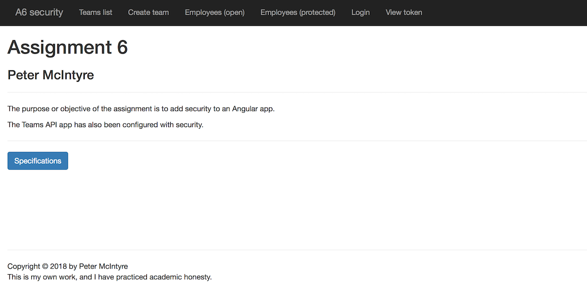
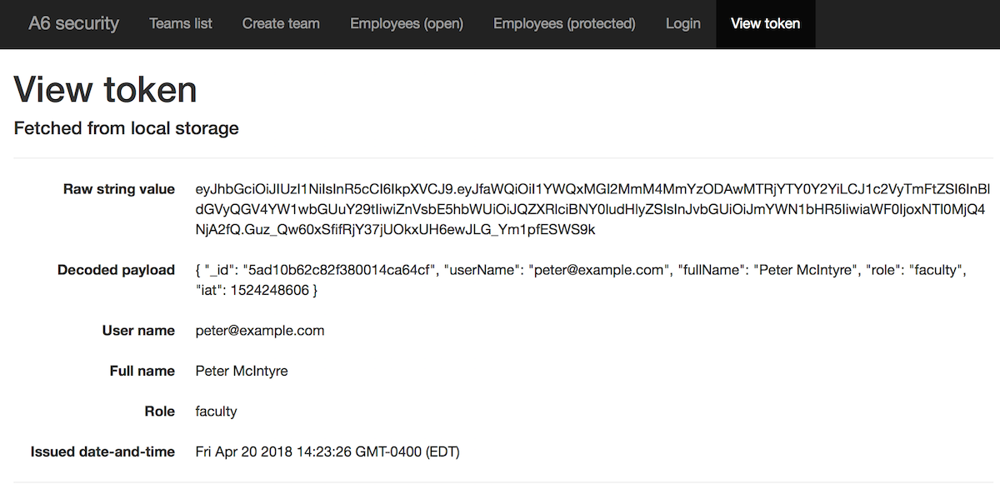
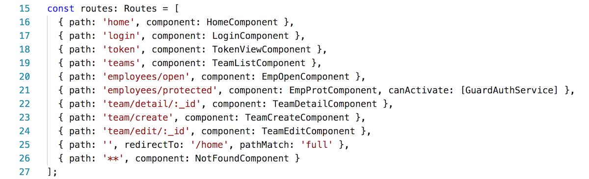

## Assignment 6 checklist

Compare your work to this sample solution. You can right-click any image and open it in its own tab/window to view it full-size.

<br>

### User interaction and appearance

**U1.** Title/landing view looks OK. Includes student name. Appearance shows thought and care.



<br>

**U5.** After login, the "view token" view displays useful and correct data.



<br>

### Program design and coding

**C1.** Route objects correctly declared, in the right sequence.

Empty and not found routes are at the end of the array.



<br>

**C2.** Coding guidance in the "Add security features to an Angular app" document was done correctly.

Includes, most importantly, updates to the app module.

<br>

**C3.** The login component's `onSubmit()` methd is correct, and is functionally similar to the example shown below:

```ts
onSubmit(): void {

  // Clear the existing token
  localStorage.removeItem('access_token');

  // Attempt to login
  this.a.login(this.credentials).subscribe(res => {

    // Show the response from the web service
    console.log(res as string);

    // Save the token in the browser's local storage
    localStorage.setItem('access_token', res.token);

    // Go to a landing/info view
    this.router.navigate(['/token']);

  }, error => {
    // Show the error in the console, and in the view
    console.log(error);
    this.loginError = 'Unable to login, invalid credentials';
  }
  );

}
```

<br>

