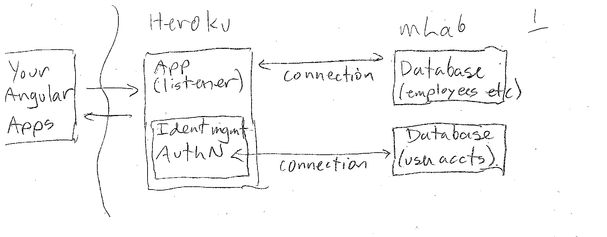
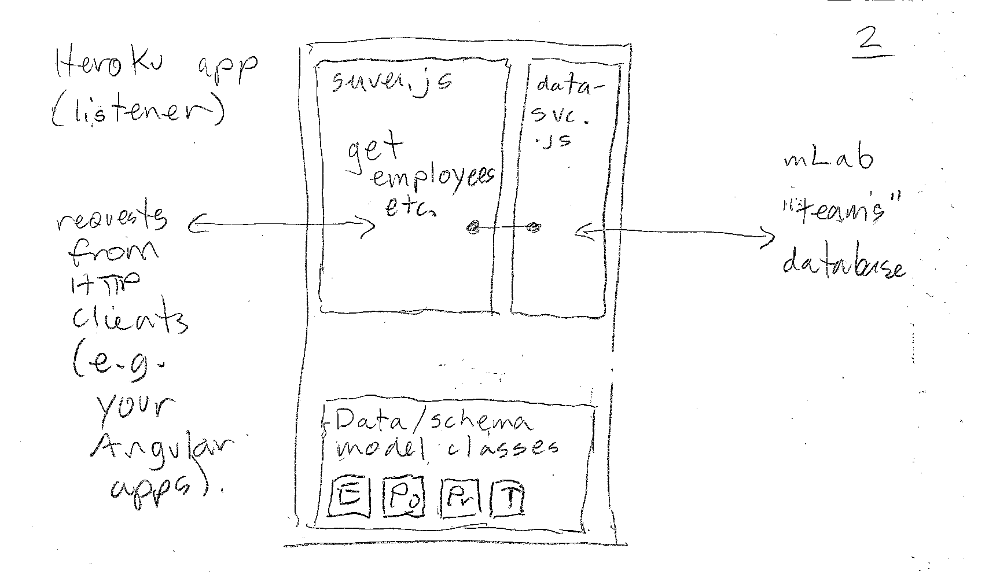
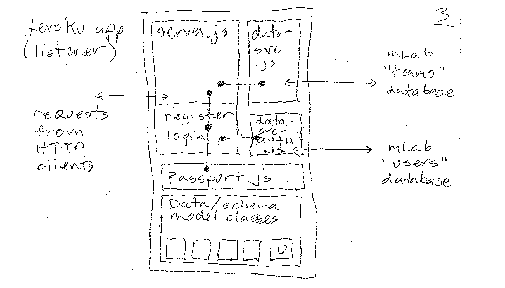

## BTI425 Assignment 6

The purpose or objective of the assignment is to add security features to an Angular app and your Teams API.

> This document is being edited.  
> This notice will be removed when the edits are complete.  

<br>

Read/skim all of this document before you begin work.

While you are doing the work, if a *specific task* is not clear, or it seems to require an unreasonable amount of time to complete, or it seems to require knowledge way beyond the content we've covered in the course, please don't hesistate to contact your professor. 

<br>

### Due Date

Sunday, April 22, 2018, at 6:00pm ET

Grade value: 10% of your final course grade

*If you wish to submit the assignment before the due date and time, you can do that.*

<p class='highlight sb'><b>The "one late privilege" rule is different for this last assignment.<br>Your professor MUST have all assignments by 6:00pm on Monday, April 23.<br>Final marks are due when the term ends the next day,<br>and there are NO "incomplete" grades in this course.</b></p>

<br>

### Introduction to the problem to be solved

In this assignment, we will add security features to your Teams API. It will support the *identity management* and *authentication* tasks. 

Then, you will create an Angular app that participates in the security features of the Teams API. It will have views to support login and user account creation, and some data views (e.g. employees or teams or whatever) will be protected, so that they are delivered to authorized users only. 

Two new-to-you technology pieces that will be learned and used in this assignment are Passport.js and JSON Web Tokens (JWT). 
* [Passport.js](http://www.passportjs.org/docs/) is authentication middleware for Node.js 
* [JWT](https://jwt.io/) is a way to represent claims securely between two parties

<br>

#### Teams API - overview diagram

It will be helpful to locate and open (for editing) your Teams API code base, as you go through this part of the document.

The following is a simplified box-and-line drawing of the new and desired Teams API app configuration. (The diagrams below were drawn quickly, to meet a publication deadline. It is likely that they will be re-drawn with colours.) As in the past, you can right-click any image and open it in its own tab/window to view it full-size.



As you can see, the left side has your Angular apps, which run in a browser on a device. The middle and right side is the Teams API app. The part that is hosted at `herokuapp.com` is the listener for requests from Angular apps. The "Database (employees etc.)" part - where the data is actually persisted - is hosted at `mLab.com`. 

<br>

#### Before changes

The next diagram has more detail about the middle "Heroku" part of the diagram above. It shows the presence, organization, and relationship of the code assets that make your Teams API work, *before we make any changes*. 



As you can see, the app - before changes - has three distinct areas:
1. `server.js`, which is the apps entry point, and listener for requests 
2. `data-service.js`, which is designed to interact with the database 
3. Data/schema model classes, which define the shape of the app's entities

Read/skim the code in `server.js`, and you will see methods like...

```js
// Get all employees
app.get("/employees", (req, res) => {

// Get one project
app.get("/project/:projectId", (req, res) => {
```

Each calls a method/function in the data service, and then returns the result as JSON (or as an error). The relationship between the server/listener and the data service is shown as a short line with solid dots at each end. 

The shape of the entities are defined in the data/schema classes (identified in the diagram as E for employee, Po for position, Pr for project, and T for team). 

<br>

#### After changes

The next diagram shows the new security code assets and their relationships. The diagram is similar to the "before changes" (above), but with more boxes-and-lines.



There are several things to notice. 

First, the `server.js` code box has been enlarged to include "register" (a new account) and "login" methods. It also has new code that has a relationship to a new box of code, Passport.js. Similar to above, the relationship between the server/listener and Passport.js is shown as a short line with solid dots at each logical usage point.

Second, notice `Passport.js`. This code is now brought in to handle authentication and some identity management tasks. Also notice its dots-and-line connector, indicating a relationship between some existing methods/functions in the listener with Passport.js code. 

Third, notice a new "U" (for user accounts) data/schema model class. It defines the shape of a user account (i.e. username, password, possibly other claims such as family name, given name, birthdate, etc.). 

Finally, notice a new code box, `data-service-auth.js`. It will include methods/functions that handle the authentication heavy lifting, such as "registerUser" and "checkUser". For this assignment and this course's introductory treatment of security topics, your teacher team has decided to isolate the identity management storage part in a separate database. This also happens to be a good practice, because of the sensitive nature of a database with user account data. 

<br>

**Reminder about how-to instructions and guidance**

As first described in the previous assignment specifications, the how-to instructions in this assignment, and in future assignments, will probably be less detailed, with less guidance.  

<br> 

### Specifications overview and work plan

> The following content will be edited.  
> The goal is to complete editing by the end of Friday, April 13.  

Here's a brief list of specifications that you must implement:

* TBA
* TBA

Make no changes to the existing database on mLab. 

Add a new database on mLab to hold the user accounts.

Modify the Teams API web service (`server.js`) to add security features (identity management, and authentication). 

Use Passport.js to help with these tasks (and then issue and validate tokens). 

Create/configure an Angular app to use the security-aware Teams API web service. 

Learn and configure route guard and HTTP interceptor class. 

( more to come )

More details are provided below, in the section titled **"Doing the work"**.

During the Thursday classes/sessions, your professor will help you *get started* and *make progress* on the assignment. 

<br>

### Getting started

Getting started includes a number of tasks:
* Locating your Teams API code base and preparing it for modification 
* Creating a new mLab deployment (i.e. a database) 
* TBA

<br>

#### Locating your Teams API code base

( more to come )

<br>

#### Creating a new mLab deployment

( more to come )

<br>

#### Creating an Angular app

Open a terminal window, and navigate to a suitable file system location. We will use the Angular CLI program to create the folder and its generated code for the project:

```
ng new assignment6 --routing -st -sg
```

After the app generation task completes, verify that the app runs. Then prepare the rest of your dev environment:
* Probably use another terminal window (so you can run code-generation commands)
* Probably use one or two Finder windows/tabs (for graphical navigation and Quick Look viewing)
* Code editor 
* Browser, and browser developer tools (at a minimum, you'll probably be using the element inspector, and the JavaScript console)
* Reference notes, including the relevant course notes (current and past), and authoritative resources (e.g. MDN, Angular documentation, etc.)

Include the Bootstrap CSS library in your app. 

Add `<meta>` tags for author and description, similar to what you've done in previous assignments. 

> We have created a document that suggests [how to create the containment structure](https://github.com/sictweb/bti425/blob/master/Templates_and_solutions/containment-nav-content-footer.md) for an app that has nav, content, and footer areas. Just like this app.  
> You may find it useful for this assignment, and for future work (as is or adapted).  

<br>

### Doing the work

( more to come )

<br>

### Testing your work

For this assignment, there is no external testing capability that can be used. 

Therefore, rely on your browser tools for this step. Soon, your professor will help you learn how to use the debugger.

<br>

### Reminder about academic honesty

You must comply with the College’s academic honesty policy.

Although you may interact and collaborate with others, you must submit your own work.

<br> 

### Submitting your work

Here’s how to submit your work, before the due date and time:

> We must have the modified files from your Teams API.  
> More how-to-submit details soon. 

1. Locate the folder that holds your project files. 

2. Make a copy of the folder. (You will be uploading a zipped version of the copy.)

3. Inside that folder, remove (delete) the `node_modules` folder. Your professor does NOT need that folder. 

4. Compress/zip the copied folder. The zip file SHOULD be less than 1MB in size. If it isn’t, you haven’t followed the instructions properly.

5. Login to My.Seneca. Open the course area. Click the “Assignments” link on the left-side navigator. Follow the link for this assignment. Submit/upload your zip file. The page will accept three submissions, so if you upload, then decide to fix something and upload again, you can do so.

<br>
