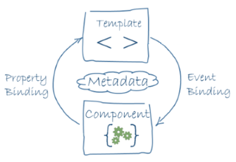

## Angular architecture overview

This document is intended to be a light summary of the concepts and principles of the Angular architecture. 

The authoritative source is the excellent "Architecture" section in the FUNDAMENTALS section of the Angular documentation. This content *complements* the official docs - it does *not* replace it. Make sure that you open and go through both.


<br>

### The big picture

To begin to understand the Angular architecture, the dev team has created a "big picture" diagram. 


<br>

**Let's start with "component"**

For now, focus on the middle of that diagram, which shows a *component*. 



<br>

To build an Angular app, we define a set of components, for every UI element, screen, and route. An app will always have a root component that contains all other components. (Credit to [Victor Savkin, "Core Concepts"](https://vsavkin.com/the-core-concepts-of-angular-2-c3d6cbe04d04).)

In the `src/app` folder, there are five source code files. Ignore a few of them for now, and focus on these two, which essentially define a *component*:

```text
app.component.html
app.component.ts
```

The purpose of the `.html` file should be apparent, after you inspect it:
* It includes a chunk of HTML, and so it defines the appearance of the rectangle (the area of the UI)
* It includes a *data binding* expression, `{{title}}`

Now, look at the `.ts` file. By convention, JavaScript source code files use the "js" filename extension. Here, by convention, TypeScript source code files use the "ts" filename extension. 

So the file contains our program code for the component. All components have the same structure:
* "import" statement(s)
* A "decorator" - `@Component()` - this is a probable future JavaScript language feature, which enables a library or framework to implement part of a class' behaviour; we pass in a configuration object
* The "class" declaration, which holds the component's code

That's the getting-started explanation. Components that do more will have more code - as you would expect - but this is how we can begin to understand.

<br>

### Where to next?

Back to the Angular documentation. 

We are asking you to go through the TUTORIAL now. Doing this will enable you to feel the Angular dev workflow, and get some code in front of you, particularly TypeScript code, which will likely be new. 

In a future class/session, we will circle back and connect some of this work to general architecture principles, so that we can build on this knowledge in the near future. 

The short-term goal for the week is to cover the content in the first four numbered steps of the tutorial:
1. Introduction
2. The Hero Editor
3. Master/Detail
4. Multiple Components

<br>

**Getting started**

The "Setup..." info in step number 2 will enable you to get the code for the project. 

Do that before continuing.

<br>

**Additional notes**

The Angular documentation is excellent. At this point here, we cannot add value. So, follow along and learn.

<br>
