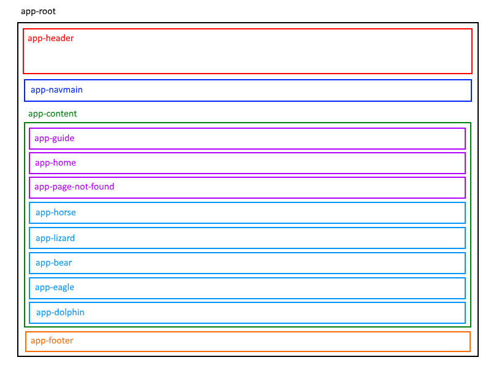
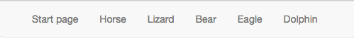

## Angular Components Example

In this document, you will create an app with several components. 

The goal is to become comfortable with the idea of components, and the process of creating and displaying them. 

<br>

### Getting started, new project

Your professors believe that it is important to plan your work *before writing code*. How?

Visualize what you are trying to do, and then quickly draw a simple diagram. (Diagramming skills are important for a programmer. These skills help you plan and later code more effectively. They also help you communicate with others, whether understanding someone else's plan, or selling your plan to someone else.)

A simple diagram will help you identify the information and functionality that your app needs. It will also naturally suggest what components it will need (and later services and so on). 

> Do this *BEFORE WRITING CODE*. 

For our example app, here's what we're trying to do. Each rectangle will (or could) have information and/or functionality inside.   



<br>

### Generate a new project  

At this point, we will assume that you are comfortable using the Angular CLI to create a new project. For example, this command will create a new "animals" project:

```
ng new animals --routing -st -sg
```
  
**Recall:** 
  
The `--routing` option adds the code we need for "routing", which is a topic that will be covered in detail next week. Adding routing now (when the new project is created) is a *best practice*. 

The `-st` option does not add "testing" code. One of the effects is that it reduces the size of the project, and makes it slightly faster in the change detection and build processes.

The `-sg` option does not create a Git repository for the project. That simplifies the configuration for us. 

**IMPORTANT NOTE:**

The latest version of the Angular CLI confuses the `-st` and `-sg` options with the new `-s` and `-t` options, which indicate that we **do not** wish to have external template (.html) and style (.css) files.  

If you have created an app using the above `ng new animals --routing -st -sg` command and your solution **does not contain app.component.html** then use the following command instead:

```
ng new animals --routing -S
```

This will skip the testing, while still keeping the .html &amp; .css files intact.  Unfortunately, it will still generate a .git directory inside your newly created "animals" directory.  Simply remove the .git directory to avoid using git in our solution.

<br>

#### Adding the Bootstrap styles

As we have seen, a quick way to kickstart the style / structure of your project is to use the Bootstrap framework. (At the time of writing, Bootstrap version 3.3.7 is a good choice, however Bootstrap 4 is currently in Beta and is available as well.)

We can add this framework by adding this now-familiar code to the `<head>` element in the `src/index.html` file:

```html
<link rel="stylesheet" href="https://maxcdn.bootstrapcdn.com/bootstrap/3.3.7/css/bootstrap.min.css" integrity="sha384-BVYiiSIFeK1dGmJRAkycuHAHRg32OmUcww7on3RYdg4Va+PmSTsz/K68vbdEjh4u" crossorigin="anonymous">
```

Optionally, add the following code to the bottom of the `<body>` element:

```html
<script src="https://code.jquery.com/jquery-3.2.1.min.js" integrity="sha256-hwg4gsxgFZhOsEEamdOYGBf13FyQuiTwlAQgxVSNgt4="crossorigin="anonymous"></script>
<script src="https://maxcdn.bootstrapcdn.com/bootstrap/3.3.7/js/bootstrap.min.js" integrity="sha384-Tc5IQib027qvyjSMfHjOMaLkfuWVxZxUPnCJA7l2mCWNIpG9mGCD8wGNIcPD7Txa" crossorigin="anonymous"></script>
```

<br>

#### Create the structural components

Create the app's basic structural components:
* Header
* Navigation (named "NavBar")
* Main content (named "Content")
* Secondary content (named "SideBar") 
* Footer

This is done with Angular CLI commands:

```text
ng g c header --flat
ng g c navbar --flat
ng g c content --flat
ng g c sidebar --flat
ng g c footer --flat
```

To review, the `ng g c` command creates the component's source code files, and updates the app module (by adding import-related code). 

A few notes about the source code files and generated code, using the first command above, "header":

In `header.component.ts`:
* A class named `HeaderComponent` is created
* Its selector is `app-header` 

In `header.component.html`, some getting-started text is generated. We always replace that generated text with our own. For example (using Bootstrap classes): 

```html
<div class="header">
  <div class="row">
    <h3>Animals are awesome!</h3>
  </div>
</div>
```

<br>

#### Create components to support routing (discussed next week)

Create components to support routing:
* Home (a home or start page)
* Page not found (named "PageNotFound")

This is done with Angular CLI commands:

```text
ng g c home --flat
ng g c PageNotFound --flat
```

Notice the use of CamelCase on the "PageNotFound" name. The Angular CLI will parse that, and make the component's file name assets use lower case, with dash separators between the words. Nice.

<br> 

#### Create components to hold content

Finally, create components to hold content; we'll use an *animals* theme:
* Horse
* Lizard
* Bear
* Eagle
* Dolphin

This is done with Angular CLI commands:

```text
ng g c horse --flat
ng g c lizard --flat
ng g c bear --flat
ng g c eagle --flat
ng g c dolphin --flat
```

At this point, you can edit the HTML template content to meet your needs. For example, the "horse" component has this HTML template to render a Bootstrap 3 "Panel" (the text content is from Wikipedia, and the image is from a Google search):

```html
<div class="horse panel panel-default" id="horse">
  <div class="panel-heading">
    <h3 class="panel-title">Horse</h3>
  </div>
  <div class="panel-body">
    <p>The horse (Equus ferus caballus)[2][3] is one of two extant subspecies of Equus ferus. It is an odd-toed ungulate mammal
      belonging to the taxonomic family Equidae. </p>
    <p>The horse has evolved over the past 45 to 55 million years from a small multi-toed creature, Eohippus, into the large,
      single-toed animal of today. Humans began to domesticate horses around 4000 BC, and their domestication is believed
      to have been widespread by 3000 BC. Horses in the subspecies caballus are domesticated, although some domesticated
      populations live in the wild as feral horses. These feral populations are not true wild horses, as this term is used
      to describe horses that have never been domesticated, such as the endangered Przewalski's horse, a separate subspecies,
      and the only remaining true wild horse. There is an extensive, specialized vocabulary used to describe equine-related
      concepts, covering everything from anatomy to life stages, size, colors, markings, breeds, locomotion, and behavior.</p>
    
  </div>
</div>
```

<br>

### Building the user interface

In the root of the project's file system, the `index.html` source code file can be left as-is, with no changes required. 

The first substantial change will be in the app component's HTML template. (Why? Because that is used - bootstrapped - when the app loads for the first time.)

Remove the existing content, except for the `<router-outlet></router-outlet>` element.

Then, add elements for each of the structural components:

```html
<app-header></app-header>
<app-navbar></app-navbar>
<div class="container"> <!-- All main "content" will be in a bootstrap "container" -->
  <app-content></app-content>
</div>
<app-footer></app-footer>
```

Notice the `app-content` selector. Let's look at the correspond "content" component next. Only its HTML template needs to be updated at the moment:

```html
<div class="content row">
  <div class="col-md-12">
      <app-guide></app-guide>
      <app-home></app-home>
      <app-page-not-found></app-page-not-found>
      <app-horse></app-horse>
      <app-lizard></app-lizard>
      <app-bear></app-bear>
      <app-eagle></app-eagle>
      <app-dolphin></app-dolphin>
    </div>
</div>
```

Notice how the "content" component contains all of our other "content" and "routing" components.  This corresponds directly with our initial design from the "Getting Started" section above!  Once our components are defined, it's simple to place them within other components to create complex views.   

<br>

#### Updating our Navigation component

For now, the navigation component - i.e. the menu bar - will simply be used to jump to a specific "content" component (ie: "horse" using it's "id" element, ie

```html
<a href="#horse">Horse</a>
```

Open the HTML template for the "navbar" component. Create a standard, Bootstrap 3 Navbar:

```html
<nav class="navbar navbar-default">
    <div class="container-fluid">
        <!-- Brand and toggle get grouped for better mobile display -->
        <div class="navbar-header">
            <button type="button" class="navbar-toggle collapsed" data-toggle="collapse" data-target="#bs-example-navbar-collapse-1"
                aria-expanded="false">
                <span class="sr-only">Toggle navigation</span>
                <span class="icon-bar"></span>
                <span class="icon-bar"></span>
                <span class="icon-bar"></span>
            </button>
        </div>

        <!-- Collect the nav links, forms, and other content for toggling -->
        <div class="collapse navbar-collapse" id="bs-example-navbar-collapse-1">
            <ul class="nav navbar-nav">
                <li>
                    <a href="#start">Start page</a>
                </li>
                <li>
                    <a href="#horse">Horse</a>
                </li>
                <li>
                    <a href="#lizard">Lizard</a>
                </li>
                <li>
                    <a href="#bear">Bear</a>
                </li>
                <li>
                    <a href="#eagle">Eagle</a>
                </li>
                <li>
                    <a href="#dolphin">Dolphin</a>
                </li>
            </ul>
        </div>
        <!-- /.navbar-collapse -->
    </div>
    <!-- /.container-fluid -->
</nav>
```

The result will look something like the following:



<br>

### Study the code example

See the ["animals" code example in the Week 6 folder](https://github.com/sictweb/bti425/tree/master/Week_06) of our BTI425 GitHub repository. 

It implements the instructions in this document.

For best learning results, you should try to reproduce it.

<br>
