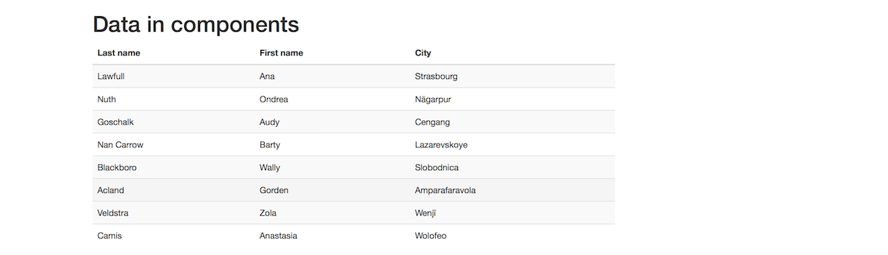
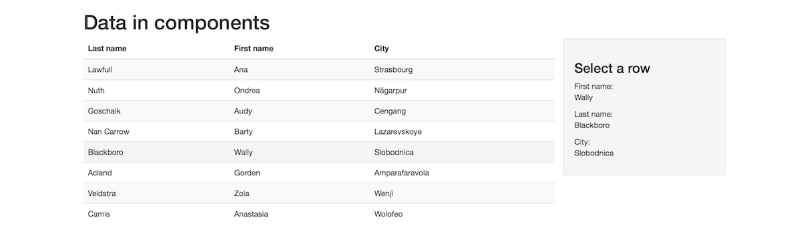
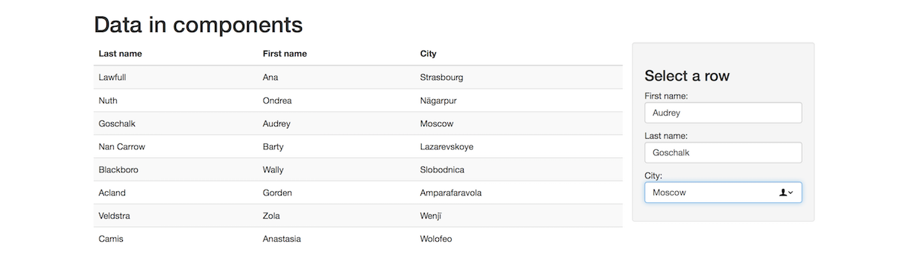
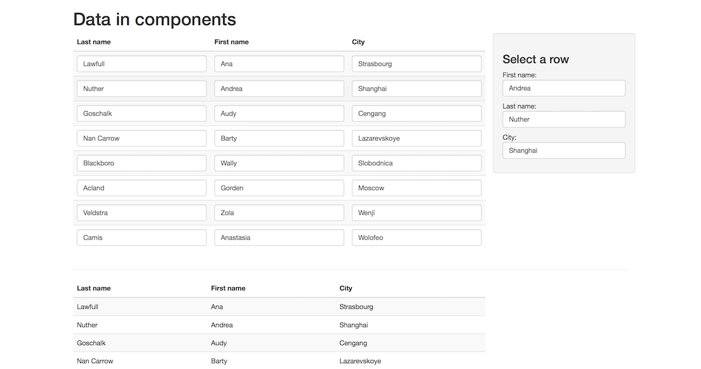

## Angular Components In Class Demonstration

Live coding demonstration. 

<br>

### Create an app

Create a new Angular app:

```
ng new my-customers --routing -S -g
```

Open it in a code editor. Study the result. 

Run the app, and view it in a browser. Open the browser dev tools, and show the console.

Edit the `index.html` file, to add the Bootstrap CSS rules from its CDN, and then make sure that it is working.

<br>

### Add new components, and a data/schema class

Create two components. We need a nice "header":

```
ng g c header --flat -S
```

> Remember: `g` is the abbreviation for "generate", and `c` is the abbreviation for "component".  
> And: `--flat` does not create a folder to hold the new component's source code files, and `-S` does not create a test class file. 

Next, we need a component that will display a list of customers:

```
ng g c customers --flat -S
```

Finally, we need to write a code module that describes a "customer" - data or schema code, in other words. In an Angular app, we can use a class, or a [TypeScript *interface*](https://www.typescriptlang.org/docs/handbook/interfaces.html). Here, we will use a class:

```
ng g class customer -S
```

> Note and FYI: In C++, you are probably familiar with an abstract base class, with pure virtual methods. In TypeScript, this is called an *interface*.  
> You can create a new class instance that inherits from an interface. Similar to C++, you cannot directly create an instance of an abstract base class - you must create a new instance of an object (i.e. a class) that *inherits* from an abstract base class.  
> The same concept applies to a TypeScript interface.  
> Later in the course, we will create and use interfaces. 

What properties do we write for the new "Customer" class? Continue with the next task...

<br>

### Get the data

In Assignment 1, you learned how to use the Mockaroo.com service to generate some data. Return to Mockaroo.com and generate some new data for some customers. 

Study the data in your file. Then, edit the new "Customer" class, and add matching properties. 

<br>

### Getting started - TypeScript data/schema class design

The code generator created an empty "Customer" class. 

As you would expect, a TypeScript class can hold declarations (symbols) for state (properties) and behaviour (methods). Let's start with properties. 

Property names are usually camelCase, and begin with a lower-case letter. Each property is typed. We'll use "string" and "number" for now. If your Mockaroo.com-generated data includes a date string, then it is a string. (Don't try to define it as a date object.) For example:

```js
export class Customer {
  id: number;
  firstname: string;
  // other properties
}
```

Code modules (class or interface) that describe the shape of data / schema objects typically do not have any or many methods. 

<br>

### Show/display the new "CustomersComponent", etc.

Above, we generated the new component, but we cannot see it yet. Let's fix that now. Edit the App component's HTML template (`app.component.html`). 

Comment out, or delete, all the code except for the `<router-outlet>` element. Replace it with custom elements for the two new components created above:

```html
<!-- new... -->
<app-header></app-header>
<app-customers></app-customers>
<!-- existing... -->
<router-outlet></router-outlet>
```

Save your work, and look at the result. It's a bit ugly, but it does prove that it is working. Let's make it look a bit better now.

<br>

#### Put the content in a container

Edit `index.html`. Enclose the `<app-root>` element in a "div" element that uses the Bootstrap "container" class. 

<br>

#### Edit the header text

Edit the Header component's HTML template. Replace the text with an "h1" element that has some better and more descriptive text. 

Now, we'll work on the new Customers component. Before we do much, let's learn something about the design of a component class. 

<br>

### Getting started - Angular component class design

A typical component class (`whatever.component.ts`) has this design:

```js
import { Component, OnInit } from '@angular/core';
// Other imports, e.g. data classes etc. 

// Decorator... located just before the class declaration
@Component({
  selector: 'app-whatever',
  templateUrl: './whatever.component.html',
  styleUrls: ['./whatever.component.css']
})
// Class declaration...
export class WhateverComponent implements OnInit {

  // Constructor, which can be edited
  constructor() {}

  // On initialization event handler, which can be edited
  ngOnInit() {}

  // Methods that can be called; may or may not return a result; for example...
  hello() {
    return "Hello, world!";
  }

  // Properties that hold data/state (and they should be initialized somewhere); for example...
  name: string;
  age: number;
  pets: string[];
}
```

With that knowledge, let's edit the Customers component. We will be editing the code (the `.ts` file) and the template (the `.html` file). 

<br>

### Display a list of customers 

Our first task is to display a list of customers. Let's create an array property that will hold about 5 or 10 customers from your Mockaroo.com-generated data. For example, here's the statement that will create a 2-element array:

```js
// The data we want to display
customers = [{ "id": 1, "firstname": "Ana", "lastname": "Lawfull", "city": "Strasbourg", "email": "alawfull0@imgur.com", "website": "http://nsw.gov.au/sed/accumsan.json", "birthdate": "1996-03-19T09:05:56Z", "credits": 6938 },
{ "id": 2, "firstname": "Ondrea", "lastname": "Nuth", "city": "Nāgarpur", "email": "onuth1@last.fm", "website": "http://usa.gov/aliquet.xml", "birthdate": "1997-03-02T14:08:54Z", "credits": 4032 }];
```

While that's OK, we really must create a *typed* array. Force the `customers` array to be *an array of type Customer*. You wrote the class above, so let's use it. This changes the statement slightly:

```js
// The data we want to display
customers: Customer[] = [{ "id": 1, "firstname": "Ana", "lastname": "Lawfull", "city": "Strasbourg", "email": "alawfull0@imgur.com", "website": "http://nsw.gov.au/sed/accumsan.json", "birthdate": "1996-03-19T09:05:56Z", "credits": 6938 },
{ "id": 2, "firstname": "Ondrea", "lastname": "Nuth", "city": "Nāgarpur", "email": "onuth1@last.fm", "website": "http://usa.gov/aliquet.xml", "birthdate": "1997-03-02T14:08:54Z", "credits": 4032 }];
```

Uh oh, it doesn't know about the Customer class yet. We solve this by adding an "import" statement near the top:

```js
import { Customer } from "./customer";
```

<br>

#### Update the template

Open the component's HTML template for editing. Create a Bootstrap row div, and inside that, a div that will be 3/4 of the total width. 

Then, render a table. Use the Bootstrap table and table-striped classes. It might be nice to use the table-hover class too.

Now, render the rows. How? the `*ngFor` *structural directive* will do that for us. Similar to the array `map()` functionality in React (JSX), it will create elements for each item in a collection. Here's what it looks like:

```html
<tbody>
  <tr *ngFor="let c of customers">
    <td>{{c.lastname}}</td>
    <td>{{c.firstname}}</td>
    <td>{{c.city}}</td>
  </tr>
</tbody>
```

Notice how the data items are rendered. The first and easiest way to do data binding is *interpolation* binding (read-only, for display), which uses a syntax similar to Handlebars, double curly braces. When rendering data that's in a component property, just write its name. Data flows from the component to the target. 

<br>

#### Save and run

Save your work, and run it. It should look like this:



<br>

### Select an item, view its details

Recall that your Assignment 1 work enabled a browser user to click a table row to display more details in an area on the right side of the table. Let's add that now. Here's how to think about this task:
1. Add a click handler to each table row (in the markup)
2. Write the click handler method (in the code)
3. Add elements that render the detail (in the markup)

<br>

#### Add a click handler

An easy task, similar to React, and easier than the pure JavaScript or assisted jQuery ways. For any element, we add an event handler with this syntax:

```html
... (event-name)="methodName(optionalArguments)" ...
```

So, let's add a "click" handler. It will call a method named "selectRow()" (we will write that next), and pass the current object/data to the method:

```html
<tr *ngFor="let c of customers" (click)="selectRow(c)">
```

<br>

#### Write the click handler method

In the component's code, add a new property to hold the data for a selected customer. Remember, we're using TypeScript, so we must declare the property's type:

```js
selectedCust: Customer;
```

Next, write the click handler method. It will accept an argument (the selected customer's data), and then simply set the just-created "selectedCust" property:

```js
selectRow(c: Customer) {
  this.selectedCust = c;
}
```

<br>

#### Add elements that render the detail

In the component's HTML template, add a new div that is 1/4 of the total width, so that it will end up beside (i.e. on the right side of) the table. 

Then add some elements to the new div. Use the interpolation binding technique you learned above. For example:

```html
<h3>Select a row</h3>
<p>First name:<br>
{{ selectedCust.firstname }}</p>
<p>Last name:<br>
{{ selectedCust.lastname }}</p>
<p>City:<br>
{{ selectedCust.city }}</p>
```

That's it. Save your work, and run it. 

<br>

#### A few refinements

It would be nice if the pointer shape changed to a "pointing finger" when hovered over the table rows. There are different ways to make it work. An easy way is to add a class to the table's `<tbody>` element. Then, in the component's CSS, add a rule:

```css
.tableBody:hover {
  cursor: pointer;
}
```

If you have the console running, you probably noticed an error message that complained about the value of selectedCust. You can fix that easily, using a few different ways. One way is to add a statement to the constructor method that initializes selectedCust to a new (empty) Customer object. 



<br>

### Enable editing, version 1

Let's change the detail area so that it is an editor. We'll change the rendered text values (from selectedCust) to `<input>` elements. The idea is that an edit will update the data that's displayed in the table *at the same time*. 

<br>

#### Prepare the app to use HTML Forms elements

Angular has a great story for supporting HTML Forms elements. Let's add the support to the app. Open the App module (`app.module.ts`) for editing. Near the top, import the forms module:

```js
import { FormsModule } from "@angular/forms";
```

Then, in the "imports" collection of the `@NgModule` decorator, add `FormsModule`. 

<br>

#### Edit the template

Replace the display-only detail elements with `<input>` elements, as suggested below:

```html
<h3>Select a row, then edit</h3>
<p>First name:<br>
<input class="form-control" [(ngModel)]="selectedCust.firstname"></p>
```

The `ngModel` symbol represents the component's data model. In other words, its properties. (Remember, one of those properties is "selectedCust".)

The `( )` parentheses, like the event-handling example above, enables browser user input to the component. 

The enclosing `[ ]` brackets is the other form of component-to-target binding. (Above, you learned about interpolation.) 

Together, `[( )]` means "two-way" binding, in and out, to and from. That's what we want here. 

On the right side of the equals sign is the expression. For this simple use case, it's simply the name of the property we want to render and enable editing for. 

Save your work and run. It just works. Do some edits, and notice that the table updates as you type.  



<br>

### Enable editing, version 2

Just for fun, let's change the table so that every cell can be edited. 

First, copy the table, and paste it below the div row, into a new div row. We suggest that you separate the two divs with a horizontal rule (aka "thematic break") element. Doing this will save/preserve our current work, and give us a slick way to show editing results.

In the top table, replace the interpolated bindings with an `<input>` element. That's all you have to do.

```html
<tr *ngFor="let c of customers" (click)="selectRow(c)">
  <td>
    <input class="form-control" [(ngModel)]="c.lastname">
  </td>
  <!-- etc. -->
```

Again, easy. 



<br>

Happy coding!

<br>
