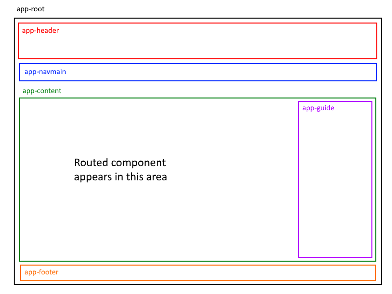

## Angular routing example

In this document, you will configure routing in an app that has several components. It's the app that was created in the [Angular components example](angular-components-example) document. Here, we will make the changes to support routing.

The goal is to become comfortable with the routing foundations and configuration, and the process of implementing routing in an app. 

<br>

### Getting started, new project

To get started, we are repeating the advice from last week:

Your professors believe that it is important to plan your work *before writing code*. How?

Visualize what you are trying to do, and then quickly draw a simple diagram. 

A simple diagram will help you identify the information and functionality that your app needs. It will also naturally suggest what components it will need. *It will also naturally suggest how routing will work in the app.* 

> Do this *BEFORE WRITING CODE*. 

For our example app, here's what we're trying to do. Each rectangle will (or could) have information and/or functionality inside.   



<br>

### Generate a new project  

Last week, the *Angular Components Example* notes helped you learn to generate a project that had many components. 

Review, or follow the procedure in the [Generate a new project](angular-components-example#generate-a-new-project) topic section (and stop or pause just before the "Building the user interface" topic section).

> Do this now, before continuing.

<br>

#### Configure the user interface structure

In last week's *Angular Components Example*, the user interface was built by adding custom elements for *all* the generated components. This week, it will be a bit different. 

We do start out by doing the same task as last week - we edit the app component's HTML template (`app.component.html`). It will look the same as it did last week:

```html
<app-header></app-header>
<app-navmain></app-navmain>
<div class="container"> <!-- All main "content" will be in a Bootstrap "container" -->
  <app-content></app-content>
</div>
<app-footer></app-footer>
```

This week, the content component's HTML template will be different. How? It will be configured for routing, and therefore will not simply include elements for all components. In other words, it is the "host" component. The other routed components will be inside the host. 

Edit the content component's HTML template (`content.component.html`). We will have a left-side main content rectangle, and a right-side guide (or "sidebar"):

```html
<div class="content row">
  <div class="col-md-9">
      <router-outlet></router-outlet>
    </div>
  <div class="col-md-3">
      <app-guide></app-guide>
  </div>
</div>
```

Notice the new `<router-outlet>` custom element. As you have learned, the HTML markup from the routed component will be added to the document object model (DOM) *just below* the `<router-outlet>` element. 

Also notice that we're doing something different here, when compared to a "new" project, which locates the `<router-outlet>` element in the *app component*. Here, we are locating it in the *content component*. 

<br>

#### Checkpoint

At this point, you have or have done the following:
* A simple diagram of the UI
* A user interaction plan
* A project with a number of components
* A structure to hold routed components.

Good work so far - your project is ready and prepared for routing. 

Let's circle back and complete the work by 1) configuring the app routing module, and 2) configuring navigation.

<br>

#### Configure the app routing module

Open the app routing module (`app-routing.module.ts`) for editing. 

The following is a repetitive process. For each standard "content" component:

Add an "import" statement. For example: 

```js
import { HorseComponent } from "./horse.component";
```

Then, add a new *route* object to the `routes` array. For example

```javascript
const routes: Routes = [
  { path: 'horse', component: HorseComponent }
];
```

After doing this for each content component, add the configuration for the special routed components and routes. In other words, the *empty* route, and the *not found* component and route. (Review the [how-to notes](angular-routing-intro#special-routed-components-and-routes) if needed.)

<br>

#### Configuring navigation

You have recently learned that a purpose-built "navigation" component - in other words, a menu - will enable navigation and routing to work. 

Therefore, open the navigation component's HTML template (`navmain.component.html`) for editing. 

Add menu items for each routed content component. Notice that we do NOT use an `href` attribute. Instead, we use a `routerLink` attribute:

```html
<div class="navmain row">
  <ul class="nav">
    <li class="nav-item">
        <a class="nav-link" routerLink="/home"><b>Home page</b></a>
    </li>
    <li class="nav-item">
        <a class="nav-link" routerLink="/horse">Horse</a>
    </li>
    <!-- etc. -->
```

<br>

#### Quick note: RouterLinkActive directive

A great feature included in the @angular/router package is the ["RouterLinkActive" Directive](https://angular.io/api/router/RouterLinkActive).  Using this directive, we can specify a class to be added *only when the route is "active"*.  

This is extremely useful when writing navigation components, as they typically require a class to be applied when the corresponding route is visible (ie: we wish to highlight the text "Horse" by setting the class "active" on the parent `<li>` element:

```html
<li class="nav-item" routerLinkActive="active">
  <a class="nav-link" routerLink="/horse">Horse</a>
</li>
```

<br>

### Summary

In this document, you learned to adapt the procedure you learned last week - an app with multiple components - to include and enable *routing*. 

Adding and configuring routing is an incremental task, and it builds upon existing skills with a consistent and logical approach. 

Future course topics will continue to use routing, and will also enable you to learn more about richer and more complex routing scenarios. 

<br>
