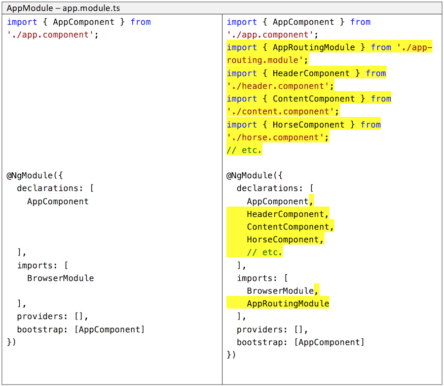
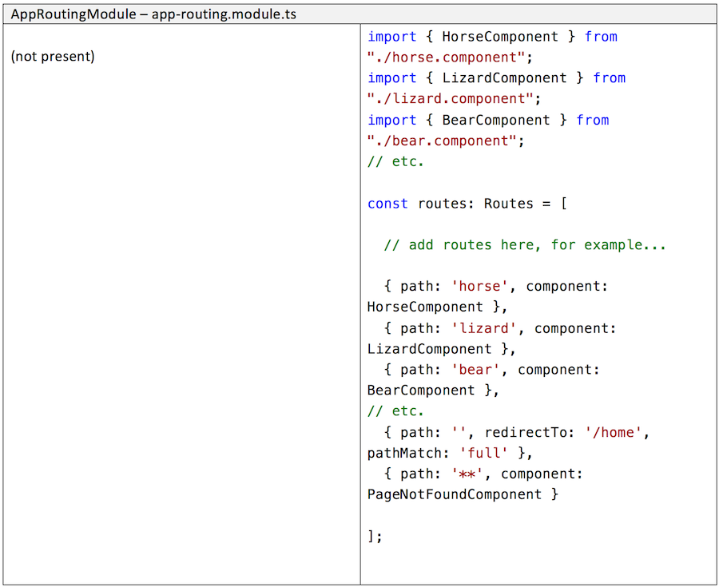
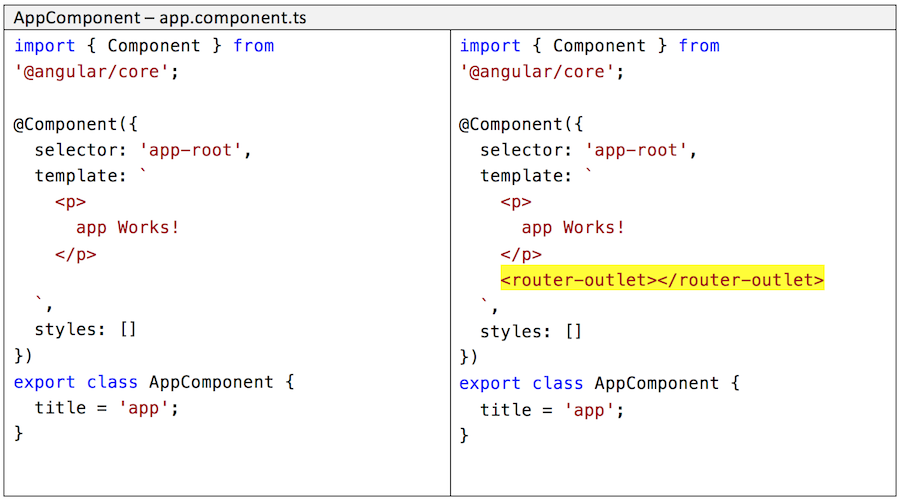

## Adding routing to an *existing* app

In this document, you will learn how to add the routing feature to an existing app. 

It is not very likely that you will be working with an app that does not yet have routing. But if you do, use this information to help you add routing.

 

### Adding routing to an app (our guidance)

To get started, it is worthwhile to understand how an app with routing is different from an app that does not have routing. 

In summary, there are only a small number of differences:
* The app module is configured with the routing feature 
* A new app routing module is created
* A "host" component is configured with a `<router-outlet>` element
* Navigation elements use a special `routerLink` attribute

Let's study each difference to learn exactly what to do to add routing to an app.

 

#### App module edits

Open the app module (`app.module.ts`) for editing.

The code for an app that does NOT have routing is in the left column. The right column shows the new code  - highlighted in yellow - for an app with routing.

 

#### New app routing module

Create a new file (`app-routing.module.ts`) to hold the app routing module source code. 

All code in the right column is new.

 

#### Configure a router outlet somewhere

Open the HTML template that will host the routed components. The example below shows the new `<router-outlet>` element in the app component inline HTML template.

The right column shows the new code  - highlighted in yellow - for an app with routing.

 

#### Additional optional info

From the community...

Here is a helpful note (in addition to the official docs):  
[SO - add routing module](https://stackoverflow.com/questions/44990030/how-to-add-a-routing-module-to-an-existing-module-in-angular-cli-version-1-1-1)

Another take on this task:  
[Config routing](https://shermandigital.com/blog/configure-routing-in-an-angular-cli-project/)

 
