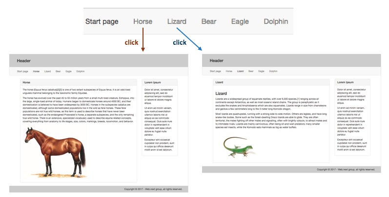

## Angular routing, introduction

Recall the ["Routing" in React](react-routing) notes from a few weeks ago. (Please review them before continuing.)

To summarize, you learned some new ideas:
* The purpose of routing is to implement navigation in an app
* Routing matches a URL/path to a component
* In an app, we must add the router code module, and then design and configure the URLs
* It is possible to define URL parameters
* It is possible to define a "not found" route

As you would expect, Angular has the routing feature. If you understood the configuration and use of routing in React, then you will be comfortable with routing in Angular. 

> One of the differences between Angular and React is that the Angular team wrote the router as part of the platform. If you want routing in a React app, then you must use a third-party router written by people who are not on the React team. 

This document covers some of the *getting started* topics, with the support of the official Angular documentation. Then, in a separate document, we'll take an existing app that has multiple components, and implement routing for it.

For the remainder of the course, we'll continue to work with routing, as we cover *services* and *interactive forms*. 

<br>

### Supporting documentation

In the official [Angular.io documentation](https://angular.io/docs) set, there are two main sources of information on routing. 

One is the **TUTORIAL > Routing** area. To preview its contents:
* It continues with the *Tour of Heroes* example
* Routing is added manually to the app
* Its "version 1" approach is to define the route definitions among many source code files; after refactoring, its "version 2" approach gathers them into the preferred way, into the routing module
* It incrementally adds *default* and *not found* routes

In summary, the content is useful to read/skim. (Do that now.) However, your professors think that its learning path should not be considered best practice or authoritative. Today, we will recommend an approach that provides many benefits, including coding ease, better quality, and repeatability. 

The other source of information is the **FUNDAMENTALS > Routing & Navigation** area. To preview its contents:
* It uses the same *Tour of Heroes* problem and data set
* An evolutionary and detailed approach through a wide range of routing and routing-related topics, with much detail
* Includes many topics (router state, router events, guard, child, lazy load, etc.) that are too advanced for our current needs (later in the course, we will cover some of them)

In summary, some of this content is useful to skim. (Do that now.) However, your professors think that its learning path is too detailed and too tied to the *Tour of Heroes* example. As a result, it's not as clear as it could be in presenting routing topics to you in a way that you can understand, repeat, and implement. As noted above, we will recommend an approach that will be better. 

<br>

### Adding routing to an app

The best and easiest way to add the routing feature to an app is to make sure that it has it when the project is *created* for the first time. 

As you have learned, when learning more about components, we should (must) use the `--routing` option when creating a new project:

`ng new animals --routing -st -sg`

**IMPORTANT NOTE:**

The latest version of the Angular CLI confuses the `-st` and `-sg` options with the new `-s` and `-t` options, which indicate that we **do not** wish to have external template (.html) and style (.css) files.  

If you have created an app using the above `ng new animals --routing -st -sg` command and your solution **does not contain app.component.html** then use the following command instead:

```
ng new animals --routing -S
```

This will skip the testing, while still keeping the .html &amp; .css files intact.  Unfortunately, it will still generate a .git directory inside your newly created "animals" directory.  Simply remove the .git directory to avoid using git in our solution.


The remainder of this document teaches you how to configure and use routing. 

<br>

**Adding routing to an *existing* app**

We prefer to cover this topic in a [separate document](angular-routing-existing-app). 

It is not very likely that you will be working with an app that does not yet have routing. As a result, we prefer to cover that topic separately, to minimize the distraction from our main message in this document.

<br>

### Configure and use routing

At this point in time, we have a project with the routing feature. 

Let's study the project's code, to learn how to recognize routing in an app, and to learn where to find the routing feature. That will enable us to learn where to begin configuring and using it. 

<br>

#### New source code: app-routing.module.ts

In the `src/app` folder, notice a new `app-routing.module.ts` source code file. Its contents:

```javascript
import { NgModule } from '@angular/core';
import { Routes, RouterModule } from '@angular/router';

const routes: Routes = [];

@NgModule({
  imports: [RouterModule.forRoot(routes)],
  exports: [RouterModule]
})
export class AppRoutingModule { }
```

<br>

Notice the `routes` constant. Soon, we will edit the contents of the empty array, and add *route objects*. Each of these route objects has a *string URL path*, and the name of a *component class*. 

Before we add each route object, we will `import` the component that it refers to. For example:

```javascript
import { HorseComponent } from "./horse.component";
import { HomeComponent } from "./home.component";
import { PageNotFoundComponent } from "./page-not-found.component";
```

When fully configured, the `routes` constant will look something like this:

```javascript
const routes: Routes = [
  { path: 'home', component: HomeComponent },
  { path: 'horse', component: HorseComponent },
  { path: '', redirectTo: '/home', pathMatch: 'full' },
  { path: '**', component: PageNotFoundComponent }
];
```

<br>

> Notice - if you're coding the routes while reading this, make sure that:  
> 1) the component already exists, and  
> 2) it is imported.

<br>

#### Updated code: app.module.ts

In the `src/app` folder, notice the familiar `app.module.ts` source code file. 

The ability of the app to support routing is seen in this file. The code was added because the `--routing` option was used when the project was created. 

First, in the "import" statements near the top, we see:

```javascript
import { AppRoutingModule } from './app-routing.module';
```

Then, in the `@NgModule` decorator, it matches up to an `AppRoutingModule` value in the `imports` array:

```javascript
  imports: [
    BrowserModule,
    AppRoutingModule
  ],
```

<br>

#### Checkpoint...

To summarize so far, routing is recognized in an app by the presence of the app routing module code, and some new code in the app module. 

To preview the rest of the procedure, here's what we must do:
1. Plan your components and routes
2. Add one or more components that will participate in routing
3. In the HTML markup (i.e. the view code) of the component that will "host" the routed component, add a `<router-outlet>` element
4. In the HTML markup of a navigation component (or any kind of component), use the `routerLink` attribute in the `<a>` element instead of the `href` attribute

<br>

#### Planning your components and routes

This is the *think before you code* task. Very important. 

One of the first tasks to be done when designing any app is to *sketch out* the user interface (UI), and the interaction or usage flow. 

This task will enable you to clearly and separately *list or document* the components that will enable your UI and interaction plan. Some will be structural (in that they will appear on every screen), while others will be routed components. 

Let's assume that we will continue with the example from last week's components coverage. In other words, we're creating an "animals" app, with many components. Here's an example of a sketch, showing an example UI and interaction flow, for a couple of animals:



<br>

Finally, as a result of sketching out the UI and interaction flow, and then listing/documenting the components that are needed, you will be able to design or infer the URL path segments for each routed component. 

> Some of this work is done in the companion [getting started example](angular-routing-example) document. 

The result will enable you to begin creating components, using the Angular CLI generator. 

<br>

#### Adding a *new* routed component

Although the content in this section is mentioned in the "Notice" callout above, we'll cover it now in a clear and complete fashion. 

Adding a new *routed* component is an easy thing to do, with a clear and unambiguous procedure. In fact, it adds only one more task to the overall task of adding a new component to an app. 

You already know that a new component can be added to an app with an `ng g c foo --flat` command in the Angular CLI. The command will 1) generate the source code files for the new component, and 2) update the app component by adding an "import" statement and a value in the "declarations" array. 

To enable the new component to participate in routing, we must do one more task (which you have seen above):

Edit the `app-routing.module.ts` source code file. Assume we are working with a newly-created app that supports routing.

Near the top, add an "import" statment. Assume that we have just added (generated) a new "horse" component. The import statement will look like the following. It is no different from the code statement that was added to the app module:

```javascript
import { HorseComponent } from "./horse.component";
```

Then, add a new *route* object to the `routes` array:

```javascript
const routes: Routes = [
  // other existing routes may already be here
  { path: 'horse', component: HorseComponent },
  // other existing routes (empty, not found, etc.)
];
```

In summary, this enables a component to participate in routing. There's still a bit more to do however, explained soon.

<br>

**What's in a *route object*?**

A *route object* a JavaScript object that conforms to the [Route interface](https://angular.io/api/router/Route). 

While the interface documentation shows the members, we must look at the [Routes type](https://angular.io/api/router/Routes) documentation to learn about the purpose and use of each member. 

For beginner scenarios, the most-often used members are:

`path` - a string for the URL segment that follows the leading slash 

`component` - a component type (class name)

Soon, you will learn about a couple of other members for some specialty route objects.

<br>

#### Locate and use the router-outlet element in the hosting component

The view for a routed component must appear somewhere, right?

Choose a component that will be the "host" for routed components. Often it will be a simple content container that conceptually enables other content to be swapped in and out (i.e. routed) based on some interaction or context/environmental stimulus. 

Then, in that component's HTML markup, in a suitable location, add a `<router-outlet>` element:

```html
<!-- other markup above -->
<router-outlet></router-outlet>
<!-- other markup below -->
```

At runtime, the HTML markup from the routed component will be added to the document object model (DOM) *just below* the `<router-outlet>` element. 

> Note: In a new app, we find the `<router-outlet>` element in the *app component*.

<br>

##### More about router-outlet

In the [RouterOutlet documentation](https://angular.io/api/router/RouterOutlet), we learn that it is a *directive*. 

"It acts as a placeholder that Angular dynamically fills based on the current router state." 

> A directive is an important part of Angular architecture.  
> A directive allows you to attach behaviour to elements in the DOM.  
> As you have recently learned, a component is a directive that includes an HTML template.  

<br>

#### Showing a routed component - the routerLink attribute

How can we cause the view for a routed component to appear? 

Most often - at least for beginner or introductory app scenarios - we use a navigation component. For example, the view code (i.e. the HTML markup) for this kind of component is typically an unordered list of `<a>` (anchor/hyperlink) elements. 

In standard HTML documents, the `href` attribute is used. However, we do NOT use this attribute in links to routed components. Instead, re use the `routerLink` attribute.

> To repeat:  
> In an `<a>` element, REPLACE the `href` attribute  
> with a `routerLink` attribute. 

For example, assume we are adding a link to the new "horse" component from above. We add a new `<a>` element, as shown below. (The `nav-...` classes are from the Bootstrap styles.)

```html
  <!-- other markup below -->
  <li class="nav-item">
    <a class="nav-link" routerLink="/horse">Horse</a>
  </li>
  <!-- other markup below -->
```
<br>

##### More about routerLink

In the [RouterLink documentation](https://angular.io/api/router/RouterLink), we learn that it is a directive. 

It "Lets you link to specific parts [components] of your app." 

In the Description section, it briefly describes the usage of a static link, which we use today. It also has other coverage, which will be useful next week, or in the future:
* Dynamic links/values
* Segment naming and matching rules
* Query string parameter handling

<br>

#### Special routed components and routes

While the tasks above will enable you to successfully define, configure, and use routing, an app needs a few more "special" routing-related tasks. 

First, an app should have a "home" view, that serves as its "start page" or "landing page". That's easy to create and code. The component's name can be "home" or "start" or something that makes sense for your app.

> It is usually a good idea to configure the "home" route as the first object in the routes array.

Next, an app must have a *route object* to handle an empty route. In other words, if the URL has no segments - just the host name - then the app must know what to show. Assuming that you have already created a "home" component (mentioned in the previous paragraph), add a new *route object* to the `routes` constant in the app routing module:

```javascript
const routes: Routes = [
  // existing route objects
  { path: '', redirectTo: '/home', pathMatch: 'full' }
];
```

Finally, an app must have a component that will appear whenever an invalid (non-existing) URL is entered or processed. This is the classic "page not found" use case. To accomplish this, create a new component using the Angular CLI, and pay attention to the use of upper and lower case, by using CamelCase:

```text
ng g c PageNotFound --flat
```

The Angular CLI will look at the CamelCase name, and generate properly-named source code files and a JavaScript class. 

Then, in the app routing module, add another *route object* as the *last item* in the `routes` array:

```javascript
const routes: Routes = [
  // existing route objects
  { path: '', redirectTo: '/home', pathMatch: 'full' },
  { path: '**', component: PageNotFoundComponent }
];
```

<br>

##### Does the order of the *route objects* in the `routes` array matter?

Does the order of the *route objects* in the `routes` array matter? 

Yes. Here are some getting-started guidelines:

Place the *more specific* route(s) (i.e. the one with more segments, and/or URL parameters, and/or query string paramaeters) above (before) the *less specific* route(s). This will make more sense next week, when we begin to use URL parameters. 

Place the *empty*  route just above (before) the last route in the array. 

Finally, place the *not found* route as the last item in the array. 

<br>

### Summary, and next actions

Before this week, you learned how to create and work with *components*. The scenarios were simple, in that the goal was to package and display an area of the user interface. Multiple components were created and displayed. 

This week, we learned how to add *routing* to an app. This feature enables the app to swap out or replace a component (an area of the user interface) with another. 

The best plan is to ensure that a new project is created with the routing option. Then, adding routed components becomes a predictable and straightforward manner. 

<br>

##### Next actions

In our [getting started example](angular-routing-example) document, you will learn to enhance the "animals" components example, by adding the routing feature. 

<br>
