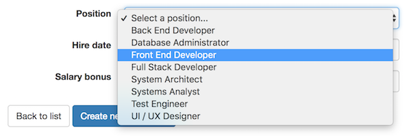

## Angular service and the Teams API

This document has information about using the Teams API from an Angular service. 

<br>

### Return types

The return type information is from [USING THE API](https://github.com/sictweb/bti425/tree/master/Templates_and_solutions/teams-api#using-the-api). 

All of the HTTP GET methods return a collection, which is an array. *Yes, even the "get one" methods.* 

For example, assume that we send an HTTP GET request to this URL, to get a specific employee:

```
https://your-teams-api.herokuapp.com/team-raw/599b0af0fc13ae20630004b0
```

<br>

Here is the response:

```json
[
  {
    "_id":"599b0af0fc13ae20630004b0",
    "TeamName":"Team 11",
    "TeamLead":"5997456604a898b529b5ee07",
    "__v":0,
    "Employees":[
      "5997456604a898b529b5ee08",
      "5997456604a898b529b5ee09",
      "5997456604a898b529b5ee0a",
      "5997456604a898b529b5ee0b",
      "5997456604a898b529b5ee0c",
      "5997456604a898b529b5ee0d",
      "5997456604a898b529b5ee0e",
      "5997456604a898b529b5ee0f",
      "5997456604a898b529b5ee10",
      "5997456604a898b529b5ee11",
      "5997456604a898b529b5ee12",
      "5997456604a898b529b5ee13",
      "5997456604a898b529b5ee14",
      "5997456604a898b529b5ee15",
      "5997456604a898b529b5ee16",
      "5997456604a898b529b5ee17",
      "5997456604a898b529b5ee18",
      "5997456604a898b529b5ee19",
      "5997456604a898b529b5ee1a"
    ],
    "Projects":[
      "599af650fc13ae7e60000070",
      "599af650fc13ae7e60000071"
    ]
  }
]
```

<br>

#### Use the returned result

We must remove it from the array. Here's a suggested strategy. 

First, in the service, plan to return a typed collection, from "get all" and "get one" methods. In other words, don't change the logic there. For example:

```ts
// Assume that teamsApi is the injected HttpClient object
teamGetById(id: string) {
  return this.teamsApi.get<Team[]>(`${this.Url}team/${id}`);
}
```

Then, in the component, extract the result. Do it as the *last task* in the body of the `subscribe()` method. For example:

```ts
// Assume that t is a property of type Team
// Assume that id is a string value of the route parameter
// Assume that m is the data manager service
// In the following, c is the array of Team objects inside the Observable
this.m.teamGetById(id).subscribe(c => this.t = c[0]);
// Then, in the template markup, we can use the properties
// of the "t" Team object
```

<br>

### Sorting a collection

As you know, the Teams API delivers collections that don't seem to be sorted in any reasonable way. 

Where can we put the code to do sorting? Well, we could attempt to put it in the data manager service, or in a component. 

We would suggest doing this task in a component. The component's execution context will tell you whether sorted results make sense, so do it as close to the browser user as possible. 

Where in the component? Similar to the previous task, do it as the *last task* in the body of the `subscribe()` method. 

There are several ways to sort. One way is to use the JavaScript array `sort()` method, and provide a sort function to it. If you decide that this is what you want to do, write a private sort method in your component. The following is an example of an ascending sort for a single property in the Team object:

```ts
private teamName = function (a, b) {
  if (a.TeamName < b.TeamName) {
    return -1;
  }
  if (a.TeamName > b.TeamName) {
    return 1;
  }
  // If you also want to sort on another property,
  // add another code block that's similar to
  // the one above, and use the other property's name
  return 0;
}
```

Then, in the component, write the code that calls the sort methods. For example:

```ts
// Assume that teams is an array property of type Team
// Assume that m is the data manager service
// In the following, c is the array of Team objects inside the Observable
this.m.teamGetAll().subscribe(c => this.teams = c.sort(this.teamName));
// Then, in the template markup, we can use the contents
// of the "teams" Team array
```

<br>

### Creating a new Employee object

One of the tasks that we must do is to write code that will enable the creation of new Employee objects. 

An Employee has a property named "Position". It's data type is Position. Uh oh, how do we gather that information in the user interface?

We use an HTML Forms *item selection* element. To select a single item, we can use a dropdown list, a radio button group, or a single-selection list box. In the discussion below, we'll use a dropdown list. 

Remember, a [select element](https://developer.mozilla.org/en-US/docs/Web/HTML/Element/select) includes a number of [option elements](https://developer.mozilla.org/en-US/docs/Web/HTML/Element/option). Each option has a text that appears in the user interface (it's between the opening and closing tags). Each option also has a *value* that is available to our program code. The value is not shown in the user interface, and it is considered the unique identifier for the selected item. 



<br>

#### Design and coding strategy

We will implement the following design and coding strategy. Do this any time that you need to use an item selection element. 
1. Fetch the items that will appear on the list
2. Prepare to handle the selected item
3. Write the markup in the template
4. In the "create" method, handle the selected item

<br>

#### Fetch the items that will appear on the list

In the "create employee" component class, we need the items that will appear on the list. 

Therefore, it needs a property to hold the collection of position data. 

It also needs to fetch the data. (Remember, all fetches that ultimately use a web service must be coded in the `ngOnInit()` method.)

> You can also sort the data, as you have recently learned.

For example:

```ts
// Assume that positions is an array property of type Position
// Assume that m is the data manager service
// In the following, c is the array of Position objects inside the Observable
this.m.positionGetAll().subscribe(c => this.positions = c.sort(this.positionName));
```

<br>

#### Prepare to handle the selected item

Before going to the template code, let's prepare to handle the selected item. 

We need a string property to store the value of the selected item. 

<br>

#### Write the markup in the template

Write the markup in the component. Use the correct containment, and the correct Bootstrap classes. For example:

```html
<div class='form-group'>
  <dt>Position</dt>
  <dd>
    <select class='form-control' [(ngModel)]='selectedPosition'>
      <option *ngFor='let p of positions' [value]='p._id'>{{ p.PositionName }}</option>
    </select>
  </dd>
</div>
```

<br>

##### Extra bonus - adding a "Select a position..." prompt

If you want a "Select a position..." prompt as shown in the image above, here's how to do it. 

Add an `option` item as the *first* element in the `select` element. Ensure its value is empty. For example:

```html
<option value=''>Select a position..."</option>
```

<br>

#### In the "create" method, handle the selected item

When the browser user clicks the "create new employee" button, the idea is that we send the data in the new employee object to an "employee add" method in the data manager service. 

The browser user has entered most of the data in the new employee object, but it is missing the "position" data. 

So, before we continue, we must use the value in the selected item to "look up" or locate the matching position object. We already have the positions collection in memory locally, so we can just use the `find()` method to get the object we want.

```ts
let p = this.positions.find(pos => pos._id == this.selectedPosition);
```

Then, we use its value to update the new employee object:

```ts
this.e.Position = p;
```

At this time, we can do any other property-setting task, or data cleanup task, before calling the method in the data manager service. 

<br>
