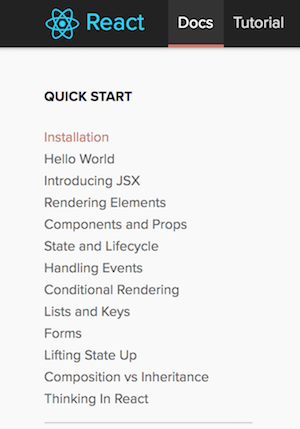

## Getting started with React

The next part of our learning journey will depend almost completely on the excellent content that the React development team has published. 

Get ready by visiting the [React home page](https://reactjs.org/), and read/scan the content.

On the top navigation menu, notice the [Docs](https://reactjs.org/docs/installation.html) (documentation) and [Tutorial](https://reactjs.org/tutorial/tutorial.html) items. 



<br>

### Installation

As described in the [Docs](https://reactjs.org/docs/installation.html) installation notes, React is installed by using the Node Package Manager. 

For best results, use the React app generator. Install it on your computer:

```text
npm install -g create-react-app
```

<br>

### Create an app

Next, create a new app. Assuming that you want to create a new app (and folder) named "my-app":

```text
create-react-app my-app
```

The process will create a new folder, with the code needed to get started.

<br>

### Run the app

A React app is a client-side front-end app. It does NOT have a server part to it. A browser user "pulls" a React app, by visiting a URL that is the "root" of the app. As you will learn later, the packaging and deployment process creates a bundle of files that are sent to the browser when the root of the app is requested for the first time. 

That being said, all React developers - you included now - will [start](https://docs.npmjs.com/cli/start) an on-demand per-instance [localhost](https://en.wikipedia.org/wiki/Localhost) Node.js server, and listen on the app's URL. Then, from a browser, the app is pulled *from* the localhost server, *to* the browser's memory, and is ready for use. 

Therefore, start the server listener:

```text
npm start
```

The server begins listening on HTTP port 3000. Depending on your computer's configuration, it may automatically open a browser to the [localhost port 3000 URL](http://localhost:3000/). 

<br>

### Edit the app

Start Visual Studio Code. Open the "my-app" folder. 

Alternatively, you can use the command line. However, as you probably noticed in your Terminal window, the on-demand web server is blocking it from further interaction. So, open a new Terminal window (Cmd+T, or Shell > New Window). Then you can make "my-app" your current folder, and run the `code .` command. 

An easy edit, just to prove that you can do so, is to edit the `App.js` file in the `src` folder. Add an HTML `p` element with some content. After you save your changes, switch over to the browser window. It should show the new content. Behind the scenes, the Terminal process will regenerate the content, making changes where necessary to the deployment assets. As part of the process, the browser will refresh the visible content.

<br>

<br>
<br>
<br>
<br>
<mark>&nbsp;new topics&nbsp</mark>
<br>
<br>
<br>
<br>

### New

getting started page, all good recommendations

Add React to a Website - demonstrate


<br>

### Work through several topics

At the top of this document we noted that the next part of our learning journey will depend almost completely on the excellent content that the React development team has published. 

Therefore, spend a few hours (before, during, and after class) to go through these topics:

[Installation](https://reactjs.org/docs/installation.html)  
[Hello World](https://reactjs.org/docs/hello-world.html)  
[Introducing JSX](https://reactjs.org/docs/introducing-jsx.html)  
[Rendering Elements](https://reactjs.org/docs/rendering-elements.html)  
[Components and Props](https://reactjs.org/docs/components-and-props.html)  
[State and Lifecycle](https://reactjs.org/docs/state-and-lifecycle.html)  
[Handling Events](https://reactjs.org/docs/handling-events.html)  

<br>

### "Build" the app

Now that we've scratched the surface of React and worked with some of it's core functionality, why don't we actually "build" the application.  So far, we've been learning and practicing our React skills in a controlled, "development" environment.  Once we're happy with the end result however, we can actually "build" the application, which will generate a much smaller footprint (bundled, minified JavaScript / CSS, etc). 

If you take a look at the generated `package.json` file, you will see that the `"scripts"` property contains our initial `"start"` script (ie: **npm start**), as well as a number of *other* scripts that we can invoke.  The one we're most interested in here, is the `"build"` script (ie: **npm run build**).  Once executed, this script initiates a "build" process that creates a highly optomized "production" build of our code in a new folder called "build".

Try executing this command by following the below steps:

* Stop the "development server" currently running using **ctrl + c**
* Execute the command **"npm run build"**

Once this process is complete, open the newly created "build" folder.  You will see that there's only a handful of files now, most notably, an "**index.html**" file and a "**static**" folder containing 2 sub-folders: "**js**" and "**css**" which contain your bundled JavaScript &amp; CSS files respectfully. If you take a look at index.html (after temporairly formatting it in Visual Studio Code), you will see that it's a small skeleton that references your .js file.

Now, all we need to run this in a "production" environment, is a static web server.  Fortunately for us, we know exactly how to create one using Node.js and Express.

Recall [from WEB322](http://zenit.senecac.on.ca/~patrick.crawford/index.php/web322/course-notes/week4-class1/), a **server.js** file using the following code:

```javascript
var express = require("express");
var app = express();
var HTTP_PORT = process.env.PORT || 8080

app.use(express.static("public"));

app.listen(HTTP_PORT, ()=>{
    console.log("listening on port: " + HTTP_PORT);
});
```

will treat a local "public" directory as a "static" directory!  All we have to do is create a new web server using the above code, and place **all** of our React.js production code from the "build" directory, into our new server's "public" directory. 

Once this is complete, we can run our new Express server.js file (`node server.js`) in the browser to see our production React.js code (we can even push this to Heroku).

Remember: the server is only serving up static files to **build** the application on the client-side.

<br>

### What's next?

There are three more documents that can help you understand more about the React way to build an app.

The first is the `README.md` that the React generator creates. As it states near the top of that file, you can find the most recent version of this guide [here](https://github.com/facebookincubator/create-react-app/blob/master/packages/react-scripts/template/README.md). Surprisingly, there are many nuggets that give you hints about the app design and deployment process. Most will be beyond your need during this short two-week treatment of React, but many of the themes will be reused when we begin working with Angular (and you never know, you may end up working with React in the future). 

Another is the official [React tutorial](https://reactjs.org/tutorial/tutorial.html). It's a recommended skim/read, and you may or may not want to code along with it.

The other is from the Visual Studio Code documentation set, titled [Using React in VS Code](https://code.visualstudio.com/docs/nodejs/reactjs-tutorial). It's a reasonably short document. One of its very useful topics is the how-to for debugging React in VS Code. 

Happy coding!

<br>
