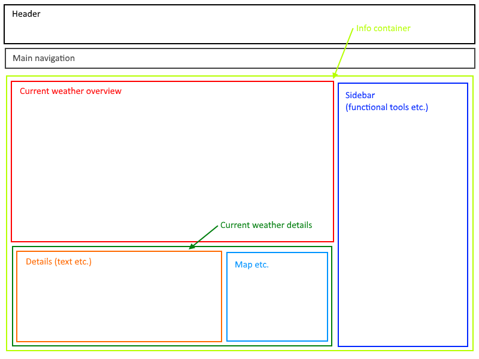
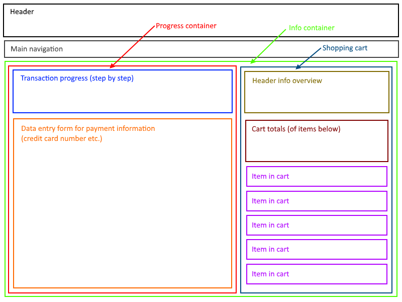

## Introduction to React

Our last topic stop before we get to Angular is **React**. We will plan to work with React this week and next.

React is a widely-used JavaScript library for building user interfaces. In terms of mindshare for front-end development, React and Angular have almost all of it. 

For us, React will be very useful, as a way to introduce *component*-oriented architecture when developing apps. 

 

### Relevant history

It all starts with Facebook, which is a web app that has worldwide reach, and about two *billion* users, according to Facebook and [other metrics](https://en.wikipedia.org/wiki/List_of_virtual_communities_with_more_than_100_million_active_users). 

At scale, the app that the user interacts with must offer good-enough performance, and worthwhile features and functionality. React is the front-end engine for these, on both browser and mobile device platforms.

As the Facebook platform and code base matured into the 2010s, the underlying technology of React was developed and implemented. In 2013, Facebook released it as [open source](https://github.com/facebook/react). 

 

### What's different

Until now, you have worked directly with the browser document object model (DOM). Changes were made by vanilla JavaScript, and then by jQuery or Knockout. 

With React, we must change our thought process. The big difference is that we will not work directly with the DOM. Yes, our work will affect the rendered DOM, but we cannot use that conceptual model as a foundation for building and modifying the DOM. 

What specifically is different? In React, we build the user interface with *components*. 

A component is a JavaScript code container. It includes user interface declarations (markup), and JavaScript code for logic, state management, and communication. The component is responsible for an area (e.g. a rectangle) in the user interface, including rendering and interaction. A component can hold other components, and/or be embedded in a "parent" component. 

This completely changes the architecture and code design of all parts of the app. Until now, we have used a *page-first* approach to app design, where the task to be done, and the workflow to be followed, was designed around a set of pages. Each page used JavaScript to add functionality and user interaction. The browser and the HTML document was at the center of our app-building efforts.

In React, it's different. We use an *app-first* design approach, and build the app with components. The HTML document remains only as the default deployment target, in a browser or browser-like object on a device. React handles the DOM building and modification tasks. 

In addition, React apps also work on iOS and Android platforms, by using the [React Native](https://facebook.github.io/react-native/) libraries. 

In summary:
* The React component architecture changes our app design approach 
* We now use an app-first design approach, and build the app with components

 

### How can I visualize these new ideas?

Consider two widely-known kinds apps that are used by many people on a browser or mobile device:
1. Weather app
2. Online store

 

**Weather app**

Study the diagram below. Its visual design is understandable - it shows current weather information for a city or region. Its content is navigation-driven, based on what the user wants to see. 

As a React app, each rectangle is a *component*. Each component includes content (text, image, etc.), and elements that support user interaction. Depending on navigation, old components are replaced by new components (e.g. a new city). 

Notice the light green box (titled "Info container") surrounding the content below the header and navigation. That would be a component, with embedded components inside. 

Notice also the darker green box (titled "Current weather details"). That is also a component, with embedded components inside. 

 

**Online store**

Study the diagram below. It too should be understandable - it shows the "payment information" step of the online shopping checkout process. Its content is partly navigation-driven, but it is also logic- and workflow-driven, based on the user's intention. 

As a React app, each rectangle is a *component*. In contrast to the above, many of the components will maintain state, and/or manage persistence, handle communication with back-end processes, perform calculations, and display or dispose of nested/embedded components. 

Notice the nesting of components.

 
