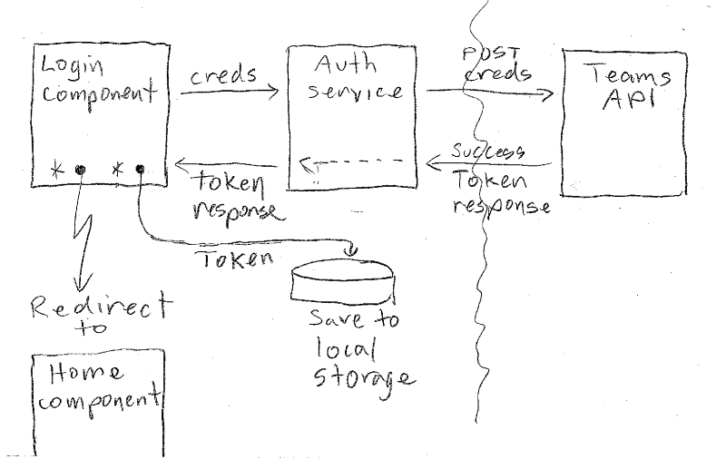
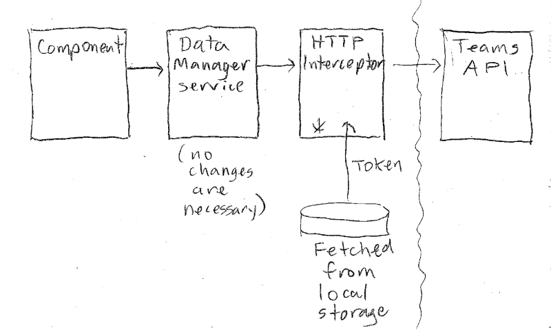
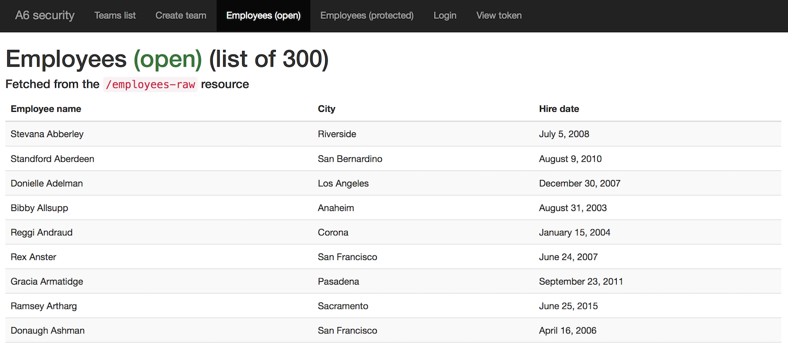
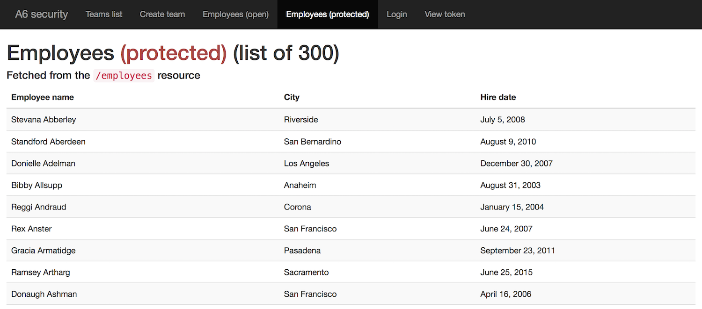

## Add security features to an Angular app

This document focuses on the work needed to add security features to an Angular app. 

In the sections below, we will modify a sample solution for Assignment 5. The individual tasks can be done to any app. Some of the code can be copy/pasted, sometimes a whole file (or component file collection), and sometimes smaller amounts of code. 

### Login task visualization

The following visualization helps explain the login task:



Here's the sequence:
* Credentials are entered.  
* The login component calls a method in the auth service.  
* The auth service sends a POST request, with the credentials, to the Teams API.
* If successful, a token response is delivered to the auth service, and then through to the login component. 
* The token is saved to the browser's local storage.
* A redirect happens (to somewhere). 

<br>

### Request-handling visualization

The following visualization helps explain the request task:



Here's the sequence:
* A component calls a method in the data manager service (it wants some data).
* Assuming that it passes the guard, the request is allowed to go to the data manager service. 
* The data manager service sends a request to the web service (its coding and approach does not change).
* The HTTP Interceptor intercepts the request, fetches the token from the browser's local storage, and adds it to an "Authorization" header before passing on the request 

<br>

### Task preview

Here's a preview of the tasks to be done:
1. Add the token-handling library and professor-provided code
1. Add services for authentication tasks
1. Integrate the authentication services into the app
1. Code and test the login view
1. Add components for viewing employees

<br>

#### Getting started

Fetch the "assignment6base.zip" from the [code repository](https://github.com/sictweb/bti425/tree/master/Templates_and_solutions). It is a sample solution for Assignment 5. Reminder, run `npm i` to install the packages it needs to run. 

Before attempting to load the app, edit the URL to your Teams API, in the data manager service class. Then, run the app, and it should load and run successfully, and enable you to view the list of teams. However, the "create team" may not work completely, because you have protected the `/employees` route at the Teams API (when you added security to that app). 

<br>

### Add the token-handling library and professor-provided code

The Teams API web service works with JSON Web Tokens (JWT). Add support for JWT to this Angular app:

```
npm i @auth0/angular-jwt
```

We must edit the app module to complete the JWT integration. Import it:

```ts
import { JwtModule } from "@auth0/angular-jwt";
```

Next, just below all of the `import` statments, and *before* the `@NgModule` decorator, add this function:

```ts
export function tokenGetter() {
  return localStorage.getItem('access_token');
}
```

Finally, in the `imports` array of the `@NgModule` decorator, add the `JwtModule...` object:

```ts
  imports: [
    BrowserModule,
    FormsModule,
    AppRoutingModule,
    HttpClientModule,
    JwtModule.forRoot({
      config: {
        tokenGetter: tokenGetter,
        authScheme: 'JWT'
      }
    })
  ],
```

<br>

Your professor team has created some code modules that perform some of the authentication tasks. The code is in "angularappscuritycode.zip" from the [code repository](https://github.com/sictweb/bti425/tree/master/Templates_and_solutions). 

<br>

#### View the contents of a token

The  *token view* component enables the user to view the contents of a token (that is persisted in the browser's local storage). Here's what the user interface looks like (when there is an existing token):


The three `token-view.component.*` files (ts, html, css) can be copied into your project's `src/app` folder. This component works as-is, without any edits required. 

> Then, edit the app module, to `import` the component, and add it to the `declarations` array.  
> Also, add a route now, and then edit the nav component so that we can easily use the token view component via the menu.  
> Note that this component will not view correctly, but it will after we complete an integration task, below. 

The *login* component enables the user to login (authenticate). Here's what the user interface looks like (when loaded):


The three `login.component.*` files can be copied too. This component's class has a partially-implemented `login()` method, which you will edit later. 

> Then, edit the app module, to `import` the component, and add it to the `declarations` array.  
> Also, add a route now, and then edit the nav component so that we can easily use the login component via the menu.  
> Note that this component will not view correctly, but it will after we complete an integration task, below. 

<br>

### Add services for authentication tasks

There are *three* new services. In the "angularappsecuritycode.zip" file, you will find source code for all three. One needs to be edited by you, and the other two are code-complete.

Copy these code modules into your `src/app` folder:
* `auth.service.ts`
* `guard-auth.service.ts` 
* `intercept-token.service.ts`

<br>

### Integrate the authentication services into the app

The "auth" service needs to be integrated, and edited by you.

<br>

#### Coding for `auth.service.ts` 

In the app module, import the "auth" service:

```ts
import { AuthService } from './auth.service';
```

Then, add it to the `providers` array in the `@NgModule` decorator. 

Now, open the auth service code for editing. Update the value of the URL, which will be your Teams API. Then, study the methods, to learn what this service does. 

As noted above, the other two services are code-complete, and just need to be integrated into the app. 

<br>

#### Coding for `guard-auth.service.ts` 

In the app module, import the "guard" service:

```ts
import { GuardAuthService } from './guard-auth.service';
```

Then, add it to the `providers` array in the `@NgModule` decorator. 

<br>

#### Coding for `intercept-token.service.ts`

In the app module, import support for the interceptor service, and then import the "interceptor" service:

```ts
import { HTTP_INTERCEPTORS } from '@angular/common/http';
import { InterceptTokenService } from "./intercept-token.service";
```

Then, add it to the `providers` array in the `@NgModule` decorator, in the following way:

```ts
  providers: [
    DataManagerService,
    AuthService,
    GuardAuthService,
    {
      provide: HTTP_INTERCEPTORS,
      useClass: InterceptTokenService,
      multi: true
    }
  ],
```

At this point, the app should run without errors. It should:
* Display a list of teams
* Partially render the "create a team" view
* Display the token view
* Display the login view

<br>

### Code and test the login view

Open the login component class for editing. Notice that the `onSubmit()` method is mostly empty, except for an algorithm. 

Use it to guide you to complete the coding task. 

After you do so successfully, the token view will show you the contents of the token that you get back from your Teams API. 

<br>

### Add components for viewing employees

Using the Angular CLI, generate two components. 

One component (maybe named "EmployeesOpen") will display a list of employees from the Teams API `/employees-raw` resource. The idea is that this component can be viewed with or without being authenticated. 

Go ahead and code it now. You have previous experience coding this kind of component. 

> Tip - Use your own code, or copy-paste the code from the existing team list component, and edit the contents to match the needs of the data.  
> Tip - Add a route now, and then edit the nav component so that we can easily use the menu.  
> Tip - You will need another data manager service method to fetch from the `/employees-raw` resource. 

Here's what it may look like when you're done:



<br>

The other component (maybe named "EmployeesProtected") will display a list of employees from the `/employees` resource. 

> Tip - Ditto above. 

Next, we will add code to "protect" the route to this component with a "guard". How? Open the app module for editing. Import the guard:

```ts
import { GuardAuthService } from './guard-auth.service';
```

Then, modify the route object to add a `canActivate` property:

```ts
// other routes above
{ path: 'employees/protected', component: EmpProtComponent, canActivate: [GuardAuthService] },
// other routes below
```

If authenticated, the user will see the list of employees. If not, the user will be redirected to the login view. 

Here's what it may look like when you're done:



<br>

### Summary

In this document, you learned how to add security features to an Angular app, which works with a secure Teams API. 

We added a number of code modules, which can be re-used and edited for other Angular apps. 

<br>
