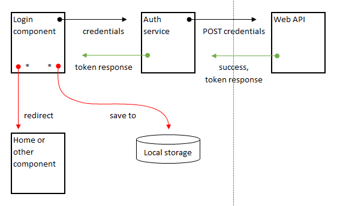
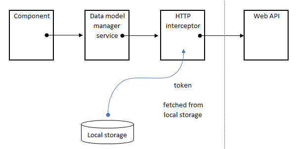
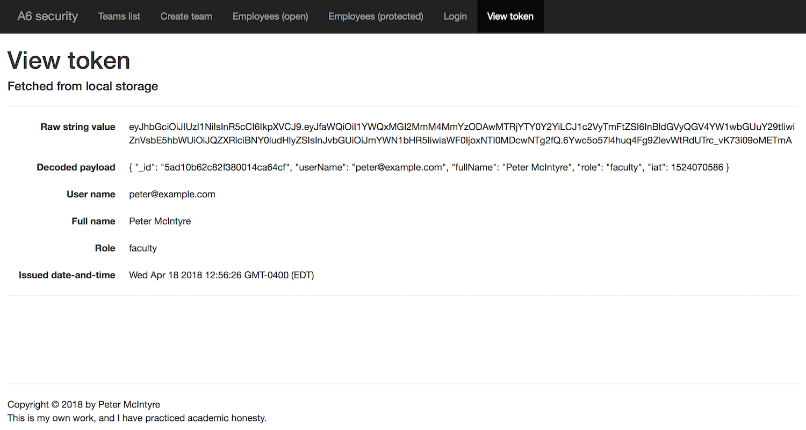
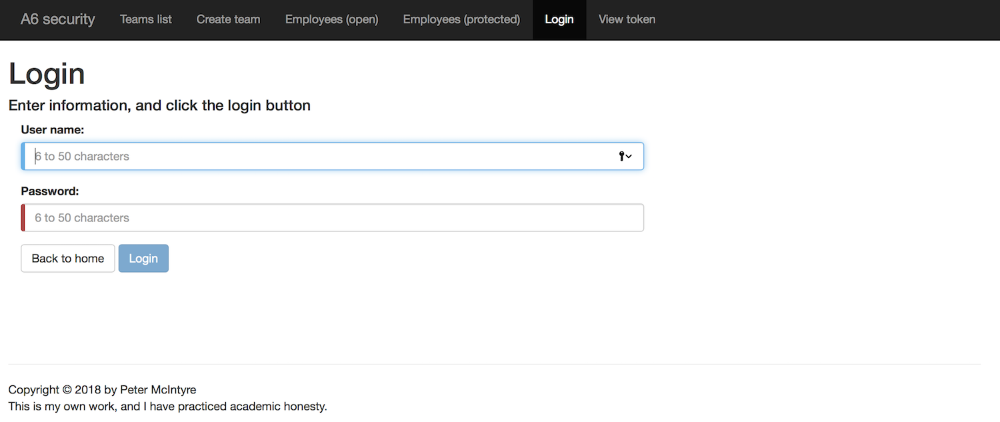

## Add security features to an Angular app

This document focuses on the work needed to add security features to an Angular app. 

<br>

### Login task visualization

The following visualization helps explain the login task:



Here's the sequence:
* Credentials are entered.  
* The login component calls a method in the auth service.  
* The auth service sends a POST request, with the credentials, to the web API.
* If successful, a token response is delivered to the auth service, and then through to the login component. 
* The token is saved to the browser's local storage.
* A redirect happens (to somewhere). 

<br>

### Request-handling visualization

The following visualization helps explain the request task:



Here's the sequence:
* A component calls a method in the data manager service (because it wants some data from the web API).
* Assuming that it passes the guard, the request is allowed to go to the data manager service. 
* The data manager service sends a request to the web service (its coding and design approach does not change).
* The *HTTP Interceptor* intercepts the request, fetches the token from the browser's local storage, and adds it to an "Authorization" header before passing on the request 

<br>

### Task preview

Here's a preview of the tasks to be done:
1. Add the token-handling library and professor-provided code
2. Add services for authentication tasks
3. Integrate the authentication services into the app
4. Code and test the login view
5. Add components for viewing employees

<br>

#### Getting started

Fetch the code for the Angular app from the Week 12 folder in the course's code example repo. 

<br>

### Add the token-handling library and professor-provided code

Your web API is configured to use with JSON Web Tokens (JWT). In a Terminal window, add support for JWT to this Angular app:

```
npm i @auth0/angular-jwt
```

Then, we must edit the app module to complete the JWT integration. Import it:

```ts
import { JwtModule } from "@auth0/angular-jwt";
```

Next, just below all of the `import` statments, and *before* the `@NgModule` decorator, add this function:

```ts
export function tokenGetter() {
  return localStorage.getItem('access_token');
}
```

Finally, in the `imports` array of the `@NgModule` decorator, add the `JwtModule...` object:

```ts
  imports: [
    BrowserModule,
    FormsModule,
    AppRoutingModule,
    HttpClientModule,
    JwtModule.forRoot({
      config: {
        tokenGetter: tokenGetter,
        authScheme: 'JWT'
      }
    })
  ],
```

<br>

Your professor team has created some code modules that perform some of the authentication tasks. The code is in the repo.

<br>

#### View the contents of a token

The  *token view* component enables the user to view the contents of a token (that is persisted in the browser's local storage). Here's what the user interface looks like (when there is an existing token):



The three `token-view.component.*` files (ts, html, css) can be copied into your project's `src/app` folder. This component works as-is, without any edits required. However, you must integrate it:

* Edit the app module, to `import` the component, and add it to the `declarations` array.  

* Add a route now, and then edit the nav component so that we can easily use the token view component via the menu.  

Note that this component will not view correctly yet, but it will after we complete an integration task, done below. 

The *login* component enables the user to login (authenticate). Here's what the user interface will look like (when configured and loaded):



The three `login.component.*` files can be copied too. This component's class has a partially-implemented `login()` method, which you will edit later. 

> As done above, edit the app module, and then edit the nav component menu. 

Note that this component will not view correctly yet (as above)...

<br>

### Add services for authentication tasks

There are *three* new services. In the repo, you will find source code for all three. One needs to be edited by you, and the other two are code-complete.

Copy these code modules into your `src/app` folder:
* `auth.service.ts`
* `guard-auth.service.ts` 
* `intercept-token.service.ts`

<br>

### Integrate the authentication services into the app

The "auth" service needs to be integrated, and edited by you.

<br>

#### Coding for `auth.service.ts` 

In the app module, import the "auth" service:

```ts
import { AuthService } from './auth.service';
```

Then, add it to the `providers` array in the `@NgModule` decorator. 

Now, open the auth service code for editing. Update the value of the URL, which will be your web API. Then, study the methods, to learn what this service does. 

As noted above, the other two services are code-complete, and just need to be integrated into the app. 

<br>

#### Coding for `guard-auth.service.ts` 

In the app module, import the "guard" service:

```ts
import { GuardAuthService } from './guard-auth.service';
```

Then, add it to the `providers` array in the `@NgModule` decorator. 

<br>

#### Coding for `intercept-token.service.ts`

In the app module, import support for the interceptor service, and then import the "interceptor" service:

```ts
import { HTTP_INTERCEPTORS } from '@angular/common/http';
import { InterceptTokenService } from "./intercept-token.service";
```

Then, add it to the `providers` array in the `@NgModule` decorator, in the following way:

```ts
  providers: [
    DataManagerService,
    AuthService,
    GuardAuthService,
    {
      provide: HTTP_INTERCEPTORS,
      useClass: InterceptTokenService,
      multi: true
    }
  ],
```

At this point, the app should run without errors.

<br>

### Code and test the login view

Open the login component class for editing. Notice that the `onSubmit()` method is mostly empty, except for an algorithm (as code comments). 

Use it to guide you to complete the coding task. 

After you do so successfully, the token view will show you the contents of the token that you get back from your web API. 

<br>

### Protect a component

Select a component that you wish to protect. 

> For example, from Assignment 2, we want to protect the "add new" English term component. 

Next, we will add code to "protect" the route to this component with a "guard". How? Open the app module for editing. Import the guard:

```ts
import { GuardAuthService } from './guard-auth.service';
```

Then, modify the route object to add a `canActivate` property:

```ts
// other routes above
{ path: 'students/:id/detail', component: TermEnglishCreateComponent, canActivate: [GuardAuthService] },
// other routes below
```

If authenticated, the user will see the student detail view. If not, the user will be redirected to the login view. 

<br>

### Summary

In this document, you learned how to add security features to an Angular app, which works with a secure web API. 

We added a number of code modules, which can be re-used and edited for other Angular apps. 

<br>
