## Add security features to web service

After learning something about [security topics](security-intro), we are ready to write some code. 

In our context, we must:
1. Add security features to the Teams API, and
2. Add security features to an Angular app

This document focuses on the first point, adding security features to the Teams API. A [separate document](security-add-to-app) focuses on the second point. 

The following is a simplified box-and-line drawing of the new and desired Teams API app configuration. It shows the new security-related code assets and their relationships.

There are several things to notice. 

First, the `server.js` code box has been enlarged to include "register" (a new account) and "login" methods. It also has new code that has a relationship to a new box of code, Passport.js. Similar to above, the relationship between the server/listener and Passport.js is shown as a short line with solid dots at each logical usage point.

Second, notice `Passport.js`. This code is now brought in to handle authentication and some identity management tasks. Also notice its dots-and-line connector, indicating a relationship between some existing methods/functions in the listener with Passport.js code. 

Third, notice a new "U" (for user accounts) data/schema model class. It defines the shape of a user account (i.e. username, password, possibly other claims such as family name, given name, birthdate, etc.). 

Finally, notice a new code box, `data-service-auth.js`. It will include methods/functions that handle the authentication heavy lifting, such as "registerUser" and "checkUser". For this course's introductory treatment of security topics, your teacher team has decided to isolate the identity management storage part in a separate database. This also happens to be a good practice, because of the sensitive nature of a database with user account data. 

The work described below has four major tasks:
1. Prepare your Heroku and mLab deployments
2. Add a teacher-provided code module
3. Write a user account schema 
4. Edit `server.js` 

 

### Prepare your Heroku and mLab deployments

In this task, there are two sub-tasks to be done:
1. Ensure that you can update your Heroku deployment
2. Create a new mLab deployment

 

#### Ensure that you can update your Heroku deployment

Almost three months ago, you deployed your Teams API to Heroku (and created an mLab database). If you have not periodically or regularly updated the Heroku deployment, we *strongly recommend* doing an update, before continuing with the remaining work below. 

The idea is to make a minor change to `server.js` that does not affect its functionality. For example, do a code reformat, or add a blank line or two, or a code comment somewhere. Again, the idea is to make a change and *successfully* "push" it to Heroku. 

First, locate and open (for editing) your Teams API code base. If you have not changed it since it was deployed in January, the Source Control tool (in Visual Studio Code) should be clean (i.e. no changed items yet). 

Next, make a minor change to `server.js` as described above. 

Finally "push" it to Heroku. If you want to review a summarized reminder of the overall deployment procedure, [read this section](https://sictweb.github.io/bti425/notes/teams-api-setup#creating-a-minimal-server-app-that-can-be-hosted-at-heroku) of the Teams API Setup document. That section and the next two sections will be useful. (And, if it's not enough, you can always go back to the [Teams API README](https://github.com/sictweb/bti425/blob/master/Templates_and_solutions/teams-api/README.md) on the code repository.)

 

#### Create a new mLab deployment

Assuming the task above was successful, we can continue with this task. 

As noted above, we want to create a separate database to hold the user accounts. Therefore, we must create another mLab deployment. If you want to review a summarized reminder of the overall procedure, [read this section](https://sictweb.github.io/bti425/notes/teams-api-setup#working-with-mlab) of the Teams API Setup document. 

Save (and note) your credentials, and the MongoDB connection string. We will need these items soon. 

 

### Add a teacher-provided code module

In the diagram above, there is a `data-service-auth.js` box. Your professors have created that code module, and supplied it in the [security-topics](https://github.com/sictweb/bti425/tree/master/Templates_and_solutions/security-topics) folder of the code repository. 

Download it, and add it to your Teams API project. 

> Note that your project will not build/compile cleanly without errors, because the new code module references a user account schema that does not yet exist. You will code the schema in the next task. 

 

### Write a user account schema 

It should be obvious that the project needs a data/schema class that defines the shape of a user account. Using the existing code in the "models" folder as a guide, create a `user.js` source code file, and write code for a user. We want a few properties, and we want the user name to be unique. Here's some properties to get your design started:

* user name - unique (e.g. an email address probably)

* password

* full name (e.g. Firstname Lastname) 

* role (e.g a role claim, like "user account manager" or "student")

For info and guidance, consult the Mongoose schema documentation, and the [schema types](http://mongoosejs.com/docs/schematypes.html#schematype-options) document.

When you're done, it may look like the following example:

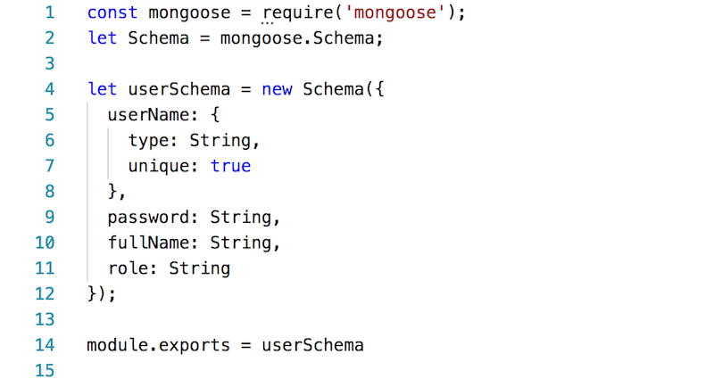

> Note that your project will now probably build/compile cleanly without errors, because the new code module can now reference a user account schema.

 

**Checkpoint**

At this point in time, in the context of the [security topics document](security-intro) we have done the following:

* Partially-implemented the *identity management* part. We have a user account schema, and a user accounts storage location on mLab. Some of the remaining *identity management* code is in the professor-provided `data-service-auth.js` code, and more will be added to `server.js`, described below. 

* Partially-implemented the *authentication* part. We have added the `data-service-auth.js` source code file to the project, which includes the "login" code. 

Next, we will integrate these new parts into `server.js`, add some token-validation *authentication* code, and add some *authorization* code. 

 

### Edit `server.js` 

There are several changes to be made. At certain points, there will be an opportunity to test. You can run the code locally if you wish. 

 

#### User account storage and handling code

Locate the existing connection string. Below, add a new connection string to the new mLab deployment that will hold the user accounts database:

Obviously, replace the text with the values you noted or saved above when you created the deployment. 

Next, locate the existing declaration of the `dataService` constant. Below, add another declaration to the professor-supplied code module:

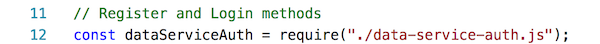

Next, locate the existing declaration of the `data` constant that initializes the Mongoose connector to the Teams API data. Below, add another declaration to the user accounts data:

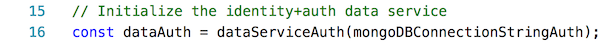

At this point, we have defined and connected the user account storage and its handler. 

 

#### Authentication and user account creation code

Now, we will add the code that configures and initializes authentication. We are using the widely-used and well-respected Passport.js system. 

Before (above) the code that declares the `app` constant, we must add the following code block:

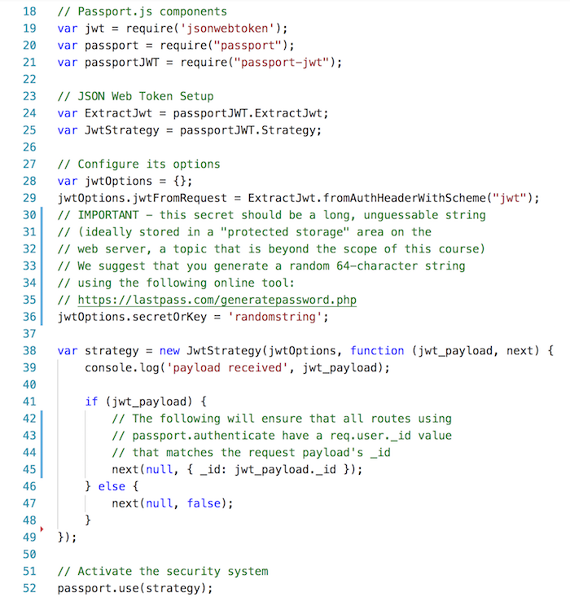

Next, just after the code that declares the `app` constant and its two `use` method calls (use bodyParser and cors), add another call to use Passport.js:

Finally, add two new route handlers. One will listen for "register" (you know what that does), and the other will listen for "login" (and you know what that does too):

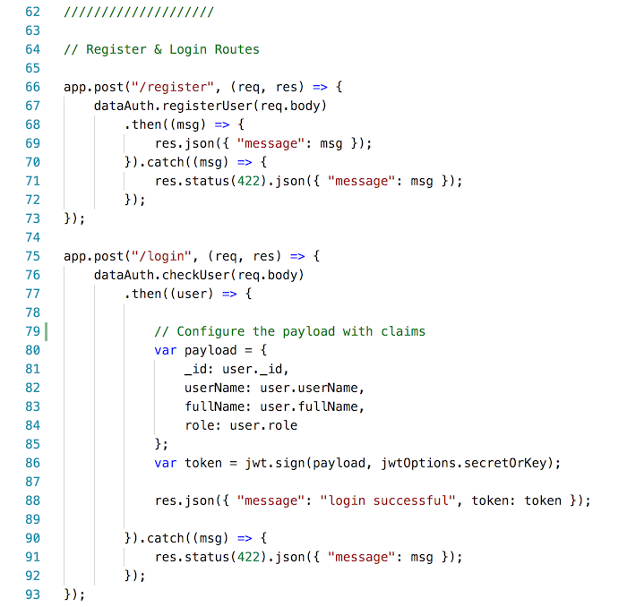

 

### Checkpoint to test your work

At this point in time, if your code builds/compiles cleanly, and runs locally, then push your updated project to Heroku. 

Next, test your work. How? Use [Postman](https://www.getpostman.com/). You probably used this app earlier in the term, or in a previous course. It enables you to compose HTTP requests in a nice-to-use graphical app. 

Send a `GET` request to your Teams API "employees" collection. We just want to see that it still returns data correctly. 

 

#### Register new user accounts

Assuming that it does return data, we can test the "register" and "login" listeners. There are no existing user accounts, so we must create a few. 

First, start the process to register a new user account, for the "user account manager". There are some very important request configuration items to note:
* The request method will be `POST` 
* The URL will be the `/register` route on your own Teams API
* Add a new header, `Content-Type` is `application/json` 

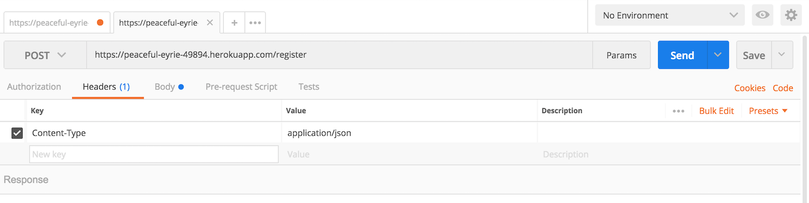

 

Next, compose the request body. We MUST send a well-formed object that matches the user account schema. However, study line 30 of the `data-service-auth.js` code module. It compares the supplied "password" with the supplied "password2". Hmmm, "password2" is *not* in the user account schema. 

That is OK. It is simply a familiar "confirm password" field that is used only during the initial validation task. We obviously do not store/save "password2". However, we MUST include it as a property in our request body:

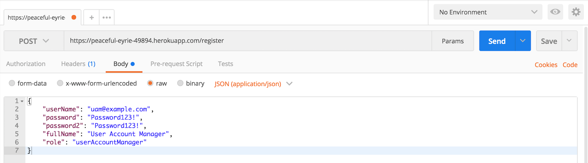

 

After sending the request, if successful, the response status will be "200 OK", and it will return a message stating that the user account was successfully registered. 

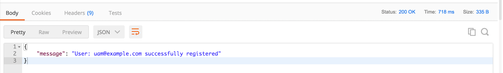

 

Do it again, another few times. Use your own name, and that of a friend or family member. For example: 

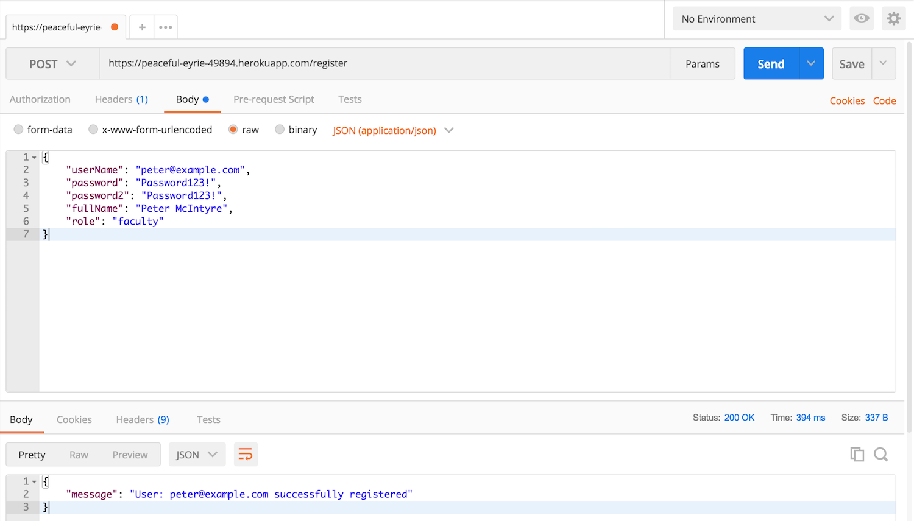

 

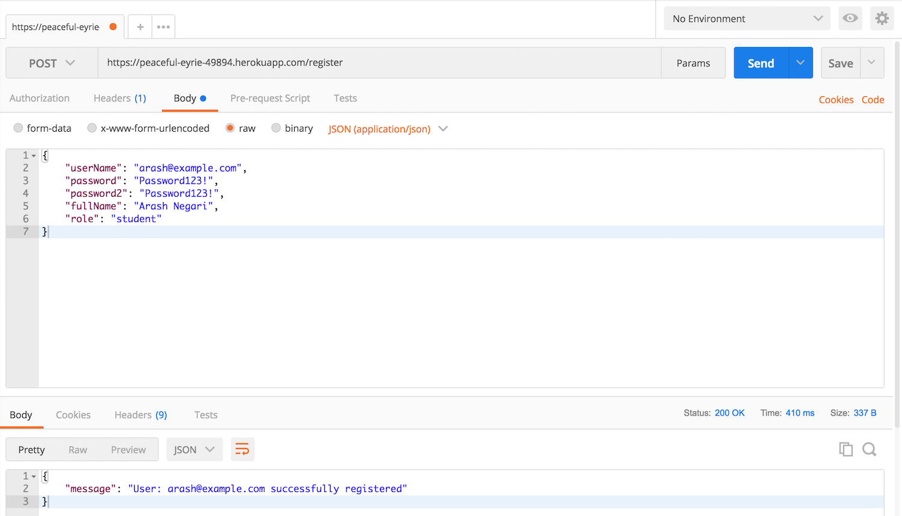

 

#### Login a user

Now that you have user accounts, login with one or more of them. There are some very important request configuration items to note:
* The request method will be `POST` 
* The URL will be the `/login` route on your own Teams API
* Add a new header, `Content-Type` is `application/json` 

Next, compose the request body. We MUST send a well-formed object that has `userName` and `password` properties. Study the `checkUser()` function that begins on line 70 of the `data-service-auth.js` code module. 

After sending the request, if successful, the response status will be "200 OK", and it will return a message stating that the login was successful. *And, it returns a token.* 

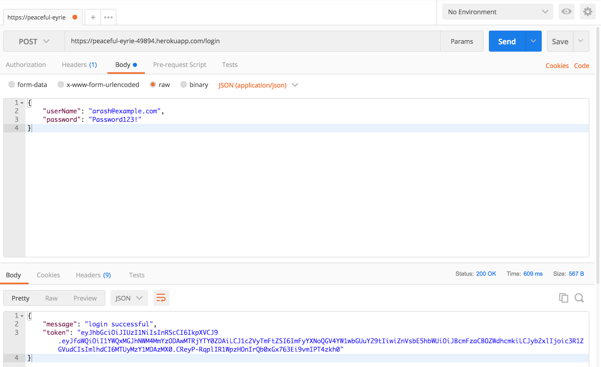

 

#### What is in the token?

What is in the token? Well, copy it, and use the [JWT.io](https://jwt.io) service to decode it. 

This is a two-step process. First, paste the token text into the left-side area. It will decode what it can, and show the results on the right side. Initially, it will show an error, "Invalid Signature". This is expected, because it does not yet know the secret key (on or near line 36 of `server.js`). 

 

After pasting the secret key in the right-side textbox (in the "VERIFY SIGNATURE" area), it will be happier, and display a "Signature Verified" message. 

 

### Checkpoint to test your work

At this point in time, if your code builds/compiles cleanly, and runs locally, then push your updated project to Heroku. 

Requesting `/employees` without a token

 

Configuring the token in the authorization header

 

Requesting `/employees` WITH a token

 
