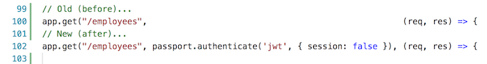

## Add security features to web service

After learning something about [security topics](security-intro), we are ready to write some code. 

In our context, we must:
1. Add security features to the web service/API, and
2. Add security features to an Angular app

This document focuses on the first point, adding security features to the web service/API. A [separate document](security-add-to-app) focuses on the second point. 

The following is a simplified box-and-line drawing of the new and desired configuration. It shows the new security-related code assets and their relationships.


There are several things to notice. 

First, the `server.js` code box includes "register" (a new account) and "login" methods. It also has new code that has a relationship to a new box of code, Passport.js. Similar to above, the relationship between the server/listener and Passport.js is shown as a red line  that connects at each logical usage point.

Second, notice `Passport.js`. This code is now brought in to handle authentication and some identity management tasks. Also notice its red line connector, indicating a relationship between some existing methods/functions in the listener with Passport.js code. 

> [Passport.js](https://www.passportjs.org/docs) is authentication middleware for Node.  
> It is designed to authenticate requests.  
> It works with other code as part of a larger security system.  

Third, notice a new "U" (for user accounts) data/schema model class. It defines the shape of a user account (i.e. username, password, possibly other claims such as family name, given name, birthdate, etc.). 

Finally, notice a new code box, `manager-auth.js`. It will include methods/functions that handle the authentication tasks, such as "registerUser" and "checkUser". For this course's introductory treatment of security topics, your teacher team has decided to isolate the identity management storage part in a separate database. This also happens to be a good practice, because of the sensitive nature of a database with user account data. 

The work described below has four major tasks:
1. Prepare your Heroku and mLab deployments
2. Add a teacher-provided code module
3. Write a user account schema 
4. Edit `server.js` 

<br>

### Prepare your Heroku and MongoDB Atlas deployments

In this task, there are two sub-tasks to be done:
1. Ensure that you can update your Heroku deployment
2. Add a "users" collection to your MongoDB Atlas deployment

<br>

#### Ensure that you can update your Heroku deployment

Recently, you have made changes to your web service/API, in support of your work on Assignments 1 and 2. Soon, we'll be adding more functionality. 

<br>

#### Prepare to add a "users" collection to the database

As noted above, we want to create a new collection to hold the user accounts. 

> Ideally, we should create a new database for security assets.  
> However, we will defer that until a future course. 

<br>

### Add a teacher-provided code module

In the diagram above, there is a `manager-auth.js` box. Your professors have created that code module, and supplied it in the security topics folder of the code repository. 

Download it, and add it to your web service/API project. 

> Note that your project will not build/compile cleanly without errors, because the new code module references a user account schema that does not yet exist. You will code the schema in the next task.  

<br>

### Write a user account schema 

It should be obvious that the project needs a data/schema class that defines the shape of a user account. Using the existing code in the "models" folder as a guide, create a `msc-user.js` source code file, and write code for a user account. We want a few properties, and we want the user name to be unique. Here's some properties to get your design started:

* user name - unique (e.g. an email address probably)

* password

* full name (e.g. Firstname Lastname) 

* role (e.g a role claim, like "user account manager" or "student")

For info and guidance, consult the Mongoose schema documentation, and the [schema types](http://mongoosejs.com/docs/schematypes.html#schematype-options) document.

When you're done, it may look like the following example:


> Note that your project will now probably build/compile cleanly without errors, because the new code module can now reference a user account schema.  
> It will not run, however, because there's more work to do. 

<br>

**Checkpoint**

At this point in time, in the context of the [security topics document](security-intro) we have done the following:

* Partially-implemented the *identity management* part. We have a user account schema, and a user accounts storage location on mLab. Some of the remaining *identity management* code is in the professor-provided `manager-auth.js` code, and more will be added to `server.js`, described below. 

* Partially-implemented the *authentication* part. We have added the `manager-auth.js` source code file to the project, which includes the "login" code. 

Next, we will integrate these new parts into `server.js`, add some token-validation *authentication* code, and add some *authorization* code. 

<br>

### Edit `server.js` 

There are several changes to be made. At certain points, there will be an opportunity to test. You can run the code locally if you wish (run `node server.js`, and test with a browser, and attempt to get/fetch various resources).

<br>

#### User account storage and handling code

Locate the existing declaration of the `dataService` constant. Below, add another declaration to the professor-supplied code module.

<br>

#### Authentication and user account creation code

Now, we will add the code that configures and initializes authentication. We are using the widely-used and well-respected Passport.js system. 

First, add the Passport.js-related code to the project:

```
npm install passport
npm install passport-jwt
npm install jsonwebtoken
npm install bcryptjs
```

Before (above) the code that declares the `app` constant, we must add the following code block:


Notice the "JWT" initialism, which means "[JSON Web Tokens](https://jwt.io)". While we could use any packaging system for our app's tokens, we will suggest using JWT. We like its pitch as an open and standard way to securely represent claims. The code above configures and assumes JWT in our app. 

Next, just after the code that declares the `app` constant and its two `use` method calls (use bodyParser and cors), add another call to use Passport.js:


Finally, add two new route handlers. One will listen for "register" (you know what that does), and the other will listen for "login" (and you know what that does too):


<br>

### Checkpoint to test your work

At this point in time, if your code builds/compiles cleanly, and runs locally, then push your updated project to Heroku. 

Next, test your work. How? Use [Postman](https://www.getpostman.com/). You probably used this app earlier in the term, or in a previous course. It enables you to compose HTTP requests in a nice-to-use graphical app. 

Send a `GET` request to one of the collections. We just want to confirm that it still returns data correctly. 

<br>

#### Register new user accounts

Assuming that it does return data, we can test the "register" and "login" listeners. There are no existing user accounts, so we must create a few. 

First, start the process to register a new user account, for the "user account manager". There are some very important request configuration items to note:
* The request method will be `POST` 
* The URL will be the `/register` route on your web service/API
* Add a new header, `Content-Type` is `application/json` 


<br>

Next, compose the request body. We MUST send a well-formed object that matches the user account schema. However, study line 30 of the `manager-auth.js` code module. It compares the supplied "password" with the supplied "password2". Hmmm, "password2" is *not* in the user account schema. 

That is OK. It is simply a familiar "confirm password" field that is used only during the initial validation task. We obviously do not store/save "password2". However, we MUST include it as a property in our request body:


<br>

After sending the request, if successful, the response status will be "200 OK", and it will return a message stating that the user account was successfully registered. 


<br>

Do it again, another few times. Use your own name, and that of a friend or family member. For example: 


<br>


<br>

#### Login a user

Now that you have user accounts, login with one or more of them. There are some very important request configuration items to note:
* The request method will be `POST` 
* The URL will be the `/login` route on your web service/API
* Add a new header, `Content-Type` is `application/json` 

Next, compose the request body. We MUST send a well-formed object that has `userName` and `password` properties. Study the `checkUser()` function that begins on line 70 of the `manager-auth.js` code module. 

After sending the request, if successful, the response status will be "200 OK", and it will return a message stating that the login was successful. *And, it returns a token.* 


<br>

#### What is in the token?

What is in the token? Well, copy it, and use the [JWT.io](https://jwt.io) service to decode it. 

This is a two-step process. First, paste the token text into the left-side area. It will decode what it can, and show the results on the right side. Initially, it will show an error, "Invalid Signature". This is expected, because it does not yet know the secret key (on or near line 36 of `server.js`). 


<br>

After pasting the secret key in the right-side textbox (in the "VERIFY SIGNATURE" area), it will be happier, and display a "Signature Verified" message. 


<br>

### Edit `server.js`, continued...

At this point, the *identity management* and the *authentication* parts have been configured and tested. 

For the authentication part, only the *initial login and deliver a token* functionality has been tested. Let's add the *token validation* functionality now.

While we could protect all of the routes, let's just protect one route for now, the `/employees` route. (The protection process is the same for ALL routes, so if you want to protect more, it's easy to do - just copy-paste some code.) 

<br>

#### Add token-validation functionality

Locate the `app.get('/employees'...` function in `server.js`. 

We add the functionality by *adding another argument to the function signature*. Study this before-and-after code snippet:



If the request includes a valid token, the request processing will continue (and in this case, it will return an employees collection). If not valid, then HTTP 401 will be returned to the requestor (and this is done by the Passport.js code). 

<br>

### Checkpoint to test your work

At this point in time, if your code builds/compiles cleanly, and runs locally, then push your updated project to Heroku again. 

Then, use Postman again. Send another `GET` request for the `/employees` resource. This time, the response should be HTTP 401 Unauthorized, because we have not sent a token. 


<br>

Now, add a token to the request. That is done by adding an `Authorization` header. Very important, the *value* must be "JWT", a space, and the token text. 


<br>

This time, the request should complete successfully. 


<br>

### In summary

In this document, you learned how to configure a security system for an existing web service. 

We added *identity management* and *authentication* features to the app, by adding, coding, and configuring a number of code assets. 

Your work was tested with the Postman app, and you learned how to include a token with a request. 

In a separate document, you will learn how to code an Angular app that uses this now-secure web service/API. 

<br>
