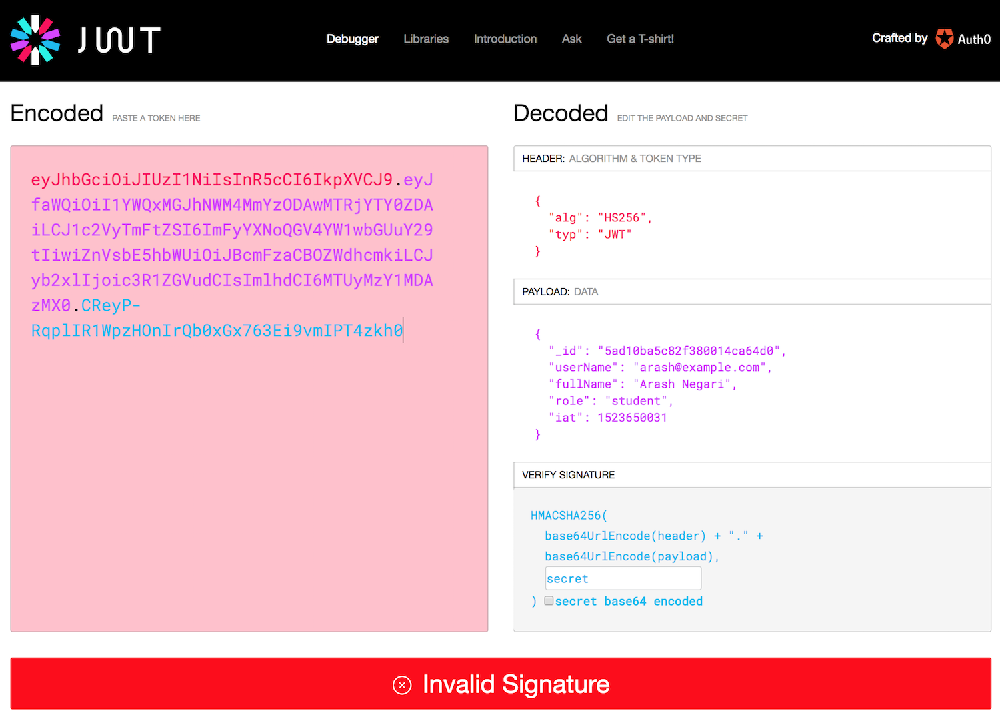
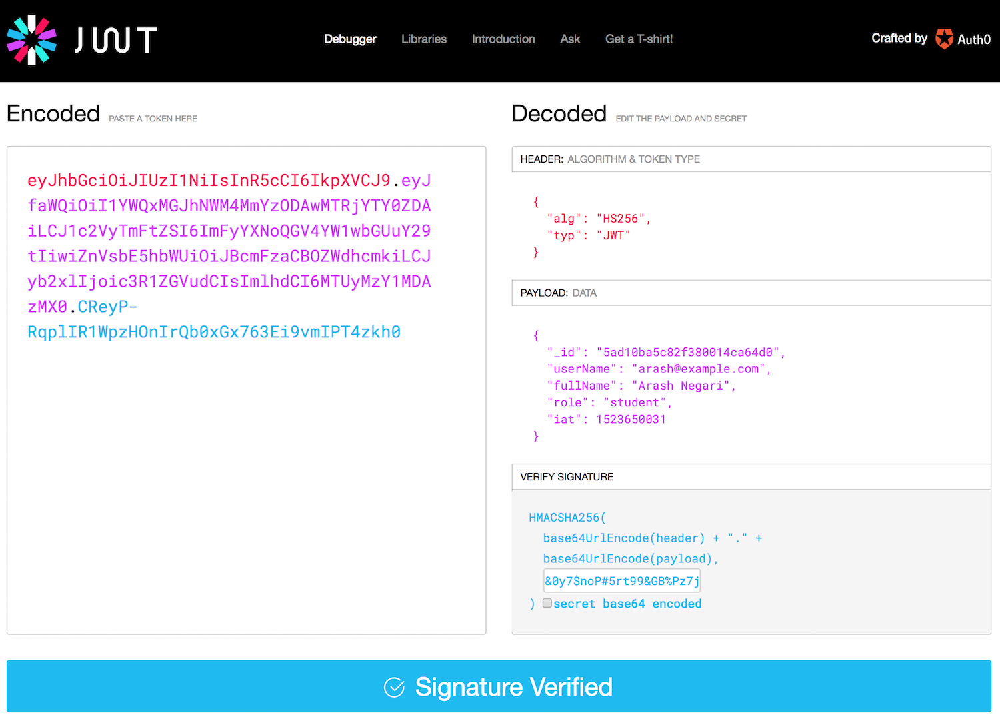
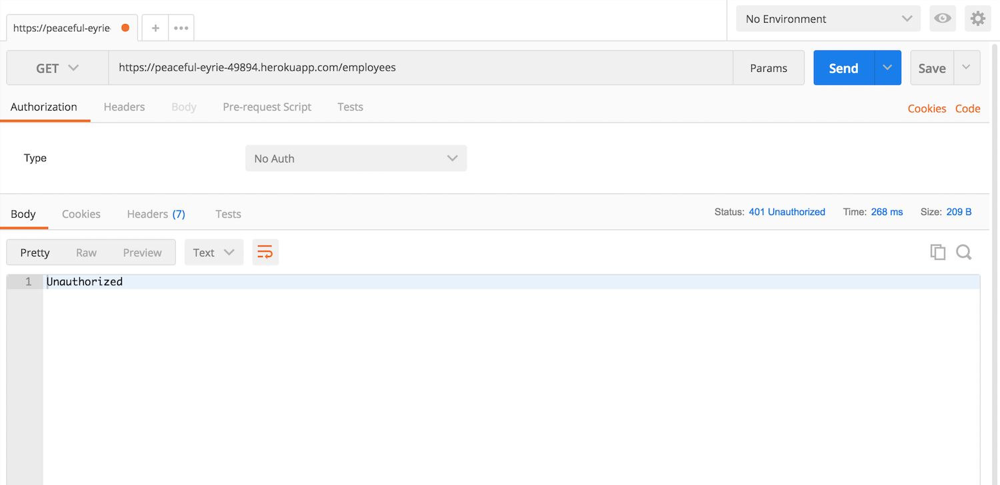
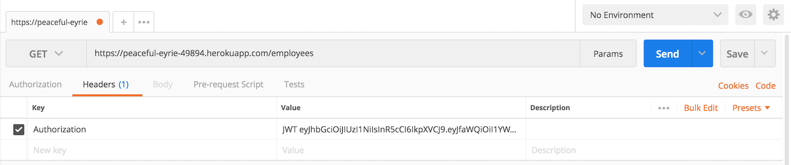
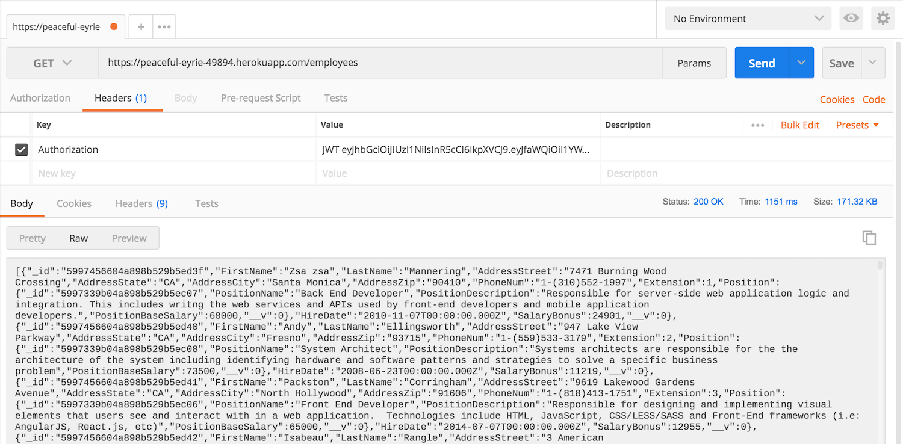

## Add security features to a web API

After learning something about [security topics](security-intro), we are ready to write some code. 

In our context, we must:
1. Add security features to the web service/API, and
2. Add security features to an Angular app

This document focuses on the first task, adding security features to the web service/API. A [separate document](security-add-to-app) focuses on the second task. 

The following is a simplified box-and-line drawing of the new and desired configuration. It shows the new security-related code assets and their relationships.


There are several things to notice. 

First, the `server.js` code box includes "register" (a new account) and "login" methods. It also has new code that has a relationship to a new box of code, Passport.js. Similar to above, the relationship between the server/listener and Passport.js is shown as a red line  that connects at each logical usage point.

Second, notice `Passport.js`. This code is brought in to handle authentication and some identity management tasks. Also notice its red line connector, indicating a relationship between some existing methods/functions in the listener with Passport.js code. 

> [Passport.js](https://www.passportjs.org/docs) is authentication middleware for Node.  
> It is designed to authenticate requests.  
> It works with other code as part of a larger security system.  

Third, notice a new "U" (for user accounts) data/schema model class. It defines the shape of a user account (i.e. username, password, possibly other claims such as family name, given name, birthdate, etc.). 

Finally, notice a new code box, `manager-auth.js`. It will include methods/functions that handle the authentication tasks, including user account activation, creation, and login. 

> For this course's introductory treatment of security topics, your professor team has decided to add these authentication methods/functions to the existing `manager.js` source code file.  
> In a future course, you may learn to isolate these into a separate source code file. 

> Similarly, your professor team has decided to store user account data in the existing database that we have been using.  
> In a future course, you may learn to isolate the identity management storage part in a separate database. This alternative approach is a good practice, because of the sensitive nature of a database with user account data. 

The work described below has several major tasks:
1. Prepare your Heroku and MongoDB Atlas deployments
2. Write a user account schema 
3. Test/check that you can fetch the new data
4. Add some new security code to `manager.js` 
5. Add some new security code to `server.js` 
6. Incrementally test your work 

<br>

### Prepare your Heroku and MongoDB Atlas deployments

In our database, we must create a new collection to hold the user accounts. Typically, we will do a few tasks:
* Decide on the design (shape) of a user account 
* Write JSON for one or two user accounts that you can use while you write code
* Import these user accounts into MongoDB

> In [Assignment 3](/graded-work/assign3), we will do this in a slightly different way.  
> The professor team has provided user account data for all of Assignment 2's students. That's the data that we will import into MongoDB. 

<br>

#### Design (shape) of a user account 

While there is no design standard for a user account, you probably realize that it should have properties for user name, password, role, and so on. Think about some typical and useful properties, and include them in your design. 

<br>

#### Write JSON for some user accounts

Instead of starting with an empty database collection of user accounts, it would be a good idea to "seed" the collection with "starter" user accounts. 

Write JSON for one or two user accounts. One of the user accounts should be for you, the programmer. Its initial password can be empty or any text; either will be replaced later an "account activation" task. 

<br>

#### Import into MongoDB

Now, you're ready to import the "seed" data into MongoDB. 

> See the [Assignment 3](/graded-work/assign3) specs for a reminder of the `mongoimport` process. 

<br>

### Web API work, initial

The goal in this section is to prepare the web API code to fetch and deliver the new user account data. 

Write a new schema for the user account. 

One of the *important features* of the schema is that the login name - often known as the user name - must be unique within the collection. In the schema class, a unique property is defined in this way:

```js
userName: { type: String, unique: true },
```

Next, we will add code that will enable you to use Postman to request user account data.

<br>

#### manager.js work

In the `manager.js` source code file:

1. Add the new schema constant (like the others). 

2. In the main function, add a new collection property. 

3. In its "connect" function member, in `db.once`, add the code to initialize the new property. 

4. Add a function that will fetch and return all user accounts. 

<br>

#### server.js work 

In the `server.js` source code file:

1. Add a function that will listen for a request, and then call the `manager.js` function that you just added above. 

2. Run the web API. Test with Postman, until successful. 

While you are still here, you should add (and test) "get one by identifier" functions to both `server.js` and `manager.js`. 

<br>

### Adding security components

In this section, the goal is to add the professor-provided security code to the web API. Some is added to `manager.js`, and some to `server.js`. 

Get the code from the Week 12 folder on the code example repo. 

<br>

#### manager.js work

Before pasting the professors' code, use a terminal window, and install some security packages to the project. Some introductory information about these security packages will be provided later in this document. 

```text
npm i bcryptjs
npm i passport
npm i passport-jwt
npm i jsonwebtoken
```

Next, study the professors' code for `manager.js`, and follow its instructions, pasting it in the right location. 

Before we can test this code, we must also add more code, described next. 

<br>

#### server.js work 

Study the professors' code for `server.js`, and follow its instructions, pasting it in the right location. 

Before we can test, we must understand the shape of the objects required by each function pair (i.e. activate, create, login). 

"Activate" needs an object with this shape:
```
{ 
  userName: string, 
  password: string, 
  passwordConfirm: string, 
  role: string 
}
```

"Create" needs an object with this shape:
```
{ 
  userName: string, 
  fullName: string, 
  password: string, 
  passwordConfirm: string, 
  role: string 
}
```

"Login" needs an object with this shape:
```
{ 
  userName: string, 
  password: string 
}
```

Therefore - *super important* - make sure that you are sending a request body with a JSON object that matches one of these shapes. 

<br>

#### Checkpoint - test these routes

Use Postman to test these routes. 

Be careful to understand - and document if necessary - the interaction patterns. And, *save the response* to a successful login request. 

<br>

#### What is in a token?

What is in the token? Well, copy its text, and use the [JWT.io](https://jwt.io) service to decode it. 

This is a two-step process. First, paste the token text into the left-side area. It will decode what it can, and show the results on the right side. Initially, it will show an error, "Invalid Signature". This is expected, because it does not yet know the secret key (on or near line 40 to 50 of `server.js`). 



<br>

After pasting the secret key in the right-side textbox (in the "VERIFY SIGNATURE" area), it will be happier, and display a "Signature Verified" message. 



<br>

### How to "protect" a route/function in `server.js` 

After all the security components are in place, how do we "protect" a route/function in `server.js`? 

Well, we add a "passport authenticate" handler to the .get() method chain, as seen in the example below.

```js
// Example of a route/function that is NOT protected
// This is what we have been doing until now
// All requests will succeed
app.get("/api/products", (req, res) => {

// Example of a protected route/function
// Only requests that include a token will succeed
app.get("/api/products", passport.authenticate('jwt', { session: false }), (req, res) => {
```

After a route/function is protected, the request MUST include a suitable request header, formatted as follows:

```
Authorization: JWT eyJhbGciOiJIUzI1NiIsInR5cCI... etc. 
```

When using Postman:
* The header "KEY" is "Authorization".
* The header "VALUE" is "JWT", then a space, then the very long string.

Requests that are successful will deliver the results that you want.  
Unsuccessful requests will deliver HTTP 401.

<br>

#### Checkpoint to test your work

Protect one of the routes, as described above. 

Then, use Postman again. Send another `GET` request for the protected resource. This time, the response should be HTTP 401 Unauthorized, because we have not sent a token. 



<br>

Now, add a token to the request. (You saved it earlier, above.) That is done by adding an `Authorization` header. Very important, the *value* must be "JWT", a space, and the token text. 



<br>

This time, the request should complete successfully. 



<br>

### Summary of the work done to this point

In this document, you learned how to configure a security system for an existing web service. 

We added *identity management* and *authentication* features to the app, by adding, coding, and configuring a number of code assets. 

Your work was tested with the Postman app, and you learned how to include a token with a request. 

In a separate document, you will learn how to code an Angular app that uses this now-secure web API. 

<br>

### More information - security packages

In this section, we present more information about the security packages:
* `bcryptjs` 
* `jsonwebtoken` 
* `passport` and `passport-jwt`

<br>

#### Password storage and `bcryptjs` 

We must NOT ever store plain-text passwords in an identity managements system. NEVER. 

Identity management systems typically transform a password into a string value that cannot be decrypted. It's a one-way transformation. In other words, it is not possible to extract a password from the transformed string value. 

So, how do we create this transformed string value? While there are several approaches, we will use a [bcrypt](https://en.wikipedia.org/wiki/Bcrypt) approach for our JavaScript + Node.js environment. 

The [bcrypt.js package](https://www.npmjs.com/package/bcryptjs) is added to the web API code base. We use its functions in two ways, in the `manager.js` code:
1. Transform a plain-text password into a [hash](https://en.wikipedia.org/wiki/Cryptographic_hash_function) which can be stored in a database  
2. Compare a plain-text password to a hashed-and-stored password 

**Transform plain-text password into a hash**

When transforming a plain-text password into a hash, the `hash` or `hashSync` functions need a [salt](https://en.wikipedia.org/wiki/Salt_(cryptography)) value, which protects the hash from [rainbow table](https://en.wikipedia.org/wiki/Rainbow_table) attacks. There are two commonly-used forms of the `hash` or `hashSync` functions:

```js
// Two code statements
// ===================
// Generate a "salt" value
var salt = bcrypt.genSaltSync(10);
// Hash the result
var hash = bcrypt.hashSync(incomingPassword, salt);

// One code statement
// ==================
// Generate the "salt" as part of the hash function
var hash = bcrypt.hashSync(incomingPassword, 10);
```

**Compare a plain-text password to a hashed-and-stored password**

In a login (authentication) function, the `compare` or `compareSync` functions return a boolean true/false value. For example:

```js
// Compare incoming password with stored password
let isPasswordMatch = 
  bcrypt.compareSync(incomingPassword, storedPassword);
```

<br>

#### Access tokens and authentication

In the [security topics introduction](https://bti425.ca/notes/security-intro.html), you learned that an access token is a package of data that includes information about the token issuer, descriptive information about the user (other than secret information), and information about the cookie or token lifetime. In other words, the package of data includes *claims*. 

What is the format or content of the token? In our course, we are using the Internet-standard ([RFC 7519](https://tools.ietf.org/html/rfc7519)) JSON Web Token. 

We use the [jsonwebtoken](https://www.npmjs.com/package/jsonwebtoken) package to create the token. 

[JSON Web Token](https://jwt.io)

<mark>&nbsp;( more to come )</mark>

<br>

#### Authentication "middleware" code

(This section will describe [Passport](http://www.passportjs.org)).

<mark>&nbsp;( more to come )</mark>

<br>
