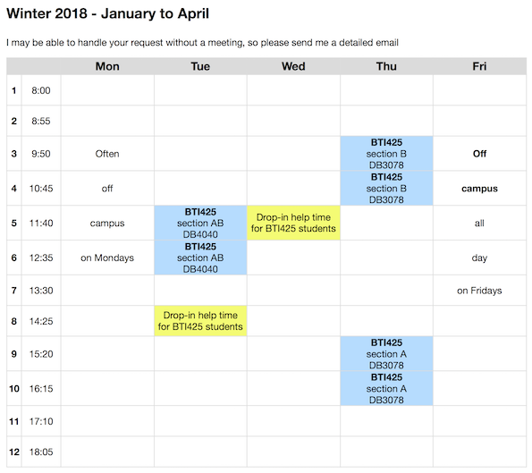

## BTI425 course outline addendum

The official BTI425 course outline is avalable at [this School of ICT web site link](https://ict.senecacollege.ca/course/bti425). 

The information below is the *course outline addendum* for the course.

 

### Faculty

For the Winter 2017 term, Professor Peter McIntyre teaches the BTI425 course. 

Info | Details
--- | ---
Web | [petermcintyre.ca](http://petermcintyre.ca)
Email | peter.mcintyre -at- senecacollege.ca
Office | DB2081 in the School of ICT office area (Dahdaleh building, south end, second floor)
Phone, address | [Available at this link](https://petermcintyre.com/welcome/contact/)
Timetable | [Available at this link](https://petermcintyre.com/welcome/contact/) (and shown below)

 

### Planned schedule of topics, tests, and assignments

The planned scheule of topics, tests, and assignments is available on this page: [Weekly schedule](weekly-schedule). 

 

### Other information

Please ensure that you are familiar with these [course policies and standards](https://sictweb.github.io/bti425/policies)

 

### Get help with course work

I am obviously available during our course time slots on Tuesday and Thursday.

During the Tuesday class, I will have limited free time.

During the Thursday class, I will have substantial free time. Thursdays will be the best day to get one-on-one help from me.

I plan to have drop-in help time on Tuesday from 2:45pm to 3:45pm, in my office (DB2081).

And also on Wednesday from 11:30am to 12:30pm.

While I will be somewhat available by email at other times, I will prefer to be available for help during the days and times discussed above. I will not commit to being available 24×7.

This may become important to you if you are facing a Sunday 6:00pm deadline for the assignment submission, and you discover that you want my help on Saturday or Sunday. I will almost certainly not be available. Therefore, you will be on your own, but you still must practice academic honesty. If you anticipate that this practice will be a problem for you, then set your own assignment due date deadline to better match my availability – for example, the Thursday or Friday just before the Sunday deadline.

 

### Professor timetable

Here's an image of Prof. McIntyre's timetable, as published in late January 2018:

 
